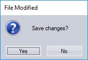
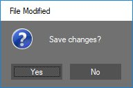
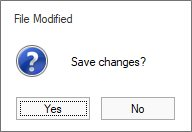

# Style settings in Windows Forms MessageBox (MessageBoxAdv)

This section explains the visual styles and customization support in MessageBoxAdv.

## Visual Styles

MessageBoxAdv supports different visual styles for its appearance. Some of the available VisualStyles are as follows:

* Default
* Office2007
* Office2010
* Metro
* Office2013
* Office2016

### Default

This option helps to set the Default theme.





MessageBoxAdv.MessageBoxStyle = MessageBoxAdv.Style.Default;

MessageBoxAdv.Show(this,"Save changes?", "File Modified", MessageBoxButtons.YesNo,MessageBoxIcon.Question);





MessageBoxAdv.MessageBoxStyle = MessageBoxAdv.Style.Default

MessageBoxAdv.Show(Me,"Save changes?", "File Modified", MessageBoxButtons.YesNo,MessageBoxIcon.Question)





 

### Office2007

Office2007 Style MessageBox is available in Tools Windows. You can replace the .NET MessageBox with new MessageBoxAdv that supports standard color schemes and custom color schemes in Office 2007 style, for consistent look and feel. Custom Icons support is also included in MessageBoxAdv. To display the Message Box, call MessageBoxAdv.Show method.

This option helps to set the following various color schemes:

* Black
* Blue
* Silver
* Managed

#### Black

This option helps to set the Black color scheme in office2007 theme.





MessageBoxAdv.Office2007Theme = Office2007Theme.Black;

MessageBoxAdv.Show(this,"Save changes?", "File Modified", MessageBoxButtons.YesNo,MessageBoxIcon.Question);





MessageBoxAdv.Office2007Theme = Office2007Theme.Black

MessageBoxAdv.Show(Me,"Save changes?", "File Modified", MessageBoxButtons.YesNo,MessageBoxIcon.Question)





 
 
#### Blue

This option helps to set the Blue color scheme in office2007.





MessageBoxAdv.Office2007Theme = Office2007Theme.Blue;

MessageBoxAdv.Show(this,"Save changes?", "File Modified", MessageBoxButtons.YesNo,MessageBoxIcon.Question);





MessageBoxAdv.Office2007Theme = Office2007Theme.Blue

MessageBoxAdv.Show(Me,"Save changes?", "File Modified", MessageBoxButtons.YesNo,MessageBoxIcon.Question)





 

#### Silver

This option helps to set the Silver color scheme in Office2007 theme.





MessageBoxAdv.Office2007Theme = Office2007Theme.Silver;

MessageBoxAdv.Show(this,"Save changes?", "File Modified", MessageBoxButtons.YesNo,MessageBoxIcon.Question);





MessageBoxAdv.Office2007Theme = Office2007Theme.Silver

MessageBoxAdv.Show(Me,"Save changes?", "File Modified", MessageBoxButtons.YesNo,MessageBoxIcon.Question)





 

#### Managed

This option helps to set the customize color scheme in office2007 theme.





MessageBoxAdv.Office2007Theme = Office2007Theme.Managed;

Office2007Colors.ApplyManagedColors(this, Color.Red);

MessageBoxAdv.Show(this,"Save changes?", "File Modified", MessageBoxButtons.YesNo,MessageBoxIcon.Question);





MessageBoxAdv.Office2007Theme = Office2007Theme.Managed

Office2007Colors.ApplyManagedColors(Me, Color.Red)

MessageBoxAdv.Show(Me,"Save changes?", "File Modified", MessageBoxButtons.YesNo,MessageBoxIcon.Question)





 

### Office2010

This option helps to set the following various color schemes in Office2010 theme.

* Black
* Blue
* Silver
* Managed

#### Black

This option helps to set the black color scheme in Office2010 theme.





MessageBoxAdv.Office2010Theme = Office2010Theme.Black;

MessageBoxAdv.MessageBoxStyle = MessageBoxAdv.Style.Office2010;

MessageBoxAdv.Show(this,"Save changes?", "File Modified", MessageBoxButtons.YesNo,MessageBoxIcon.Question);





MessageBoxAdv.Office2010Theme = Office2010Theme.Black

MessageBoxAdv.MessageBoxStyle = MessageBoxAdv.Style.Office2010

MessageBoxAdv.Show(Me,"Save changes?", "File Modified", MessageBoxButtons.YesNo,MessageBoxIcon.Question)




 
 

#### Blue

This option helps to set the Blue color scheme in Office2010 theme.





MessageBoxAdv.Office2010Theme = Office2010Theme.Blue;

MessageBoxAdv.MessageBoxStyle = MessageBoxAdv.Style.Office2010;

MessageBoxAdv.Show(this,"Save changes?", "File Modified", MessageBoxButtons.YesNo,MessageBoxIcon.Question);





MessageBoxAdv.Office2010Theme = Office2010Theme.Blue

MessageBoxAdv.MessageBoxStyle = MessageBoxAdv.Style.Office2010

MessageBoxAdv.Show(Me,"Save changes?", "File Modified", MessageBoxButtons.YesNo,MessageBoxIcon.Question)





 

#### Silver

This option helps to set the silver color scheme in Office2010 theme.





MessageBoxAdv.Office2010Theme = Office2010Theme.Silver;

MessageBoxAdv.MessageBoxStyle = MessageBoxAdv.Style.Office2010;

MessageBoxAdv.Show(this,"Save changes?", "File Modified", MessageBoxButtons.YesNo,MessageBoxIcon.Question);





MessageBoxAdv.Office2010Theme = Office2010Theme.Silver

MessageBoxAdv.MessageBoxStyle = MessageBoxAdv.Style.Office2010

MessageBoxAdv.Show(Me,"Save changes?", "File Modified", MessageBoxButtons.YesNo,MessageBoxIcon.Question)





 

#### Office2010 Managed

This option helps to set the customized color scheme in Office2010 theme.





MessageBoxAdv.Office2010Theme = Office2010Theme.Managed;

Office2010Colors.ApplyManagedColors(this, Color.Red);

MessageBoxAdv.MessageBoxStyle = MessageBoxAdv.Style.Office2010;

MessageBoxAdv.Show(this,"Save changes?", "File Modified", MessageBoxButtons.YesNo,MessageBoxIcon.Question);





MessageBoxAdv.Office2010Theme = Office2010Theme.Managed

Office2010Colors.ApplyManagedColors(this, Color.Red)

MessageBoxAdv.MessageBoxStyle = MessageBoxAdv.Style.Office2010

MessageBoxAdv.Show(Me,"Save changes?", "File Modified", MessageBoxButtons.YesNo,MessageBoxIcon.Question)





 

### Metro

This option helps to set the Metro theme.





MessageBoxAdv.MessageBoxStyle = MessageBoxAdv.Style.Metro;

MessageBoxAdv.Show(this,"Save changes?", "File Modified", MessageBoxButtons.YesNo,MessageBoxIcon.Question);





MessageBoxAdv.MessageBoxStyle = MessageBoxAdv.Style.Metro

MessageBoxAdv.Show(Me,"Save changes?", "File Modified", MessageBoxButtons.YesNo,MessageBoxIcon.Question)





 

#### Customization

In MessageBoxAdv, [MetroColorTable](https://help.syncfusion.com/cr/windowsforms/Syncfusion.Windows.Forms.MessageBoxAdv.html#Syncfusion_Windows_Forms_MessageBoxAdv_MetroColorTable) is implemented for color customization of buttons and caption while applying Metro style in MessageBoxAdv. MessageBoxAdv can be customized by using the following properties:

<table>
<tr>
<th>
MetroStyleColorTable property</th><th>
Description</th></tr>
<tr>
<td>
ForeColor</td><td>
Gets or sets the fore color.</td></tr>
<tr>
<td>
BackColor</td><td>
Gets or sets the back color.</td></tr>
<tr>
<td>
BorderColor</td><td>
Gets or sets the border color.</td></tr>
<tr>
<td>
CancelButtonBackColor</td><td>
Gets or sets the CancelButtonBackColor.</td></tr>
<tr>
<td>
CaptionBarColor</td><td>
Gets or sets the caption bar color.</td></tr>
<tr>
<td>
CaptionForeColor</td><td>
Gets or sets the caption fore color.</td></tr>
<tr>
<td>
CloseButtonColor</td><td>
Gets or sets the CloseButton back color.</td></tr>
<tr>
<td>
CloseButtonHoverColor</td><td>
Gets or sets the CloseButton hover color.</td></tr>
<tr>
<td>
AbortButtonBackColor</td><td>
Gets or sets the AbortButtonBackColor.</td></tr>
<tr>
<td>
IgnoreButtonBackColor</td><td>
Gets or sets the IgnoreButtonBackColor.</td></tr>
<tr>
<td>
NoButtonBackColor</td><td>
Gets or sets the NoButtonBackColor.</td></tr>
<tr>
<td>
OKButtonBackColor</td><td>
Gets or sets the OKButtonBackColor.</td></tr>
<tr>
<td>
RetryButtonBackColor</td><td>
Gets or sets the RetryButtonBackColor.</td></tr>
<tr>
<td>
YesButtonBackColor</td><td>
Gets or sets the YesButtonBackColor.</td></tr>
</table>





MessageBoxAdv.MessageBoxStyle = MessageBoxAdv.Style.Metro;

MessageBoxAdv.MetroColorTable.YesButtonBackColor = Color.FromArgb(82, 82, 82);

MessageBoxAdv.MetroColorTable.NoButtonBackColor = Color.FromArgb(82, 82, 82);

MessageBoxAdv.MetroColorTable.YesButtonForeColor = Color.FromArgb(255, 255, 255);

MessageBoxAdv.MetroColorTable.NoButtonForeColor = Color.FromArgb(255, 255, 255);

MessageBoxAdv.MetroColorTable.BackColor = Color.FromArgb(113, 113, 113);

MessageBoxAdv.MetroColorTable.CaptionBarColor = Color.FromArgb(255, 255, 255);

MessageBoxAdv.MetroColorTable.CaptionForeColor = Color.Black;

MessageBoxAdv.MetroColorTable.ForeColor = Color.FromArgb(255, 255, 255);

MessageBoxAdv.MetroColorTable.BorderColor = Color.FromArgb(24, 131, 215)





MessageBoxAdv.MessageBoxStyle = MessageBoxAdv.Style.Metro

MessageBoxAdv.MetroColorTable.YesButtonBackColor = Color.FromArgb(82, 82, 82)

MessageBoxAdv.MetroColorTable.NoButtonBackColor = Color.FromArgb(82, 82, 82)

MessageBoxAdv.MetroColorTable.YesButtonForeColor = Color.FromArgb(255, 255, 255)

MessageBoxAdv.MetroColorTable.NoButtonForeColor = Color.FromArgb(255, 255, 255)

MessageBoxAdv.MetroColorTable.BackColor = Color.FromArgb(113, 113, 113)

MessageBoxAdv.MetroColorTable.CaptionBarColor = Color.FromArgb(255, 255, 255)

MessageBoxAdv.MetroColorTable.CaptionForeColor = Color.Black

MessageBoxAdv.MetroColorTable.ForeColor = Color.FromArgb(255, 255, 255)

MessageBoxAdv.MetroColorTable.BorderColor = Color.FromArgb(24, 131, 215)





 

### Office2013

This option helps to set the following various color schemes in Office2013 theme.

* DarkGray
* LightGray
* White

#### DarkGray

This option helps to set the DarkGray color scheme in Office2013 theme.





MessageBoxAdv.Office2013Theme = Office2013Theme.DarkGray;

MessageBoxAdv.MessageBoxStyle = MessageBoxAdv.Style.Office2013;

MessageBoxAdv.Show(this,"Save changes?", "File Modified", MessageBoxButtons.YesNo, MessageBoxIcon.Question);





MessageBoxAdv.Office2013Theme = Office2013Theme.DarkGray

MessageBoxAdv.MessageBoxStyle = MessageBoxAdv.Style.Office2013

MessageBoxAdv.Show(Me,"Save changes?", "File Modified", MessageBoxButtons.YesNo, MessageBoxIcon.Question)





 

#### LightGray

This option helps to set the LightGray color in Office2013 theme.





MessageBoxAdv.Office2013Theme = Office2013Theme.LightGray;

MessageBoxAdv.MessageBoxStyle = MessageBoxAdv.Style.Office2013;

MessageBoxAdv.Show(this,"Save changes?", "File Modified", MessageBoxButtons.YesNo, MessageBoxIcon.Question);





MessageBoxAdv.Office2013Theme = Office2013Theme.LightGray

MessageBoxAdv.MessageBoxStyle = MessageBoxAdv.Style.Office2013

MessageBoxAdv.Show(Me,"Save changes?", "File Modified", MessageBoxButtons.YesNo,MessageBoxIcon.Question)




 
 

#### White theme

This option helps to set the white color scheme in office2013 theme.





MessageBoxAdv.Office2013Theme = Office2013Theme.White;

MessageBoxAdv.MessageBoxStyle = MessageBoxAdv.Style.Office2013;

MessageBoxAdv.Show(this,"Save changes?", "File Modified", MessageBoxButtons.YesNo,MessageBoxIcon.Question);





MessageBoxAdv.Office2013Theme = Office2013Theme.White

MessageBoxAdv.MessageBoxStyle = MessageBoxAdv.Style.Office2013

MessageBoxAdv.Show(Me,"Save changes?", "File Modified", MessageBoxButtons.YesNo,MessageBoxIcon.Question)





 

#### Office2016

This option helps to set the following various color schemes in Office2016.

* Colorful
* White
* DarkGray

#### Colorful

This option helps to set the colorful scheme in Office2016 theme.





MessageBoxAdv.Office2016Theme = Office2016Theme.Colorful;

MessageBoxAdv.MessageBoxStyle = MessageBoxAdv.Style.Office2016;

MessageBoxAdv.Show(this,"Save changes?", "File Modified", MessageBoxButtons.YesNo,MessageBoxIcon.Question);





MessageBoxAdv.Office2016Theme = Office2016Theme.Colorful

MessageBoxAdv.MessageBoxStyle = MessageBoxAdv.Style.Office2016

MessageBoxAdv.Show(Me,"Save changes?", "File Modified", MessageBoxButtons.YesNo,MessageBoxIcon.Question)





 

#### White

This option helps to set the white color scheme in Office2016 theme.





MessageBoxAdv.Office2016Theme = Office2016Theme.White;

MessageBoxAdv.MessageBoxStyle = MessageBoxAdv.Style.Office2016;

MessageBoxAdv.Show(this,"Save changes?", "File Modified", MessageBoxButtons.YesNo,MessageBoxIcon.Question);





MessageBoxAdv.Office2016Theme = Office2016Theme.White

MessageBoxAdv.MessageBoxStyle = MessageBoxAdv.Style.Office2016

MessageBoxAdv.Show(Me,"Save changes?", "File Modified", MessageBoxButtons.YesNo,MessageBoxIcon.Question)




 
 

#### DarkGray

This option helps to set the dark color scheme in Office2016 theme.





MessageBoxAdv.Office2016Theme = Office2016Theme.DarkGray;

MessageBoxAdv.MessageBoxStyle = MessageBoxAdv.Style.Office2016;

MessageBoxAdv.Show(this,"Save changes?", "File Modified", MessageBoxButtons.YesNo,MessageBoxIcon.Question);





MessageBoxAdv.Office2016Theme = Office2016Theme.DarkGray

MessageBoxAdv.MessageBoxStyle = MessageBoxAdv.Style.Office2016

MessageBoxAdv.Show(Me,"Save changes?", "File Modified", MessageBoxButtons.YesNo,MessageBoxIcon.Question)





 
