# Customization

## Style

MessageBoxAdv provides the following style and Theme support to customize the control such as.

•	Default

•	Metro

•	Office2007

•	Office2010

•	Office2013

•	Office2016

**Default:**

This option helps to set the Default theme.





MessageBoxAdv.MessageBoxStyle = MessageBoxAdv.Style.Default;
MessageBoxAdv.Show("Metro Theme","This is Syncfusion MessageBoxAdv Control", MessageBoxButtons.OK);





MessageBoxAdv.MessageBoxStyle = MessageBoxAdv.Style.Default
MessageBoxAdv.Show("Metro Theme", "This is Syncfusion MessageBoxAdv Control", MessageBoxButtons.OK)





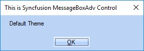 

**Metro:**

This option helps to set the Metro theme.





MessageBoxAdv.MessageBoxStyle = MessageBoxAdv.Style.Metro;
MessageBoxAdv.Show("Metro Theme","This is Syncfusion MessageBoxAdv Control", MessageBoxButtons.OK);





MessageBoxAdv.MessageBoxStyle = MessageBoxAdv.Style.Metro
MessageBoxAdv.Show("Metro Theme", "This is Syncfusion MessageBoxAdv Control", MessageBoxButtons.OK)





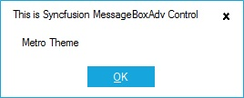 

**Office2007Theme**

Office2007 Style Message Box is available in Tools Windows. You can replace the .NET MessageBox with new MessageBoxAdv that supports standard color schemes and custom color schemes in Office 2007 style, for consistent look and feel. Custom Icons support is also included in MessageBoxAdv. To display the Message Box, call MessageBoxAdv.Show method.

This option helps to set the various color schemes such as

•	Black

•	Blue

•	Silver

•	Managed

**Black:**

This option helps to set the Black theme





MessageBoxAdv.Office2007Theme = Office2007Theme.Black;
MessageBoxAdv.Show("Office 2007Theme", "This is Syncfusion MessageBoxAdv Control", MessageBoxButtons.OK);





MessageBoxAdv.Office2007Theme = Office2007Theme.Black
MessageBoxAdv.Show("Office 2007Theme", "This is Syncfusion MessageBoxAdv Control", MessageBoxButtons.OK)





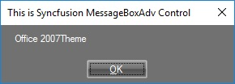 

 
**Blue**

This option helps to set the Blue color scheme in office2007 theme





MessageBoxAdv.Office2007Theme = Office2007Theme.Blue;
MessageBoxAdv.Show("Office 2007Theme", "This is Syncfusion MessageBoxAdv Control", MessageBoxButtons.OK);





MessageBoxAdv.Office2007Theme = Office2007Theme.Blue
MessageBoxAdv.Show("Office 2007Theme", "This is Syncfusion MessageBoxAdv Control", MessageBoxButtons.OK)





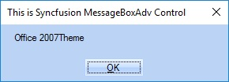 

**Silver**

This option helps to set the Silver color scheme in Office2007 theme.





MessageBoxAdv.Office2007Theme = Office2007Theme.Silver;
MessageBoxAdv.Show("Office 2007Theme", "This is Syncfusion MessageBoxAdv Control", MessageBoxButtons.OK);





MessageBoxAdv.Office2007Theme = Office2007Theme.Silver
MessageBoxAdv.Show("Office 2007Theme", "This is Syncfusion MessageBoxAdv Control", MessageBoxButtons.OK)





 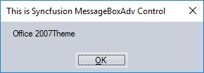 

**Managed**

This option helps to set the customize color scheme in office2007theme.





MessageBoxAdv.Office2007Theme = Office2007Theme.Managed;
Office2007Colors.ApplyManagedColors(this, Color.Red);
MessageBoxAdv.Show("Office 2007Theme", "This is Syncfusion MessageBoxAdv Control", MessageBoxButtons.OK);





MessageBoxAdv.Office2007Theme = Office2007Theme.Managed
Office2007Colors.ApplyManagedColors(this, Color.Red)
MessageBoxAdv.Show("Office 2007Theme", "This is Syncfusion MessageBoxAdv Control", MessageBoxButtons.OK)





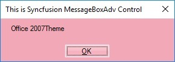 

**Office2010Theme**

This option helps to set the various color schemes such as

•	Black

•	Blue

•	Silver

•	Managed

**Black**

This option helps to set the black color scheme in Office2010Theme.





MessageBoxAdv.Office2010Theme = Office2010Theme.Black;
MessageBoxAdv.MessageBoxStyle = MessageBoxAdv.Style.Office2010;
MessageBoxAdv.Show("Office 2010 Theme", "This is Syncfusion MessageBoxAdv Control", MessageBoxButtons.OK);





MessageBoxAdv.Office2010Theme = Office2010Theme.Black
MessageBoxAdv.MessageBoxStyle = MessageBoxAdv.Style.Office2010
MessageBoxAdv.Show("Office 2010 Theme", "This is Syncfusion MessageBoxAdv Control", MessageBoxButtons.OK)




 
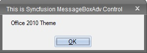 

**Blue**

This option helps to set the Blue color scheme in Office2010Theme.





MessageBoxAdv.Office2010Theme = Office2010Theme.Blue;
MessageBoxAdv.MessageBoxStyle = MessageBoxAdv.Style.Office2010;
MessageBoxAdv.Show("Office 2010 Theme", "This is Syncfusion MessageBoxAdv Control", MessageBoxButtons.OK);





MessageBoxAdv.Office2010Theme = Office2010Theme.Blue
MessageBoxAdv.MessageBoxStyle = MessageBoxAdv.Style.Office2010
MessageBoxAdv.Show("Office 2010 Theme", "This is Syncfusion MessageBoxAdv Control", MessageBoxButtons.OK)





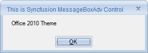 

 
**Silver**

This option helps to set the silver color scheme in Office2010Theme.





MessageBoxAdv.Office2010Theme = Office2010Theme.Silver;
MessageBoxAdv.MessageBoxStyle = MessageBoxAdv.Style.Office2010;
MessageBoxAdv.Show("Office 2010 Theme", "This is Syncfusion MessageBoxAdv Control", MessageBoxButtons.OK);





MessageBoxAdv.Office2010Theme = Office2010Theme.Silver
MessageBoxAdv.MessageBoxStyle = MessageBoxAdv.Style.Office2010
MessageBoxAdv.Show("Office 2010 Theme", "This is Syncfusion MessageBoxAdv Control", MessageBoxButtons.OK)





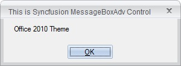 

**Office2010 Managed:**

This option helps to set the customized color scheme in Office2010Theme.





MessageBoxAdv.Office2010Theme = Office2010Theme.Managed;
Office2010Colors.ApplyManagedColors(this, Color.Red);
MessageBoxAdv.MessageBoxStyle = MessageBoxAdv.Style.Office2010;
MessageBoxAdv.Show("Office 2010 Style with Custom Color Scheme", "This is Syncfusion MessageBoxAdv Control", MessageBoxButtons.OK);





MessageBoxAdv.Office2010Theme = Office2010Theme.Managed
Office2010Colors.ApplyManagedColors(this, Color.Red)
MessageBoxAdv.MessageBoxStyle = MessageBoxAdv.Style.Office2010
MessageBoxAdv.Show("Office 2010 Style with Custom Color Scheme", "This is Syncfusion MessageBoxAdv Control", MessageBoxButtons.OK)





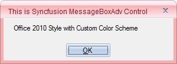 

**Office2013Theme:**

This option helps to set the various color schemes in Office2013Theme such as

•	DarkGray

•	LightGray

•	White

**DarkGray**

This option helps to set the DarkGray color scheme in Office2013Theme.





MessageBoxAdv.Office2013Theme = Office2013Theme.DarkGray;
MessageBoxAdv.MessageBoxStyle = MessageBoxAdv.Style.Office2013;
MessageBoxAdv.Show("Office 2013 Theme", "This is Syncfusion MessageBoxAdv Control", MessageBoxButtons.OK);





MessageBoxAdv.Office2013Theme = Office2013Theme.DarkGray
MessageBoxAdv.MessageBoxStyle = MessageBoxAdv.Style.Office2013
MessageBoxAdv.Show("Office 2013 Theme", "This is Syncfusion MessageBoxAdv Control", MessageBoxButtons.OK)





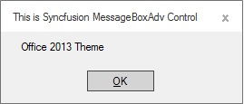 

**LightGray**

This option helps to set the LightGray color in Office2013Theme.





MessageBoxAdv.Office2013Theme = Office2013Theme.LightGray;
MessageBoxAdv.MessageBoxStyle = MessageBoxAdv.Style.Office2013;
MessageBoxAdv.Show("Office 2013 Theme", "This is Syncfusion MessageBoxAdv Control", MessageBoxButtons.OK);





MessageBoxAdv.Office2013Theme = Office2013Theme.LightGray
MessageBoxAdv.MessageBoxStyle = MessageBoxAdv.Style.Office2013
MessageBoxAdv.Show("Office 2013 Theme", "This is Syncfusion MessageBoxAdv Control", MessageBoxButtons.OK)




 
 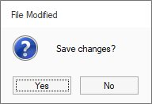 

**White Theme**

This option helps to set the white color scheme in office2013Theme.





MessageBoxAdv.Office2013Theme = Office2013Theme.White;
MessageBoxAdv.MessageBoxStyle = MessageBoxAdv.Style.Office2013;
MessageBoxAdv.Show("Office 2013 Theme", "This is Syncfusion MessageBoxAdv Control", MessageBoxButtons.OK);





MessageBoxAdv.Office2013Theme = Office2013Theme.White
MessageBoxAdv.MessageBoxStyle = MessageBoxAdv.Style.Office2013
MessageBoxAdv.Show("Office 2013 Theme", "This is Syncfusion MessageBoxAdv Control", MessageBoxButtons.OK)





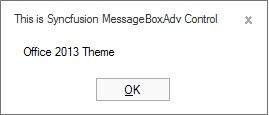 

**Office2016Theme**

This option helps to set the various color schemes in Office2016Themesuch as

•	Colorful

•	DarkGray

•	White

**Colorful**

This scheme helps to set the Colorful scheme in Office2016Theme.





MessageBoxAdv.Office2016Theme = Office2016Theme.Colorful;
MessageBoxAdv.MessageBoxStyle = MessageBoxAdv.Style.Office2016;
MessageBoxAdv.Show("Office 2016 Theme", "This is Syncfusion MessageBoxAdv Control", MessageBoxButtons.OK);





MessageBoxAdv.Office2016Theme = Office2016Theme.Colorful
MessageBoxAdv.MessageBoxStyle = MessageBoxAdv.Style.Office2016
MessageBoxAdv.Show("Office 2016 Theme", "This is Syncfusion MessageBoxAdv Control", MessageBoxButtons.OK)





 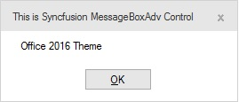 

**Dark**

This option helps to set the Dark color scheme in Office2016Theme.





MessageBoxAdv.Office2016Theme = Office2016Theme.DarkGray;
MessageBoxAdv.MessageBoxStyle = MessageBoxAdv.Style.Office2016;
MessageBoxAdv.Show("Office 2016 Theme", "This is Syncfusion MessageBoxAdv Control", MessageBoxButtons.OK);





MessageBoxAdv.Office2016Theme = Office2016Theme.DarkGray
MessageBoxAdv.MessageBoxStyle = MessageBoxAdv.Style.Office2016
MessageBoxAdv.Show("Office 2016 Theme", "This is Syncfusion MessageBoxAdv Control", MessageBoxButtons.OK)





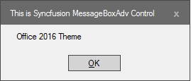 

 

**White**

This option helps to set the White color scheme in Office2016Theme.





MessageBoxAdv.Office2016Theme = Office2016Theme.White;
MessageBoxAdv.MessageBoxStyle = MessageBoxAdv.Style.Office2016;
MessageBoxAdv.Show("Office 2016 Theme", "This is Syncfusion MessageBoxAdv Control", MessageBoxButtons.OK);





MessageBoxAdv.Office2016Theme = Office2016Theme.White
MessageBoxAdv.MessageBoxStyle = MessageBoxAdv.Style.Office2016
MessageBoxAdv.Show("Office 2016 Theme", "This is Syncfusion MessageBoxAdv Control", MessageBoxButtons.OK)




 
 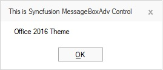 

**Metro**

In MessageBoxAdv, MetroColorTable is implemented for color customization of buttons and caption of metro form.
MetroStyleColorTable
The MetroStyleColor table helps to customize the buttons, captions and text color in MessageBoxAdv. MessageBoxAdv can be customized by using the following properties.

<table>
<tr>
<th>
MetroStyleColorTable Property</th><th>
Description</th></tr>
<tr>
<td>
ForeColor</td><td>
Gets or sets the fore color.</td></tr>
<tr>
<td>
BackColor</td><td>
Gets or sets the back color.</td></tr>
<tr>
<td>
BorderColor</td><td>
Gets or sets the border color.</td></tr>
<tr>
<td>
CancelButtonBackColor</td><td>
Gets or sets the CancelButtonBackColor.</td></tr>
<tr>
<td>
CaptionBarColor</td><td>
Gets or sets the caption bar color.</td></tr>
<tr>
<td>
CaptionForeColor</td><td>
Gets or sets the caption fore color.</td></tr>
<tr>
<td>
CloseButtonColor</td><td>
Gets or sets the CloseButton back color.</td></tr>
<tr>
<td>
CloseButtonHoverColor</td><td>
Gets or sets the CloseButton hover color.</td></tr>
<tr>
<td>
AbortButtonBackColor</td><td>
Gets or sets the AbortButtonBackColor.</td></tr>
<tr>
<td>
IgnoreButtonBackColor</td><td>
Gets or sets the IgnoreButtonBackColor.</td></tr>
<tr>
<td>
NoButtonBackColor</td><td>
Gets or sets the NoButtonBackColor.</td></tr>
<tr>
<td>
OKButtonBackColor</td><td>
Gets or sets the OKButtonBackColor.</td></tr>
<tr>
<td>
RetryButtonBackColor</td><td>
Gets or sets the RetryButtonBackColor.</td></tr>
<tr>
<td>
YesButtonBackColor</td><td>
Gets or sets the YesButtonBackColor.</td></tr>
</table>

You can achieve this by using the following code example.





MessageBoxAdv.MessageBoxStyle = MessageBoxAdv.Style.Metro;
MessageBoxAdv.MetroColorTable.NoButtonBackColor = Color.FromArgb(22, 165, 220);
MessageBoxAdv.MetroColorTable.YesButtonBackColor = Color.FromArgb(22, 165, 220);
MessageBoxAdv.MetroColorTable.CancelButtonBackColor = Color.FromArgb(22, 165, 220);
MessageBoxAdv.MetroColorTable.BackColor = Color.White;
MessageBoxAdv.MetroColorTable.BorderColor = Color.FromArgb(22, 165, 220);
MessageBoxAdv.MetroColorTable.CaptionBarColor = Color.FromArgb(22, 165, 220);
MessageBoxAdv.MetroColorTable.CaptionForeColor = Color.Black;
MessageBoxAdv.MetroColorTable.ForeColor = Color.Red;





MessageBoxAdv.MessageBoxStyle = MessageBoxAdv.Style.Metro
MessageBoxAdv.MetroColorTable.NoButtonBackColor = Color.FromArgb(22, 165, 220)
MessageBoxAdv.MetroColorTable.YesButtonBackColor = Color.FromArgb(22, 165, 220)
MessageBoxAdv.MetroColorTable.CancelButtonBackColor = Color.FromArgb(22, 165, 220)
MessageBoxAdv.MetroColorTable.BackColor = Color.White
MessageBoxAdv.MetroColorTable.BorderColor = Color.FromArgb(22, 165, 220)
MessageBoxAdv.MetroColorTable.CaptionBarColor = Color.FromArgb(22, 165, 220)
MessageBoxAdv.MetroColorTable.CaptionForeColor = Color.Black
MessageBoxAdv.MetroColorTable.ForeColor = Color.Red





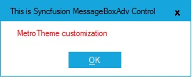 

