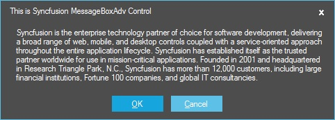
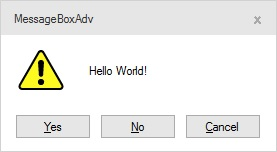
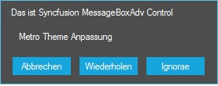

# Feature

This section explains all the design time feature of MessageBoxAdv.

## Details Pane

This pane helps to view the detail message about the text shown in the MessageBoxAdv.

**Details View**





//Details Pane

result = MessageBoxAdv.Show(this,"Hello World!", CaptionText, MessageBoxButtons.OK, SelectedIcon, SelectedIcon.Size,"details");




'Details Pane

result = MessageBoxAdv.Show(Me,"Hello World!", CaptionText, MessageBoxButtons.OK, SelectedIcon, SelectedIcon.Size,"details")





Ex: Detail Pane Figure

 

Eg: Collapsed Pane

 

## Button Support

By default, the MessageBox only has the one Ok button, but this can be changed, in case you want to ask your user a question and not just show a piece of information. Also notice how I use multiple lines in this message, by using a line break character (\n):
You control which buttons are displayed by using a value from the **MessageBoxButtons** enumeration - in this case, a Yes, No and Cancel button is included. The following values, which should be self-explanatory, can be used:

•	Ok

•	OkCancel

•	YesNo

•	YesNoCancel

•	RetryCancel

•	AbortRetryIgnore

**Ok**

This option helps to show the MessageBoxAdv with Ok Button.





//MessageBox with Ok Button
MessageBoxAdv.Show("Metro Theme Customization", "This is Syncfusion MessageBoxAdv Control", MessageBoxButtons.OK);





'MessageBox with Ok Button
MessageBoxAdv.Show("Metro Theme Customization", "This is Syncfusion MessageBoxAdv Control", MessageBoxButtons.OK)





 
 
**OkCancel**

This option helps to show the MessageBoxAdv with combination of Ok and Cancel Button.





//MessageBox with combination of Ok,Cancel Button
MessageBoxAdv.Show("Metro Theme Customization", "This is Syncfusion MessageBoxAdv Control", MessageBoxButtons.OKCancel);





'MessageBox with combination of Ok,Cancel Button
MessageBoxAdv.Show("Metro Theme Customization", "This is Syncfusion MessageBoxAdv Control", MessageBoxButtons.OKCancel)




 
  

**YesNo**

This option helps to show the MessageBoxAdv with combination of  Yes and No Button.





//MessageBox with combination of Yes and No Button
MessageBoxAdv.Show("Metro Theme Customization", "This is Syncfusion MessageBoxAdv Control", MessageBoxButtons.YesNo);





'MessageBox with combination of Yes And No Button
MessageBoxAdv.Show("Metro Theme Customization", "This is Syncfusion MessageBoxAdv Control", MessageBoxButtons.YesNo)



 

 

**YesNoCancel**

This option helps to show the MessageBoxAdv with combination of Yes,No and Cancel Button.





//MessageBox with combination of Yes,No and Cancel Button
MessageBoxAdv.Show("Metro Theme Customization", "This is Syncfusion MessageBoxAdv Control", MessageBoxButtons.YesNoCancel);





'MessageBox with combination of Yes,No And Cancel Button
MessageBoxAdv.Show("Metro Theme Customization", "This is Syncfusion MessageBoxAdv Control", MessageBoxButtons.YesNoCancel)





 
 
**RetryCancel**

This option helps to show the MessageBoxAdv with combination of Retry and Cancel Button.





//MessageBox with combination of Retry and Cancel Button
MessageBoxAdv.Show("Metro Theme Customization", "This is Syncfusion MessageBoxAdv Control", MessageBoxButtons.RetryCancel);





'MessageBox with combination of Retry And Cancel Button
MessageBoxAdv.Show("Metro Theme Customization", "This is Syncfusion MessageBoxAdv Control", MessageBoxButtons.RetryCancel)





 

**AbortRetryIgnore**

This option helps to show the MessageBoxAdv with combination of Abort, Retry and Ignore Button.





//MessageBox with combination of Abort,Retry and Ignore Button
MessageBoxAdv.Show("Metro Theme Customization", "This is Syncfusion MessageBoxAdv Control", MessageBoxButtons.AbortRetryIgnore);





'MessageBox with combination of Abort,Retry And Ignore Button
MessageBoxAdv.Show("Metro Theme Customization", "This is Syncfusion MessageBoxAdv Control", MessageBoxButtons.AbortRetryIgnore)





 

## Icon Customization

MessageBoxAdv control provides support to add the custom image. It can be shown or invoked using the MessageBoxAdv show method.





//Icon Support

MessageBoxAdv.Show("Metro Theme Customization", "This is Syncfusion MessageBoxAdv Control", MessageBoxButtons.OKCancel,this.imageListAdv1.Images[0],new Size(50, 50));





'Icon Support

MessageBoxAdv.Show("Metro Theme Customization", "This is Syncfusion MessageBoxAdv Control", MessageBoxButtons.OKCancel,this.imageListAdv1.Images[0],new Size(50, 50))





 

## MultiLineText Support

MessageBoxAdv provides MultiLine support to display the multiple lines of Text. It can be achieved using the Show method and multiple lines of text provided in it.





 MessageBoxAdv.Show("Lorem ipsum dolor sit amet, lacus amet amet ultricies. Quisque mi venenatis morbi libero, orci dis, mi ut et class porta, massa ligula magna enim, aliquam orci vestibulum tempus. Turpis facilisis vitae consequat, cum a a, turpis dui consequat massa in dolor per, felis non amet. Auctor eleifend in omnis elit vestibulum, donec non elementum tellus est mauris, id aliquam, at lacus, arcu pretium proin lacus dolor et. Eu tortor, vel ultrices amet dignissim mauris vehicula. Lorem tortor neque, purus taciti quis id. Elementum integer orci accumsan minim phasellus vel.", "This is Syncfusion MessageBoxAdv Control", MessageBoxButtons.OKCancel);





 MessageBoxAdv.Show("Lorem ipsum dolor sit amet, lacus amet amet ultricies. Quisque mi venenatis morbi libero, orci dis, mi ut et class porta, massa ligula magna enim, aliquam orci vestibulum tempus. Turpis facilisis vitae consequat, cum a a, turpis dui consequat massa in dolor per, felis non amet. Auctor eleifend in omnis elit vestibulum, donec non elementum tellus est mauris, id aliquam, at lacus, arcu pretium proin lacus dolor et. Eu tortor, vel ultrices amet dignissim mauris vehicula. Lorem tortor neque, purus taciti quis id. Elementum integer orci accumsan minim phasellus vel.", "This is Syncfusion MessageBoxAdv Control", MessageBoxButtons.OKCancel)




 
 

## Right To left Support

MessageBoxAdv support the RightToLeft support which aligns the content of the messageboxadv in right to left manner or Left to Right Manner.





MessageBoxAdv.RightToLeft = RightToLeft.Yes;
MessageBoxAdv.Show("Right To Left support","This is Syncfusion MessageBoxAdv Control", MessageBoxButtons.OK);





MessageBoxAdv.RightToLeft = RightToLeft.Yes
MessageBoxAdv.Show("Right To Left support", "This is Syncfusion MessageBoxAdv Control", MessageBoxButtons.OK)





 

## Dialog Result

This support helps to display the result of the MessageBoxButton .





CustomButtons = new string[] { "Okay", "Cancel", "Help" };
DlgRtTxtBox.Text = CustomButtons[clickedIndex - 1];





CustomButtons = New String()
{
"Okay", "Cancel", "Help"
}

DlgRtTxtBox.Text = CustomButtons(clickedIndex - 1)





 

 

## Localization Support

Localization is the process of making application multilingual by formatting the content according to the cultures. MessageBoxAdv control can be localized in any Languages, based on application requirement by following below steps.

Step 1: Need to initialize the LocalizationProvider class, inherited from the ILocalizationProvider interface, before the initializeComponent call in the constructor of an application.

Step 2: It will add the GetLocalizedString function in the LocalizationProvider class.It is needed to provide the Localization content, for the required components used in MessageBoxAdv control.

For example:
Here, MessageBoxAdv control is localized in German Language.
The following code demonstrates the same:





//Call the Localizer
LocalizationProvider.Provider = new Localizer();
MessageBoxAdv.Show("Metro Theme Anpassung", "Das ist Syncfusion MessageBoxAdv Control", MessageBoxButtons.AbortRetryIgnore);

// localizer inherits the interface ILocationProvider
public class Localizer : ILocalizationProvider
{
#region ILocalizationProvider Members

public string GetLocalizedString(System.Globalization.CultureInfo culture, string name,object obj)
{
switch (name)
{

#region MessageBoxAdv

///

///Retry Button in German Language
///

case ResourceIdentifiers.Retry:
return "Wiederholen";

///

///Abort Button in German Language
///

///
case ResourceIdentifiers.Abort:
return "Abbrechen";

///

///Ignore Button in German Language
///

case ResourceIdentifiers.Ignore:
return "Ignorae";

///

/// default
///

default:
return string.Empty;
#endregion
}
}

#endregion
}





' call the localizer
LocalizationProvider.Provider = New Localizer()
'MessageBox show
MessageBoxAdv.Show("Metro Theme Anpassung", "Das ist Syncfusion MessageBoxAdv Control", MessageBoxButtons.AbortRetryIgnore)
'localizer inherits the interface of ILocationProvider
Public Class Localizer
Implements ILocalizationProvider

'MessageBoxAdv Localization
#Region "ILocalizationProvider MemberS"

Public Function GetLocalizedString(ByVal culture As System.Globalization.CultureInfo, ByVal name As String, ByVal obj As Object) As String Implements ILocalizationProvider.GetLocalizedString
Select Case name

'''

'''Retry Button in German Language
'''

Case ResourceIdentifiers.Retry
Return "Wiederholen"

'''

'''Abort Button in German Language
'''

Case ResourceIdentifiers.Abort
Return "Abbrechen"

'''

'''Ignore Button in German Language
'''

Case ResourceIdentifiers.Ignore
Return "ignorieren"
'''

''' default
'''

Case Else
Return String.Empty

End Select
End Function

#End Region
End Class





 