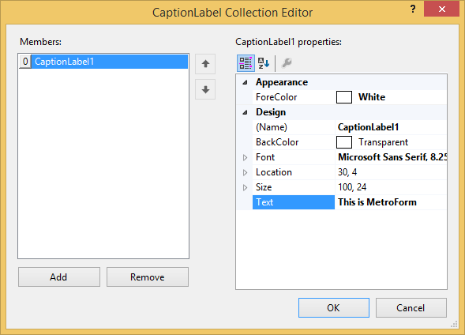
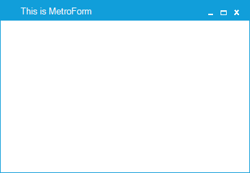
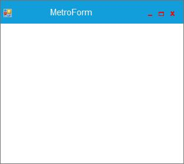

# Customization in Windows Forms Metro Form

## Caption label

Caption label can be added to the MetroForm through designer or code.

### Through designer

1) Labels can be added to the CaptionBar using `CaptionLabels` collection property.

2) Add Labels through collection editor window.

### Through code

The following code sample shows how to add a Label to the MetroForm.





Syncfusion.Windows.Forms.CaptionLabel captionLabel1 = new Syncfusion.Windows.Forms.CaptionLabel();

captionLabel1.Font = new System.Drawing.Font("Microsoft Sans Serif", 10F, System.Drawing.FontStyle.Regular, System.Drawing.GraphicsUnit.Point, ((byte)(0)));

captionLabel1.ForeColor = System.Drawing.Color.White;

captionLabel1.Name = "CaptionLabel1";

captionLabel1.Size = new System.Drawing.Size(400, 24);

captionLabel1.Text = "This is MetroForm";

this.CaptionLabels.Add(captionLabel1);





Dim captionLabel1 As Syncfusion.Windows.Forms.CaptionLabel = New Syncfusion.Windows.Forms.CaptionLabel

captionLabel1.Font = new System.Drawing.Font("Microsoft Sans Serif", 10F, System.Drawing.FontStyle.Regular, System.Drawing.GraphicsUnit.Point, ((byte)(0)))

captionLabel1.ForeColor = System.Drawing.Color.White

captionLabel1.Name = "CaptionLabel1"

captionLabel1.Size = new System.Drawing.Size(400, 24)

captionLabel1.Text = "This is MetroForm"

Me.CaptionLabels.Add(captionLabel1)





## Caption images

Caption images can be added to the MetroForm through designer or code.

### Through designer

1) Images can be added to the CaptionBar using CaptionImages collection property.

2) Add images through collection editor window.

3) Image can be added to the CaptionImage using Image property in Collection Editor.

### Through code

The following code sample shows how to add an image to the caption bar of the Metro form.





Syncfusion.Windows.Forms.CaptionImage captionImage1 = new Syncfusion.Windows.Forms.CaptionImage();

captionImage1.BackColor = System.Drawing.Color.Transparent;

captionImage1.Image = global::MetroStyleControls_2008.Properties.Resources.RBNormal;

captionImage1.Location = new System.Drawing.Point(30, 5);

captionImage1.Name = "CaptionImage1";

captionImage1.Size = new System.Drawing.Size(50, 50);

this.CaptionImages.Add(captionImage1);





Dim captionImage1 As Syncfusion.Windows.Forms.CaptionImage = New Syncfusion.Windows.Forms.CaptionImage

captionImage1.BackColor = System.Drawing.Color.Transparent

captionImage1.Image = MetroStyleControls_2008.Properties.Resources.RBNormal

captionImage1.Location = New System.Drawing.Point(30, 5)

captionImage1.Name = "CaptionImage1"

captionImage1.Size = New System.Drawing.Size(50, 50)

Me.CaptionImages.Add(captionImage1)





## Caption fore color

Caption fore color can be customized using `CaptionForeColor` property.





 this.CaptionForeColor = System.Drawing.Color.Black;





 Me.CaptionForeColor = System.Drawing.Color.Black
 




## Caption font

Font of the caption can be customized using `CaptionFont` property.





this.CaptionFont = new System.Drawing.Font("Calisto MT", 14.25F, System.Drawing.FontStyle.Bold, System.Drawing.GraphicsUnit.Point, ((byte)(0)));





Me.CaptionFont = new System.Drawing.Font("Calisto MT", 14.25F, System.Drawing.FontStyle.Bold, System.Drawing.GraphicsUnit.Point, ((byte)(0)))
 




## Caption button color

Caption button color can be customized using `CaptionButtonColor` property.





this.CaptionButtonColor = System.Drawing.Color.Red;





Me.CaptionButtonColor = System.Drawing.Color.Red
 




## Caption button hover color

Caption button hover color can be customized using `CaptionButtonHoverColor` property.





this.CaptionButtonHoverColor = System.Drawing.Color.Lime;





Me.CaptionButtonHoverColor = System.Drawing.Color.Lime
 




## Caption bar background

User can customize the Brush effects in Caption Bar using the event CaptionBarPaint and the property CaptionBarBrush.





// Applied Gradient effects in Caption Bar.
this.CaptionBarBrush = new LinearGradientBrush(new Rectangle(0, 0, this.Width, this.CaptionBarHeight), Color.DarkRed, Color.Yellow, LinearGradientMode.BackwardDiagonal);

// Event to customize the Caption Bar
this.CaptionBarPaint += new PaintEventHandler(Form1_CaptionBarPaint);

// Event to overdraw Caption Bar appearance
void Form1_CaptionBarPaint(object sender, PaintEventArgs e)
{
     e.Graphics.FillRectangle(new LinearGradientBrush(e.ClipRectangle, Color.DarkRed, Color.Yellow, LinearGradientMode.BackwardDiagonal), e.ClipRectangle);
}





' Applied Gradient effects in Caption Bar. 
Me.CaptionBarBrush = New LinearGradientBrush(New Rectangle(0, 0, Me.Width, Me.CaptionBarHeight), Color.DarkRed, Color.Yellow, LinearGradientMode.BackwardDiagonal)

' Event to customize the Caption Bar
Me.CaptionBarPaint += New PaintEventHandler(Form1_CaptionBarPaint)

' Event to overdraw Caption Bar appearance
Private Sub Form1_CaptionBarPaint(sender As Object, e As PaintEventArgs)
	e.Graphics.FillRectangle(New LinearGradientBrush(e.ClipRectangle, Color.DarkRed, Color.Yellow, LinearGradientMode.BackwardDiagonal), e.ClipRectangle)
End Sub

 




## Mouse events for caption image

### ImageMouseDown event

The ImageMouseDown event is raised when the mouse pointer is over the caption image and a mouse button is pressed.

### ImageMouseUp event

The ImageMouseUp event is raised when the mouse pointer is over the caption image and a mouse button is released.

### ImageMouseEnter event

The ImageMouseEnter event is raised when the mouse pointer enters the caption image.

### ImageMouseLeave event

The ImageMouseLeave event is raised when the mouse pointer leaves the caption image.

### ImageMouseMove event

The ImageMouseMove event is raised when the mouse pointer moves within the caption image.

#### Event data

The MouseEventHandler receives an argument of type MouseEventArgs that contains data related to this event. The following MouseEventArgs members provide information specific to this event.

<table>
<tr>
<th>
Members</th><th>
Description</th></tr>
<tr>
<td>
Button</td><td>
Gets which mouse button was pressed.</td></tr>
<tr>
<td>
Clicks</td><td>
Gets the number of times the mouse button was pressed and released.</td></tr>
<tr>
<td>
Delta</td><td>
Gets a signed count of the number of detentes the mouse wheel has rotated. A detentes is one notch of the mouse wheel.</td></tr>
<tr>
<td>
Location</td><td>
Gets the location of the mouse when generating mouse events.</td></tr>
<tr>
<td>
X</td><td>
Gets the x-coordinate of the mouse when generating mouse events.</td></tr>
<tr>
<td>
Y</td><td>
Gets the y-coordinate of the mouse when generating mouse events.</td></tr>
<tr>
<td>
Size</td><td>
Gets or sets the size for caption image.</td></tr>
<tr>
<td>
Back Color</td><td>
Gets or sets the background color for the caption image.</td></tr>
<tr>
<td>
Image</td><td>
Gets or sets the image for the caption image.</td></tr>
</table>





foreach (CaptionImage image in this.CaptionImages)
{

     image.ImageMouseUp += new CaptionImage.MouseUp(image_ImageMouseUp);

	 image.ImageMouseDown += new CaptionImage.MouseDown(image_ImageMouseDown);

	 image.ImageMouseMove+= new CaptionImage.MouseMove(image_ImageMouseMove);

	 image.ImageMouseEnter += new CaptionImage.MouseEnter(image_ImageMouseEnter);

	 image.ImageMouseLeave += new CaptionImage.MouseLeave(image_ImageMouseLeave);

}

void image_ImageMouseUp(object sender, ImageMouseUpEventArgs e)
{
   Console.WriteLine("Mouse up event has been raised");
}

void image_ImageMouseDown(object sender, ImageMouseDownEventArgs e)
{
   Console.WriteLine("Mouse down event has been raised");
}

void image_ImageMouseMove(object sender, ImageMouseMoveEventArgs e)
{
   Console.WriteLine("Mouse move event has been raised");
}

void image_ImageMouseEnter(object sender, ImageMouseEnterEventArgs e)
{
   Console.WriteLine("Mouse enter event has been raised");
}

void image_ImageMouseLeave(object sender, ImageMouseLeaveEventArgs e)
{
   Console.WriteLine("Mouse leave event has been raised");
}





For Each image As CaptionImage In Me.CaptionImages

    image.ImageMouseUp = (image.ImageMouseUp + New CaptionImage.MouseUp(image_ImageMouseUp))

    image.ImageMouseDown = (image.ImageMouseDown + New CaptionImage.MouseDown(image_ImageMouseDown))

    image.ImageMouseMove = (image.ImageMouseMove + New CaptionImage.MouseMove(image_ImageMouseMove))

    image.ImageMouseEnter = (image.ImageMouseEnter + New CaptionImage.MouseEnter(image_ImageMouseEnter))

    image.ImageMouseLeave = (image.ImageMouseLeave + New CaptionImage.MouseLeave(image_ImageMouseLeave))

Next

Private Sub image_ImageMouseUp(ByVal sender As Object, ByVal e As ImageMouseUpEventArgs)
    Console.WriteLine("Mouse up event has been raised")
End Sub

Private Sub image_ImageMouseDown(ByVal sender As Object, ByVal e As ImageMouseDownEventArgs)
    Console.WriteLine("Mouse down event has been raised")
End Sub

Private Sub image_ImageMouseMove(ByVal sender As Object, ByVal e As ImageMouseMoveEventArgs)
    Console.WriteLine("Mouse move event has been raised")
End Sub

Private Sub image_ImageMouseEnter(ByVal sender As Object, ByVal e As ImageMouseEnterEventArgs)
    Console.WriteLine("Mouse enter event has been raised")
End Sub

Private Sub image_ImageMouseLeave(ByVal sender As Object, ByVal e As ImageMouseLeaveEventArgs)
    Console.WriteLine("Mouse leave event has been raised")
End Sub



