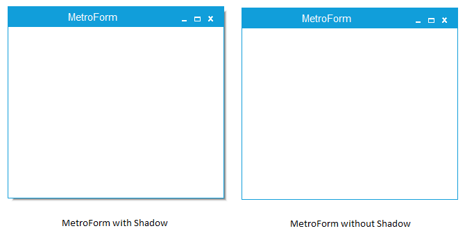

---
layout: post
title: How to Enable Shadow in Windows Forms MetroForm | Syncfusion®
description: Enable or disable shadow effects in Syncfusion® Windows Forms MetroForm using the DropShadow property, appearance settings, and more.
platform: WindowsForms
control: MetroForm
documentation: ug
---

# How to Enable Shadow in Windows Forms MetroForm

Shadow of the MetroForm can be enabled or disabled using the `DropShadow` property.





this.DropShadow = false ;





 Me.DropShadow = false 
 




 
