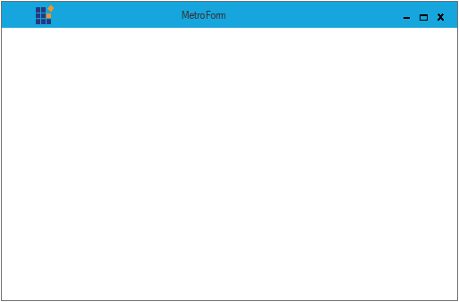

# Getting Started with Windows Forms Metro Form

This section describes how to configure `MetroForm` control in a Windows Forms application and overview of its basic functionalities.

## Assembly deployment

Refer [control dependencies](https://help.syncfusion.com/windowsforms/control-dependencies#metroform) section to get the list of assemblies or NuGet package needs to be added as reference to use the control in any application.
 
Please find more details regarding how to install the nuget packages in windows form application in the below link:
 
[How to install nuget packages](https://help.syncfusion.com/windowsforms/installation/install-nuget-packages)

## Creating simple application with MetroForm

You can create the Windows Forms application with MetroForm control as follows:

1. [Creating project](#creating-the-project)
2. [Configure MetroForm](#configure-metroForm)
3. [Add Caption Labels](#add-caption-labels)
3. [Add Caption Images](#add-caption-images)

## Creating the project

Create a new Windows Forms project in the Visual Studio to change the default form into MetroForm.

## Configure MetroForm

`MetroForm` is an advanced standard Form, we can configure it by following the given steps:

**Step 1** - Add the following required assembly references to the project:

* Syncfusion.Shared.Base.dll	

**Step 2** - Include the namespaces **Syncfusion.Windows.Forms**.





using Syncfusion.Windows.Forms;





Imports Syncfusion.Windows.Forms




   
**Step 3** - Change the class to inherit MetroForm instead of the default Form as follows.





public partial class MetroForm : MetroForm 





Partial Public Class MetroForm Inherits MetroForm
 


 
   

## Add Caption Labels

The `MetroForm` allows you to add caption labels with design and appearance. Caption labels can be added to the MetroForm through the `CaptionLabels`collection.

Following code illustrates how to add the caption labels to the MetroForm:





// Add caption labels for MetroForm

Syncfusion.Windows.Forms.CaptionLabel captionLabel1 = new Syncfusion.Windows.Forms.CaptionLabel();

captionLabel1.Font = new System.Drawing.Font("Microsoft Sans Serif", 10F, System.Drawing.FontStyle.Regular, System.Drawing.GraphicsUnit.Point, ((byte)(0)));

captionLabel1.ForeColor = System.Drawing.Color.White;

captionLabel1.Name = "CaptionLabel1";

captionLabel1.Size = new System.Drawing.Size(400, 24);

captionLabel1.Text = "Label";

this.CaptionLabels.Add(captionLabel1);





' Add caption labels for MetroForm

Dim captionLabel1 As Syncfusion.Windows.Forms.CaptionLabel = New Syncfusion.Windows.Forms.CaptionLabel

captionLabel1.Font = new System.Drawing.Font("Microsoft Sans Serif", 10F, System.Drawing.FontStyle.Regular, System.Drawing.GraphicsUnit.Point, ((byte)(0)))

captionLabel1.ForeColor = System.Drawing.Color.White

captionLabel1.Name = "CaptionLabel1"

captionLabel1.Size = new System.Drawing.Size(400, 24)

captionLabel1.Text = "Label"

Me.CaptionLabels.Add(captionLabel1)



 

## Add Caption Images

The `MetroForm` allows you to add caption images with design and appearance. Caption images can be added to the MetroForm through the `CaptionImages`collection.
Following code illustrates how to add the caption images to the MetroForm:





// Add caption image for MetroForm

Syncfusion.Windows.Forms.CaptionImage captionImage1 = new Syncfusion.Windows.Forms.CaptionImage();

captionImage1.BackColor = System.Drawing.Color.Transparent;

captionImage1.Image = ((System.Drawing.Image)(resources.GetObject("captionImage1.Image")));

captionImage1.Location = new System.Drawing.Point(30, 5);

captionImage1.Name = "CaptionImage1";

captionImage1.Size = new System.Drawing.Size(35, 35);

this.CaptionImages.Add(captionImage1);





' Add caption image for MetroForm

Dim captionImage1 As Syncfusion.Windows.Forms.CaptionImage = New Syncfusion.Windows.Forms.CaptionImage

captionImage1.BackColor = System.Drawing.Color.Transparent

captionImage1.Image = ((System.Drawing.Image)(resources.GetObject("captionImage1.Image")))

captionImage1.Location = New System.Drawing.Point(30, 5)

captionImage1.Name = "CaptionImage1"

captionImage1.Size = New System.Drawing.Size(35, 35)

Me.CaptionImages.Add(captionImage1)



 

