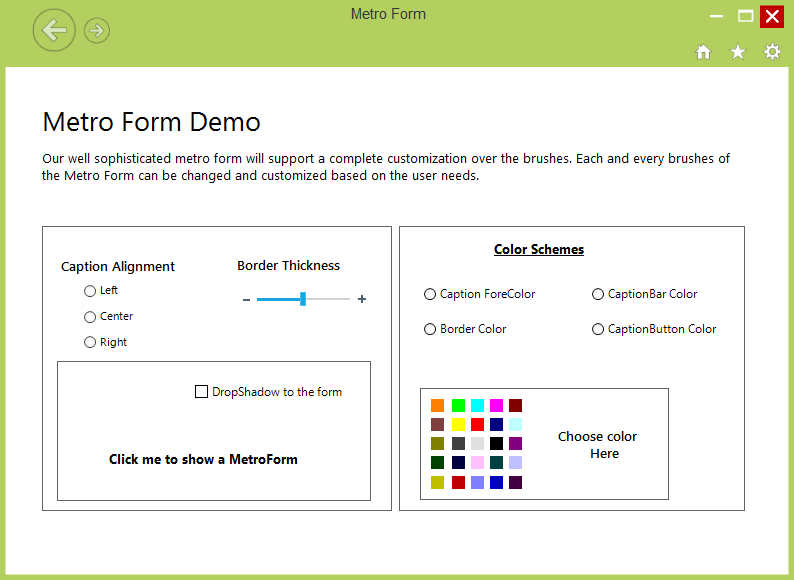

# About Syncfusion® Windows Forms MetroForm Control

[MetroForm](https://help.syncfusion.com/cr/windowsforms/Syncfusion.Windows.Forms.MetroForm.html) is used to create a customizable window for the end user's application. The features offered include resizing, dragging, and moving the window. It also supports various built-in skins and lets the user control its behavior and appearance.

## Key Features

* **Color customization** - Supports to customize Caption Background, Foreground color, Control box buttons Background and Foreground color and Border color.

* **Help button** - Provides Help button support.

* **Custom image** - Support to display Image and Text information in Caption Bar.

* **Right to left** - Supports RightToLeft layout.

* **Caption labels** - Provides support to add Label in desired location on Caption Bar.
 
## Choose between different form controls

You can refer to the different form controls [here](https://help.syncfusion.com/windowsforms/form/overview#choose-between-different-form-controls).
