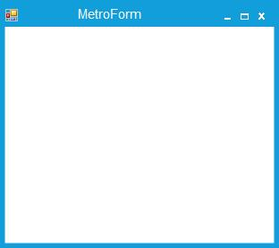
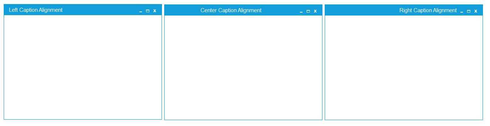

# Appearance

## Border Thickness

MetroForm border can be customized using `BorderThickness` property.





this.BorderThickness = 10;





Me.BorderThickness = 10
 




## Border Color

`BorderColor` property is used to change the color of the border.





 this.BorderColor = System.Drawing.Color.FromArgb(((int)(((byte)(17)))), ((int)(((byte)(158)))), ((int)(((byte)(218)))));





 Me.BorderColor = System.Drawing.Color.FromArgb(((int)(((byte)(17)))), ((int)(((byte)(158)))), ((int)(((byte)(218)))))
 




## Caption Bar Height

Caption bar height can be customized using `CaptionBarHeight` property.





this.CaptionBarHeight = 40;





Me.CaptionBarHeight = 40
 




## Caption Bar Color

Caption bar color can be customized using `CaptionBarColor` property.





this.CaptionBarColor = Color.Pink;





Me.CaptionBarColor = Color.Pink
 




## Caption Alignment

MetroForm caption can be aligned vertically using `CaptionAlign` property.

* Left
* Center
* Right





this.CaptionAlign = System.Windows.Forms.HorizontalAlignment.Right;





Me.CaptionAlign = System.Windows.Forms.HorizontalAlignment.Right
 




## Caption Vertical Alignment

MetroForm caption can be aligned vertically using `CaptionVerticalAlignment` property.

* Top
* Center
* Bottom





 this.CaptionVerticalAlignment = Syncfusion.Windows.Forms.VerticalAlignment.Top;





Me.CaptionVerticalAlignment = Syncfusion.Windows.Forms.VerticalAlignment.Top
 




## Icon Alignment Support

MetroForm supports Left, Right and Center alignment for Icon





this.IconAlign = System.Windows.Forms.HorizontalAlignment.Right;





 Me.IconAlign = System.Windows.Forms.HorizontalAlignment.Right
 




 
