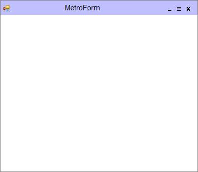

# Caption Bar Customization

## Caption Bar Height

Caption bar height can be customized using `CaptionBarHeight` property.





this.CaptionBarHeight = 40;





Me.CaptionBarHeight = 40
 




## Caption Bar Color

Caption bar color can be customized using `CaptionBarColor` property.





this.CaptionBarColor = Color.Pink;





Me.CaptionBarColor = Color.Pink
 




## Caption Fore Color

Caption fore color can be customized using `CaptionForeColor` property.





 this.CaptionForeColor = System.Drawing.Color.Black;





 Me.CaptionForeColor = System.Drawing.Color.Black
 




## Caption Font

Font of the caption can be customized using `CaptionFont` property.





this.CaptionFont = new System.Drawing.Font("Calisto MT", 14.25F, System.Drawing.FontStyle.Bold, System.Drawing.GraphicsUnit.Point, ((byte)(0)));





Me.CaptionFont = new System.Drawing.Font("Calisto MT", 14.25F, System.Drawing.FontStyle.Bold, System.Drawing.GraphicsUnit.Point, ((byte)(0)))
 




## Caption Vertical Alignment

MetroForm caption can be aligned vertically using `CaptionVerticalAlignment` property.

* Top
* Center
* Bottom





 this.CaptionVerticalAlignment = Syncfusion.Windows.Forms.VerticalAlignment.Top;





Me.CaptionVerticalAlignment = Syncfusion.Windows.Forms.VerticalAlignment.Top
 




## Caption Button Color

Caption button color can be customized using `CaptionButtonColor` property.





this.CaptionButtonColor = System.Drawing.Color.Red;





Me.CaptionButtonColor = System.Drawing.Color.Red
 




## Caption Button Hover Color

Caption button hover color can be customized using `CaptionButtonHoverColor` property.





this.CaptionButtonHoverColor = System.Drawing.Color.Lime;





Me.CaptionButtonHoverColor = System.Drawing.Color.Lime
 




