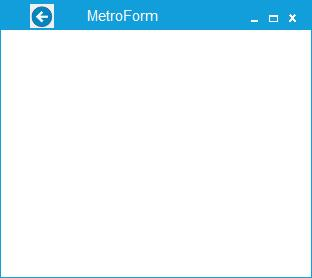
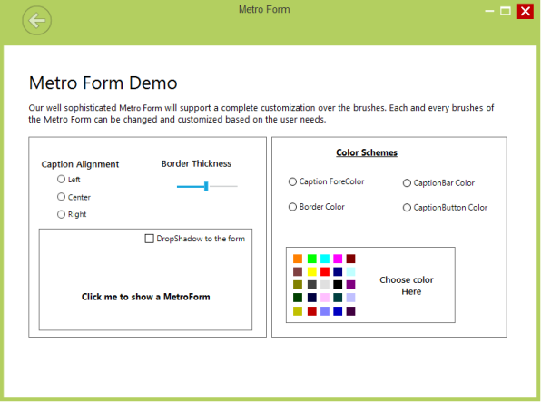

# Adding Caption Images

Caption images can be added to the MetroForm through designer or code. 

## Through Designer 

1) Images can be added to the CaptionBar using CaptionImages collection property.

2) Add images through collection editor window

3) Image can be added to the CaptionImage using Image property in Collection Editor

## Through Code

The following code sample shows how to add an image to the caption bar of the Metro form.





Syncfusion.Windows.Forms.CaptionImage captionImage1 = new Syncfusion.Windows.Forms.CaptionImage();

captionImage1.BackColor = System.Drawing.Color.Transparent;

captionImage1.Image = global::MetroStyleControls_2008.Properties.Resources.RBNormal;

captionImage1.Location = new System.Drawing.Point(30, 5);

captionImage1.Name = "CaptionImage1";

captionImage1.Size = new System.Drawing.Size(50, 50);

this.CaptionImages.Add(captionImage1);





Dim captionImage1 As Syncfusion.Windows.Forms.CaptionImage = New Syncfusion.Windows.Forms.CaptionImage

captionImage1.BackColor = System.Drawing.Color.Transparent

captionImage1.Image = MetroStyleControls_2008.Properties.Resources.RBNormal

captionImage1.Location = New System.Drawing.Point(30, 5)

captionImage1.Name = "CaptionImage1"

captionImage1.Size = New System.Drawing.Size(50, 50)

Me.CaptionImages.Add(captionImage1)





