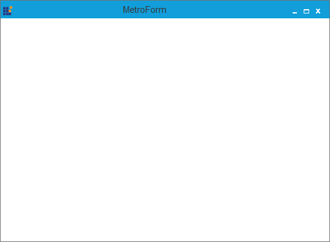

# Getting started

The default Form can be changed into the MetroForm by following the below given steps.

1)	Create a Windows Forms project in Visual Studio and refer to the following assembly.

   * Syncfusion.Shared.Base.dll
   
2)  Include the following namespace to the directives list.





using Syncfusion.Windows.Forms;





Imports Syncfusion.Windows.Forms
 



   
3)	Change the class to inherit the MetroForm instead of the default Form as follows.





public partial class Form1 : MetroForm 





Partial Public Class Form1 Inherits MetroForm
 



  
   
