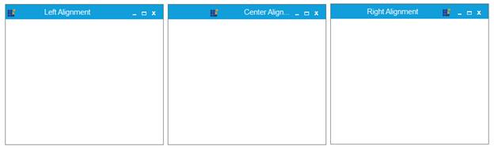

# Icon Alignment Support

MetroForm supports Left, Right and Center alignment for Icon





this.IconAlign = System.Windows.Forms.HorizontalAlignment.Right;





 Me.IconAlign = System.Windows.Forms.HorizontalAlignment.Right
 




