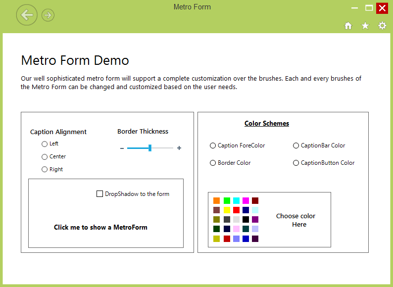

# Overview

MetroForm which does not have any dependency in RibbonControlAdv is now available in WindowsForms. It provides all basic functionality of normal Form along with plenty of appearance customization.

## Features

* Supports various color schemes customization.
* Help button support.
* Complete support for Caption Bar and Caption Image customization.
* Right to left support.

 
