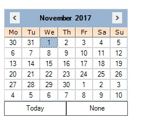
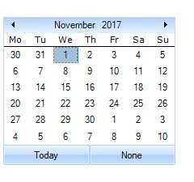
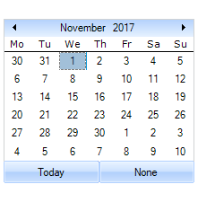
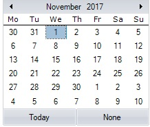
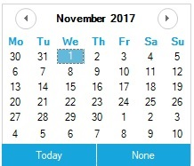

# Calendar Appearance

This section comprises the appearance settings under the following topics:

## Border Styles

The wide variety of border options are available for DateTimePickerAdv control when they are in 2D or in 3D mode. The properties in the below table illustrates the border settings.

<table>
<tr>
<th>
DateTimePickerAdv Properties</th><th>
Description</th></tr>
<tr>
<td>
BorderStyle</td><td>
Specifies whether the DateTimePickerAdv should have a border and if it is 2D or 3D border. The options are, {{ '_None_' | markdownify }} {{ '_FixedSingle_'  | markdownify }}{{ '_Fixed3D(Default)_' | markdownify }}</td></tr>
<tr>
<td>
 Border3DStyle</td><td>
Specifies the 3D border style of the DateTimePickerAdv.The options are, {{ '_Raised_' | markdownify }}{{ '_RaisedOuter_'  | markdownify }} {{ '_RaisedInner_'  | markdownify }}{{ '_Sunken(Default)_' | markdownify }}{{ '_SunkenOuter_'  | markdownify }} {{ '_SunkenInner_'  | markdownify }} {{ '_Etched_'  | markdownify }} {{ '_Bump_'  | markdownify }}{{ '_Adjust_'  | markdownify }} {{ '_Flat_' | markdownify }}</td></tr>
<tr>
<td>
 BorderSingle</td><td>
Specifies the 2D border style of the DateTimePickerAdv. The options are,{{ '_None_' | markdownify }}{{ '_Dotted_' | markdownify }}{{ '_Dashed_' | markdownify }}{{ '_Solid (default)_' | markdownify }}{{ '_Inset_'  | markdownify }}{{ '_Outset_' | markdownify }}</td></tr>
<tr>
<td>
 BorderSides</td><td>
Specifies the sides of the control which should have a border. The sides are,{{ '_Left_' | markdownify }}{{ '_Top_' | markdownify }}{{ '_Right_'  | markdownify }}{{ '_Bottom_' | markdownify }}{{ '_Middle_'  | markdownify }}{{ '_All (Default)_' | markdownify }}</td></tr>
<tr>
<td>
 BorderColor</td><td>
Specifies the color of the 2D border when BorderStyle is set FixedSingle.</td></tr>
</table>



//Sets 2D border

this.dateTimePickerAdv1.BorderStyle = System.Windows.Forms.BorderStyle.FixedSingle;

//Sets 2D border style

this.dateTimePickerAdv1.BorderSingle = System.Windows.Forms.ButtonBorderStyle.Dashed;

//Sets border for all the side of the control

this.dateTimePickerAdv1.BorderSides = System.Windows.Forms.Border3DSide.All;

//Sets color for the 2D border

this.dateTimePickerAdv1.BorderColor = System.Drawing.Color.SteelBlue;

//Sets 3D border

this.dateTimePickerAdv1.BorderStyle = System.Windows.Forms.BorderStyle.Fixed3D;

//Sets SunkenInner 3D border style

this.dateTimePickerAdv1.Border3DStyle = System.Windows.Forms.Border3DStyle.SunkenInner;




'Sets 2D border 

Me.dateTimePickerAdv1.BorderStyle = System.Windows.Forms.BorderStyle.FixedSingle 

'Sets 2D border style 

Me.dateTimePickerAdv1.BorderSingle = System.Windows.Forms.ButtonBorderStyle.Dashed 

'Sets border for all the side of the control 

Me.dateTimePickerAdv1.BorderSides = System.Windows.Forms.Border3DSide.All 

'Sets color for the 2D border 

Me.dateTimePickerAdv1.BorderColor = System.Drawing.Color.SteelBlue 

'Sets 3D border 

Me.dateTimePickerAdv1.BorderStyle = System.Windows.Forms.BorderStyle.Fixed3D 

'Sets SunkenInner 3D border style 

Me.dateTimePickerAdv1.Border3DStyle = System.Windows.Forms.Border3DStyle.SunkenInner 


 

## Background Settings

Background image for the MonthCalendarAdv is specified in BackgroundImage property.



this.monthCalendarAdv1.BackgroundImage = ((System.Drawing.Image)(resources.GetObject("monthCalendarAdv1.BackgroundImage")));

this.monthCalendarAdv1.BackgroundImageLayout = System.Windows.Forms.ImageLayout.Stretch;




Me.monthCalendarAdv1.BackgroundImage = DirectCast((resources.GetObject("monthCalendarAdv1.BackgroundImage")), System.Drawing.Image) 

Me.monthCalendarAdv1.BackgroundImageLayout = System.Windows.Forms.ImageLayout.Stretch 



 

## Visual Settings

### Themes for MonthCalendarAdv

Some sections of the MonthCalendarAdv control are themed by default. The below table list the properties which controls the themed behavior border, grid and scroll buttons.

<table>
<tr>
<th>
MonthCalendarAdv Properties</th><th>
Description</th></tr>
<tr>
<td>
ThemedBorder</td><td>
Specifies whether the border of the control is themed. By default it is true.</td></tr>
<tr>
<td>
ThemedEnabledGrid</td><td>
Specifies whether the grid holding the days is themed or not. By default it is false.</td></tr>
<tr>
<td>
ThemedEnabledScrollButtons</td><td>
Specifies whether the scroll buttons are themed. It is set to true by default.</td></tr>
</table>



this.monthCalendarAdv1.ThemedBorder = true;

this.monthCalendarAdv1.ThemedEnabledGrid = true;

this.monthCalendarAdv1.ThemedEnabledScrollButtons = true;




Me.monthCalendarAdv1.ThemedBorder = True

Me.monthCalendarAdv1.ThemedEnabledGrid = True

Me.monthCalendarAdv1.ThemedEnabledScrollButtons = True



 

### Styles 

The MonthCalenderAdv control for Windows Forms Supports for below listed Visual Styles. You can easily modify the look using the built-in visual styles.

The styles are built in for MonthCalenderAdv.

•	Default

•	Office2007

•	Office2007Outlook

•	Office2010

•	Metro

•	Office2016Colorful

•	Office2016DarkGray

•	Office2016Black

•	Office2016White

<table>
<tr>
<th>
MonthCalendarAdv Property</th><th>
Description</th></tr>
<tr>
<td>
Style</td><td>
Gets or Sets the visual style of the MonthCalendarAdv. The default value is 'Default'.</td></tr>
</table>

**Default**

This option helps to set the Default theme.

#####  Code Sample





//Default

this.monthCalendarAdv1.Style = Syncfusion.Windows.Forms.VisualStyle.Default;




'Default

Me.monthCalendarAdv1.VisualStyle = Syncfusion.Windows.Forms.VisualStyle.Default





 

**Office2007**

This option helps to set the Office2007 theme.

#####  Code Sample





// Office2007

this.monthCalendarAdv1.Style = Syncfusion.Windows.Forms.VisualStyle.Office2007;





'Office2007

Me.monthCalendarAdv1.VisualStyle = Syncfusion.Windows.Forms.VisualStyle.Office2007





 

It also specifies the color schemes for Office 2007 visual styles. They can be Blue, Silver, Black and Managed.

•	Blue

•	Black

•	Silver

•	Managed

**Blue**

This option helps to set the Office2007 Blue theme.

#####  Code Sample





// Office2007Blue

this.monthCalendarAdv1.Style = Syncfusion.Windows.Forms.VisualStyle.Office2007;
this. monthCalendarAdv1.Office2007Theme = Office2007Theme.Blue;





'Office2007Blue

Me.monthCalendarAdv1.VisualStyle = Syncfusion.Windows.Forms.VisualStyle.Office2007
Me. monthCalendarAdv1.Office2007Theme = Office2007Theme.Blue



 

**Black**

This option helps to set the Office2007 Black theme.

#####  Code Sample



{% highlight C#}

// Office2007Black

this.monthCalendarAdv1.Style = Syncfusion.Windows.Forms.VisualStyle.Office2007;
this. monthCalendarAdv1.Office2007Theme = Office2007Theme.Black;





'Office2007Black

Me.monthCalendarAdv1.VisualStyle = Syncfusion.Windows.Forms.VisualStyle.Office2007
Me. monthCalendarAdv1.Office2007Theme = Office2007Theme.Black





 

**Silver**

#####  Code Sample

This option helps to set the Office2007 Silver theme.





// Office2007Silver

this.monthCalendarAdv1.Style = Syncfusion.Windows.Forms.VisualStyle.Office2007;
this. monthCalendarAdv1.Office2007Theme = Office2007Theme.Silver;





'Office2007Silver

Me.monthCalendarAdv1.VisualStyle = Syncfusion.Windows.Forms.VisualStyle.Office2007
Me. monthCalendarAdv1.Office2007Theme = Office2007Theme.Silver





 

**Managed**

This option helps to apply the custom colors to the MonthCalendarAdv by setting Office2007Theme to “Managed” and specifying the custom color through the ApplyManagedColors method as follows.

#####  Code Sample





//Managed

this.monthCalendarAdv2.Style = Syncfusion.Windows.Forms.VisualStyle.Office2007;
this.monthCalendarAdv2.Office2007Theme = Syncfusion.Windows.Forms.Office2007Theme.Managed;
Syncfusion.Windows.Forms.Office2007Colors.ApplyManagedColors(this, Color.Red);





'Managed
Me.monthCalendarAdv2.Style = Syncfusion.Windows.Forms.VisualStyle.Office2010
Me.monthCalendarAdv2.Office2007Theme = Syncfusion.Windows.Forms.Office2007Theme.Managed
Syncfusion.Windows.Forms.Office2007Colors.ApplyManagedColors(Me, Color.Red)





 

**Office2007Outlook**

This option helps to set the Office2007Outlook theme.

#####  Code Sample





// Office2007Outlook

this.monthCalendarAdv2.Style =  Syncfusion.Windows.Forms.VisualStyle.Office2007Outlook;





'Office2007Outlook

Me.monthCalendarAdv1.VisualStyle = Syncfusion.Windows.Forms.VisualStyle.Office2007Outlook





 

**Office2010**

This option helps to set the Office2010 theme.





// Office2010

this.monthCalendarAdv1.Style = Syncfusion.Windows.Forms.VisualStyle.Office2010;





'Office2010

Me.monthCalendarAdv1.VisualStyle = Syncfusion.Windows.Forms.VisualStyle.Office2010





 

It also allows to specify the color schemes for Office 2010 visual styles. They can be blue, silver and black and managed

•	Blue

•	Black

•	Silver

•	Managed

**Blue**

This option helps to set the Office2010 Blue theme.

#####  Code Sample





// Office2010Blue

this.monthCalendarAdv1.Style = Syncfusion.Windows.Forms.VisualStyle.Office2010;
this. monthCalendarAdv1.Office2010Theme = Office2010Theme.Blue;





'Office2010Blue

Me.monthCalendarAdv1.VisualStyle = Syncfusion.Windows.Forms.VisualStyle.Office2010
Me. monthCalendarAdv1.Office2010Theme = Office2010Theme.Blue



 

**Black**

This option helps to set the Office2010 Black theme.

#####  Code Sample



{% highlight C#}

// Office2010Black

this.monthCalendarAdv1.Style = Syncfusion.Windows.Forms.VisualStyle.Office2010;
this. monthCalendarAdv1.Office2010Theme = Syncfusion.Windows.Forms.Office2010Theme.Black;





'Office2007Black

Me.monthCalendarAdv1.VisualStyle = Syncfusion.Windows.Forms.VisualStyle.Office2010
Me.monthCalendarAdv1.Office2010Theme = Syncfusion.Windows.Forms.Office2010Theme.Black





 

**Silver**

#####  Code Sample

This option helps to set the Office2010 Silver theme.





// Office2007Silver
this.monthCalendarAdv1.Style = Syncfusion.Windows.Forms.VisualStyle.Office2010;
this.monthCalendarAdv1.Office2010Theme = Syncfusion.Windows.Forms.Office2010Theme.Silver;





'Office2007Silver
Me.monthCalendarAdv1.VisualStyle = Syncfusion.Windows.Forms.VisualStyle.Office2010
Me.monthCalendarAdv1.Office2010Theme = Syncfusion.Windows.Forms.Office2010Theme.Silver





 

**Managed**

This option helps to apply the custom colors to the MonthCalendarAdv by setting Office2010Theme to “Managed” and specifying the custom color through the ApplyManagedColors method as follows.

#####  Code Sample





//Managed

this.monthCalendarAdv2.Style = Syncfusion.Windows.Forms.VisualStyle.Office2010;
this.monthCalendarAdv2.Office2010Theme = Syncfusion.Windows.Forms.Office2010Theme.Managed;
Syncfusion.Windows.Forms.Office2010Colors.ApplyManagedColors(this, Color.Red);





'Managed
Me.monthCalendarAdv2.Style = Syncfusion.Windows.Forms.VisualStyle.Office2010
Me.monthCalendarAdv2.Office2010Theme = Syncfusion.Windows.Forms.Office2010Theme.Managed
Syncfusion.Windows.Forms.Office2010Colors.ApplyManagedColors(Me, Color.Red)





**Metro**

This option helps to set the Metro theme.
 
 



// Metro
this.monthCalendarAdv1.Style = Syncfusion.Windows.Forms.VisualStyle.Metro;





'Metro
Me.monthCalendarAdv1.VisualStyle = Syncfusion.Windows.Forms.VisualStyle.Metro





**Office2016Colorful**

This option helps to set the Office2016Colorful theme.





// office2016Colorful

this.monthCalendarAdv1.Style = Syncfusion.Windows.Forms.VisualStyle.Office2016Colorful;





'office2016Colorful

Me.monthCalendarAdv1.VisualStyle = Syncfusion.Windows.Forms.VisualStyle.Office2016Colorful





**Office2016DarkGray**

This option helps to set the Office2016DarkGray theme. theme.





//Office2016DarkGray

this.monthCalendarAdv1.Style = Syncfusion.Windows.Forms.VisualStyle.Office2016DarkGray;





'Office2016DarkGray

Me.monthCalendarAdv1.VisualStyle = Syncfusion.Windows.Forms.VisualStyle.Office2016DarkGray





**Office2016DarkGray**

This option helps to set the Office2016DarkGray theme. theme.





//Office2016DarkGray

this.monthCalendarAdv1.Style = Syncfusion.Windows.Forms.VisualStyle.Office2016DarkGray;





'office2016DarkGray

Me. monthCalendarAdv1.VisualStyle = Syncfusion.Windows.Forms.VisualStyle.Office2016DarkGray





**Office2016Black**

This option helps to set the Office2016Black theme.





// office2016Black

this.monthCalendarAdv1.Style = Syncfusion.Windows.Forms.VisualStyle.Office2016Black;





' office2016Black

Me. monthCalendarAdv1.VisualStyle = Syncfusion.Windows.Forms.VisualStyle.Office2016Black





**Office2016White**

This option helps to set the Office2016White theme.





// office2016White

this.monthCalendarAdv1.Style = Syncfusion.Windows.Forms.VisualStyle.Office2016White;





' office2016White

Me. monthCalendarAdv1.VisualStyle = Syncfusion.Windows.Forms.VisualStyle.Office2016White





N> Visual styles of the Today and None button can be overridden by MonthCalendarAdv.TodayButton and MonthCalendarAdv.NoneButton respectively. See [Scroll Buttons](/windowsforms/monthcalendaradv/customizing-sections-of-calendar#scroll-buttons).

