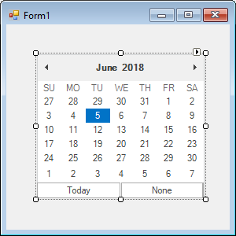

# Getting started

This section describes how to add a `MonthCalendarAdv` control in a Windows Forms application and overview of its basic functionalities.

## Assembly deployment

The following list of assemblies should be added as reference to use the MonthCalendarAdv in any application:

<table>
<tr>
<td>
{{'**Required assemblies**'| markdownify }}
</td>
<td>
{{'**Description**'| markdownify }}
</td>
</tr>
<tr>
<td>
Syncfusion.Grid.Base.dll
</td>
<td>
Syncfusion.Grid.Base contains classes that contains fundamentals and base classes of GridControl.
</td>
</tr>
<tr>
<td>
Syncfusion.Grid.Windows.dll
</td>
<td>
Syncfusion.Grid.Windows contains classes that handles all UI operations, fundamentals and base classes of GridControl which are used in the MonthCalendarAdv control.
</td>
</tr>
<tr>
<td>
Syncfusion.Shared.Base.dll
</td>
<td>
Syncfusion.Shared.Base contains style related properties of MonthCalendarAdv and various editor controls.
</td>
</tr>
<tr>
<td>
Syncfusion.Shared.Windows.dll
</td>
<td>
Syncfusion.Shared.Windows contains style related properties of MonthCalendarAdv and various editor controls.
</td>
</tr>
<tr>
<td>
Syncfusion.Tools.Base.dll
</td>
<td>
Syncfusion.Tools.Base contains base class which used for MonthCalendarAdv control.
</td>
</tr>
<tr>
<td>
Syncfusion.Tools.Windows.dll
</td>
<td>
Syncfusion.Tools.Windows contains the class that handles all UI operations and contains helper class of MonthCalendarAdv control.
</td>
</tr>
</table>

## Installing NuGet Packages

To use MonthCalendarAdv control in Windows Forms application via nuget, the following packages should be installed.
 
<table>
<tr>
<td>{{'**S.No**'| markdownify }}
</td>
<td>{{'**Framework version**'| markdownify }}
</td>
<td>{{'**NuGet Packages**'| markdownify }}
</td>
</tr>
<tr>
<td> 1
</td>
<td> 2.0
</td>
<td> Syncfusion.Tools.Windows20
</td>
</tr>
<tr>
<td> 2
</td>
<td> 3.5
</td>
<td> Syncfusion.Tools.Windows35
</td>
</tr>
<tr>
<td> 3
</td>
<td> 4.0
</td>
<td> Syncfusion.Tools.Windows40
</td>
</tr>
<tr>
<td> 4
</td>
<td> 4.5
</td>
<td> Syncfusion.Tools.Windows45
</td>
</tr>
<tr>
<td> 5
</td>
<td> 4.5.1
</td>
<td>Syncfusion.Tools.Windows451
</td>
</tr>
<tr>
<td> 6
</td>
<td> 4.6
</td>
<td>Syncfusion.Tools.Windows46
</td>
</tr>
</table>
 
Please find more details regarding how to install the nuget packages in windows form application in the below link:
 
[How to install nuget packages](https://help.syncfusion.com/windowsforms/nuget-packages)

# Creating simple application with MonthCalendarAdv

You can create the Windows Forms application with MonthCalendarAdv control as follows:

1. [Creating project](#creating-the-project)
2. [Adding control via Form Designer](#adding-control-via-form-designer)
3. [Adding control manually using code](#adding-control-manually-using-code) 
4. [Configure to allow multiple selection](configurate-to-allow-multiple-selection)
5. [Selection Date Range](#selection-date-range)

### Creating the project

Create a new Windows Forms project in the Visual Studio to display the MonthCalendarAdv with basic information.

## Adding control via Form designer

MonthCalendarAdv control can be added to the application by dragging it from the toolbox and dropping it in a designer view. The following required assembly references will be added automatically:

* Syncfusion.Grid.Base.dll
* Syncfusion.Grid.Windows.dll
* Syncfusion.Shared.Base.dll
* Syncfusion.Shared.Windows.dll
* Syncfusion.Tools.Base.dll
* Syncfusion.Tools.Windows.dll

 

 

## Adding control manually using code

To add control manually in C#, follow the given steps:

**Step 1** : Add the following required assembly references to the project:

 * Syncfusion.Tools.Base.dll
 * Syncfusion.Tools.Windows.dll
 * Syncfusion.Shared.Base.dll
 * Syncfusion.Shared.Windows.dll
 * Syncfusion.Grid.Base.dll
 * Syncfusion.Grid.Windows.dll

**Step 2** : Include the namespaces **Syncfusion.Windows.Forms.Tools**.





using Syncfusion.Windows.Forms.Tools;





Imports Syncfusion.Windows.Forms.Tools





**Step 3** : Create `MonthCalendarAdv` control instance and add it to the form.





MonthCalendarAdv monthCalendarAdv1 = new MonthCalendarAdv();

this.monthCalendarAdv1.Style = VisualStyle.Office2016Colorful;

this.Controls.Add(monthCalendarAdv1);





Dim monthCalendarAdv1 As MonthCalendarAdv = New MonthCalendarAdv

Me.monthCalendarAdv1.Style = VisualStyle.Office2016Colorful

Me.Controls.Add(monthCalendarAdv1)





 

## Configure to allow multiple selection

MonthCalendarAdv control allows you to select multiple dates by setting the AllowMultipleSelection property to true.





this.monthCalendarAdv1.AllowMultipleSelection = true;





Me.monthCalendarAdv1.AllowMultipleSelection = True





 

## Selection Date Range

 MonthCalenderAdv prevents users from selecting dates within a specified minimum and maximum range. To specify the range, set the start date and end date to `MinValue` and `MaxValue` properties respectively.





this.monthCalendarAdv1.AllowMultipleSelection = true;

this.monthCalendarAdv1.MinValue = new DateTime(2018, 1, 05);

this.monthCalendarAdv1.MaxValue= new DateTime(2018, 1, 25);





Me.monthCalendarAdv1.AllowMultipleSelection = True

Me.monthCalendarAdv1.MinValue = New DateTime(2018, 1, 05)

Me.monthCalendarAdv1.MaxValue= New DateTime(2018, 1, 25)





