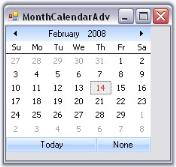

# Creating MonthCalendarAdv

We can just drag and drop the MonthCalendarAdv onto the form through designer and can access their properties through the property grid. 

 

To create the control programmatically, follow the below steps.

1. Include the required namespace.
    
   ~~~ cs
		using Syncfusion.Windows.Forms.Tools;
   ~~~
   {:.prettyprint}
   
   ~~~ vbnet
		Imports Syncfusion.Windows.Forms.Tools
   ~~~
   {:.prettyprint}

2. Create an instance of the MonthCalendarAdv control. 
   
   ~~~ cs
	   private Syncfusion.Windows.Forms.Tools.MonthCalendarAdv monthCalendarAdv1;
	   this.monthCalendarAdv1=new MonthCalendarAdv();
   ~~~
   {:.prettyprint}
   
   ~~~ vbnet
	   Private monthCalendarAdv1 As Syncfusion.Windows.Forms.Tools.MonthCalendarAdv
	   Me.monthCalendarAdv1 = New MonthCalendarAdv()
   ~~~
   {:.prettyprint}

3. Set the visual style for the control. Add that instance to the Form.

   ~~~ cs
	   this.monthCalendarAdv1.Style = Syncfusion.Windows.Forms.VisualStyle.Office2007;
	   this.Controls.Add(this.monthCalendarAdv1);
   ~~~
   {:.prettyprint}
   
   ~~~ vbnet
	   Me.monthCalendarAdv1.Style = Syncfusion.Windows.Forms.VisualStyle.Office2007
	   Me.Controls.Add(Me.monthCalendarAdv1)
   ~~~
   {:.prettyprint}

4. Run the application.

    

  

