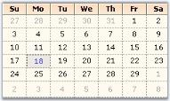

# Customizing sections of Calendar

## Grid settings

In the MonthCalendarAdv control, the dates of a month is placed inside a grid and the dates are separated using grid lines.

The below properties lets you to change the default appearance of the grid in the MonthCalendarAdv.

<table>
<tr>
<th>
MonthCalendarAdv properties</th><th>
Description</th></tr>
<tr>
<td>
GridBackColor</td><td>
Gets or Sets the back color of the Grid.</td></tr>
<tr>
<td>
GridLines</td><td>
Gets or Sets the style of the Grid lines. The options are {{ '_NotSet_' | markdownify }} {{ '_None_' | markdownify }} {{ '_Dashed_' | markdownify }} {{ '_Dotted_' | markdownify }} {{ '_DashDot_' | markdownify }} {{ '_DashDotDot_' | markdownify }} {{ '_Solid_' | markdownify }} {{ '_Standard_' | markdownify }} The default value is 'Dotted'.</td></tr>
</table>





this.monthCalendarAdv1.GridBackColor = System.Drawing.Color.FloralWhite;

this.monthCalendarAdv1.GridLines = Syncfusion.Windows.Forms.Grid.GridBorderStyle.Dashed;





Me.monthCalendarAdv1.GridBackColor = System.Drawing.Color.FloralWhite

Me.monthCalendarAdv1.GridLines = Syncfusion.Windows.Forms.Grid.GridBorderStyle.Dashed





 

### Header settings

This section will walk you through the different properties used to customize the header portion of the MonthCalendarAdv control.

### Gradient background

Gradient background can be set for the header using the below properties.

<table>
<tr>
<th>
MonthCalendarAdv properties</th><th>
Description</th></tr>
<tr>
<td>
HeadGradient</td><td>
Specifies whether the header can show a gradient background. </td></tr>
<tr>
<td>
HeaderStartColor</td><td>
Sets the start color of the header gradient when HeaderGradient property is true.</td></tr>
<tr>
<td>
HeaderEndColor</td><td>
Sets the end color of the header gradient when HeaderGradient property is true.</td></tr>
<tr>
<td>
HeaderVerticalGradient</td><td>
When HeadGradient property is set to true, vertical gradient style will be applied to the header, by default. To change it to horizontal gradient style, set this property to false.</td></tr>
</table>





this.monthCalendarAdv1.HeadGradient = true;

this.monthCalendarAdv1.HeaderVerticalGradient = true;

this.monthCalendarAdv1.HeaderEndColor = System.Drawing.Color.SteelBlue;                    

this.monthCalendarAdv1.HeaderStartColor = System.Drawing.Color.AliceBlue;





Me.monthCalendarAdv1.HeadGradient = True

Me.monthCalendarAdv1.HeaderVerticalGradient = True

Me.monthCalendarAdv1.HeaderEndColor = System.Drawing.Color.SteelBlue                   

Me.monthCalendarAdv1.HeaderStartColor = System.Drawing.Color.AliceBlue





 

### Foreground settings

The font style and fore color of the header text can be specified through HeaderFont and HeadForeColor properties.

<table>
<tr>
<th>
MonthCalendarAdv properties</th><th>
Description</th></tr>
<tr>
<td>
HeaderFont</td><td>
Specifies the font of the header.</td></tr>
<tr>
<td>
HeaderForeColor</td><td>
Specifies the fore color of the header.</td></tr>
</table>





this.monthCalendarAdv1.HeaderFont = new System.Drawing.Font("Arial", 9F, System.Drawing.FontStyle.Bold);

this.monthCalendarAdv1.HeadForeColor = System.Drawing.Color.Navy;





Me.monthCalendarAdv1.HeaderFont = New System.Drawing.Font("Arial", 9F, System.Drawing.FontStyle.Bold)

Me.monthCalendarAdv1.HeadForeColor = System.Drawing.Color.Navy





 

### Height and image for header

The height of the header can be increased or decreased using HeaderHeight property. Header can also host an image in its background using HeaderImage property.

<table>
<tr>
<th>
MonthCalendarAdv properties</th><th>
Description</th></tr>
<tr>
<td>
HeaderHeight</td><td>
Specifies the height of the header. Default value is 32 for Default Style and for other styles it is 20.</td></tr>
<tr>
<td>
HeaderImage</td><td>
Specifies the image of the header.</td></tr>
</table>



this.monthCalendarAdv1.HeaderImage = ((System.Drawing.Image)(resources.GetObject("monthCalendarAdv1.HeaderImage")));

this.monthCalendarAdv1.HeaderHeight = 30;





Me.monthCalendarAdv1.HeaderImage = DirectCast((resources.GetObject("monthCalendarAdv1.HeaderImage")), System.Drawing.Image) 

Me.monthCalendarAdv1.HeaderHeight = 30



## Header settings

This section will walk you through the different properties used to customize the header portion of the MonthCalendarAdv control.

### Gradient background

Gradient background can be set for the header using the below properties.

<table>
<tr>
<th>
MonthCalendarAdv properties</th><th>
Description</th></tr>
<tr>
<td>
HeadGradient</td><td>
Specifies whether the header can show a gradient background. </td></tr>
<tr>
<td>
HeaderStartColor</td><td>
Sets the start color of the header gradient when HeaderGradient property is true.</td></tr>
<tr>
<td>
HeaderEndColor</td><td>
Sets the end color of the header gradient when HeaderGradient property is true.</td></tr>
<tr>
<td>
HeaderVerticalGradient</td><td>
When HeadGradient property is set to true, vertical gradient style will be applied to the header, by default. To change it to horizontal gradient style, set this property to false.</td></tr>
</table>





this.monthCalendarAdv1.HeadGradient = true;

this.monthCalendarAdv1.HeaderVerticalGradient = true;

this.monthCalendarAdv1.HeaderEndColor = System.Drawing.Color.SteelBlue;                    

this.monthCalendarAdv1.HeaderStartColor = System.Drawing.Color.AliceBlue;





Me.monthCalendarAdv1.HeadGradient = True

Me.monthCalendarAdv1.HeaderVerticalGradient = True

Me.monthCalendarAdv1.HeaderEndColor = System.Drawing.Color.SteelBlue                   

Me.monthCalendarAdv1.HeaderStartColor = System.Drawing.Color.AliceBlue





 

### Foreground settings

The font style and fore color of the header text can be specified through HeaderFont and HeadForeColor properties.

<table>
<tr>
<th>
MonthCalendarAdv properties</th><th>
Description</th></tr>
<tr>
<td>
HeaderFont</td><td>
Specifies the font of the header.</td></tr>
<tr>
<td>
HeaderForeColor</td><td>
Specifies the fore color of the header.</td></tr>
</table>





this.monthCalendarAdv1.HeaderFont = new System.Drawing.Font("Arial", 9F, System.Drawing.FontStyle.Bold);

this.monthCalendarAdv1.HeadForeColor = System.Drawing.Color.Navy;





Me.monthCalendarAdv1.HeaderFont = New System.Drawing.Font("Arial", 9F, System.Drawing.FontStyle.Bold)

Me.monthCalendarAdv1.HeadForeColor = System.Drawing.Color.Navy





 

### Height and image for header

The height of the header can be increased or decreased using HeaderHeight property. Header can also host an image in its background using HeaderImage property.

<table>
<tr>
<th>
MonthCalendarAdv properties</th><th>
Description</th></tr>
<tr>
<td>
HeaderHeight</td><td>
Specifies the height of the header. Default value is 32 for Default Style and for other styles it is 20.</td></tr>
<tr>
<td>
HeaderImage</td><td>
Specifies the image of the header.</td></tr>
</table>





this.monthCalendarAdv1.HeaderImage = ((System.Drawing.Image)(resources.GetObject("monthCalendarAdv1.HeaderImage")));

this.monthCalendarAdv1.HeaderHeight = 30;





Me.monthCalendarAdv1.HeaderImage = DirectCast((resources.GetObject("monthCalendarAdv1.HeaderImage")), System.Drawing.Image) 

Me.monthCalendarAdv1.HeaderHeight = 30





 

## Week numbers

MonthCalendarAdv control can display unique [week numbers](/windowsforms/monthcalendaradv/overview#sections-of-monthcalendaradv-control) for all the weeks in a year. This section discusses the properties which can customize the appearance of the week numbers.

### Foreground settings

By default, week numbers will not be shown in the calendar. ShowWeekNumbers property should be set to true to display the week numbers. The font and fore color can be set using the below properties.

<table>
<tr>
<th>
MonthCalendarAdv properties</th><th>
Description</th></tr>
<tr>
<td>
WeekFont</td><td>
Gets or sets the font of the week numbers column.</td></tr>
<tr>
<td>
WeekTextColor</td><td>
Gets or sets the text color for week numbers column.</td></tr>
</table>





this.monthCalendarAdv1.ShowWeekNumbers = true;

this.monthCalendarAdv1.WeekFont = new System.Drawing.Font("Courier New", 9F, System.Drawing.FontStyle.Bold, System.Drawing.GraphicsUnit.Point, ((byte)(0)));

this.monthCalendarAdv1.WeekTextColor = System.Drawing.Color.Blue;





Me.monthCalendarAdv1.ShowWeekNumbers = True

Me.monthCalendarAdv1.WeekFont = New System.Drawing.Font("Courier New", 9F, System.Drawing.FontStyle.Bold, System.Drawing.GraphicsUnit.Point, CByte((0))) 

Me.monthCalendarAdv1.WeekTextColor = System.Drawing.Color.Blue 





 

### Gradient background

By default the week numbers column has a gradient background. To customize the background manually, use WeekInterior property.





this.monthCalendarAdv1.WeekInterior = new Syncfusion.Drawing.BrushInfo(Syncfusion.Drawing.GradientStyle.Vertical, System.Drawing.Color.AliceBlue, System.Drawing.Color.LightSteelBlue);





Me.monthCalendarAdv1.WeekInterior = New Syncfusion.Drawing.BrushInfo(Syncfusion.Drawing.GradientStyle.Vertical, System.Drawing.Color.AliceBlue, System.Drawing.Color.LightSteelBlue) 





 

## Day settings

MonthCalendarAdv has properties to customize the days displayed in the calendar. This section discusses those properties.

### Foreground settings

The below properties deals with the foreground appearance of the dates.

<table>
<tr>
<th>
MonthCalendarAdv properties</th><th>
Description</th></tr>
<tr>
<td>
DayNamesColor</td><td>
Specifies the fore color of the day names.</td></tr>
<tr>
<td>
DayNamesFont</td><td>
Specifies the font style of the day names.</td></tr>
<tr>
<td>
DaysFont</td><td>
Specifies the font style of the days/dates.</td></tr>
<tr>
<td>
DaysColor</td><td>
Specifies the fore color of the day names.</td></tr>
</table>





this.monthCalendarAdv1.DayNamesFont = new System.Drawing.Font("Courier New", 9F, System.Drawing.FontStyle.Bold);

this.monthCalendarAdv1.DaysNamesColor = Color.Black;

this.monthCalendarAdv1.DaysColor = System.Drawing.SystemColors.HotTrack;

this.monthCalendarAdv1.DaysFont = new System.Drawing.Font("Courier New", 8.25F, System.Drawing.FontStyle.Regular);





Me.monthCalendarAdv1.DayNamesFont = New System.Drawing.Font("Courier New", 9F, System.Drawing.FontStyle.Bold) 

Me.monthCalendarAdv1.DaysNamesColor = Color.Black

Me.monthCalendarAdv1.DaysColor = System.Drawing.SystemColors.HotTrack 

Me.monthCalendarAdv1.DaysFont = New System.Drawing.Font("Courier New", 8.25F, System.Drawing.FontStyle.Regular) 





 

### Height and day names format

The height of the day header and the day name formats are specified using below properties.

<table>
<tr>
<th>
MonthCalendarAdv properties</th><th>
Description</th></tr>
<tr>
<td>
DayNamesHeight</td><td>
Sets the height of the days header. Default value is 17.</td></tr>
<tr>
<td>
UseShortestDayNames</td><td>
Specifies whether shortest day names are used or not. by default it is true.</td></tr>
</table>





this.monthCalendarAdv1.DayNamesHeight = 22;

this.monthCalendarAdv1.UseShortestDayNames = false;





Me.monthCalendarAdv1.DayNamesHeight = 22

Me.monthCalendarAdv1.UseShortestDayNames = False





 

### Gradient background for day header

By default the day's header has a gradient background. We can change the default background style using DaysHeaderInterior property.





this.monthCalendarAdv1.DaysHeaderInterior = new Syncfusion.Drawing.BrushInfo(Syncfusion.Drawing.GradientStyle.Vertical, System.Drawing.Color.AntiqueWhite, System.Drawing.Color.SandyBrown);





Me.monthCalendarAdv1.DaysHeaderInterior = New Syncfusion.Drawing.BrushInfo(Syncfusion.Drawing.GradientStyle.Vertical, System.Drawing.Color.AntiqueWhite, System.Drawing.Color.SandyBrown)





 

## Today's date

The fore color for Today's date is set using TodayFontColor property. Using Today button at the bottom of the control, today's date can be focused. See Buttons for details.





this.monthCalendarAdv1.TodayFontColor = System.Drawing.Color.Crimson;





Me.monthCalendarAdv1.TodayFontColor = System.Drawing.Color.Crimson





The today's date for the below calendar image is "eighteenth".

## Text settings

This section discusses the properties which controls the appearance and behavior of the dates (contents) inside the grid cells.

Highlighting the dates

We can highlight the selected date using HighlightColor property.





this.monthCalendarAdv1.HighlightColor = System.Drawing.Color.Blue;





Me.monthCalendarAdv1.HighlightColor = System.Drawing.Color.Blue





## Buttons

The MonthCalendarAdv control contains the below buttons.

* LeftScrollButton,
* RightScrollButton,
* 'Today' button and
* 'None' button.

To know about the placement of these buttons in the control, refer [MonthCalendarAdv](/windowsforms/monthcalendaradv/overview) topic. Left and Right scroll buttons at the top of the control can have custom images. See Scroll Buttons for details.

Today and None buttons are displayed at the bottom of the calendar and they can be customized to set background image and font styles. This section will discuss the properties which controls the appearance and behavior of the MonthCalendarAdv.

<table>
<tr>
<th>
MonthCalendarAdv properties</th><th>
Description</th></tr>
<tr>
<td>
TodayButton</td><td>
Clicking this button at run time will move the focus to today's date in the calendar.</td></tr>
<tr>
<td>
NoneButton</td><td>
Clicking this button at run time, will remove the focus of the date in the calendar.</td></tr>
<tr>
<td>
BottomHeight</td><td>
The height of the bottom which contains the Today and None buttons are changed using this property. Default value is 20.</td></tr>
</table>

### Customizing today and none buttons

The "Today" and "None" buttons are like Essential Tools ButtonAdv controls and they support all the properties of ButtonAdv control. You can access those properties using MonthCalendarAdv.NoneButton.Visible which controls the visibility (for example).





//Hides the Today and None Buttons

monthCalendarAdv1.TodayButton.Visible=false;

monthCalendarAdv1.NoneButton.Visible=false;





'Hides the Today and None Buttons

monthCalendarAdv1.TodayButton.Visible=False

monthCalendarAdv1.NoneButton.Visible=False






[ButtonAdv](/windowsforms/buttonadv/overview)


## Scroll buttons

### Scroll button images

The default scroll button images can be replaced with custom images using the LeftScrollButtonImage and RightScrollButtonImage properties. The properties related to scroll buttons are as follows.

<table>
<tr>
<th>
MonthCalendarAdv properties</th><th>
Description</th></tr>
<tr>
<td>
LeftScrollButtonImage</td><td>
Specifies Image for left scroll button.</td></tr>
<tr>
<td>
RightScrollButtonImage</td><td>
Specifies Image for right scroll button.</td></tr>
<tr>
<td>
StretchScrollImage</td><td>
Specifies whether the image for scroll buttons is stretched to fit the size of the scroll button.</td></tr>
<tr>
<td>
ScrollButtonSize</td><td>
Specifies the size of the scroll buttons.</td></tr>
</table>





this.monthCalendarAdv1.LeftScrollButtonImage = ((System.Drawing.Image)(resources.GetObject("monthCalendarAdv1.LeftScrollButtonImage")));

this.monthCalendarAdv1.RightScrollButtonImage = ((System.Drawing.Image)(resources.GetObject("monthCalendarAdv1.RightScrollButtonImage")));

this.monthCalendarAdv1.ScrollButtonSize = new System.Drawing.Size(30, 25);

this.monthCalendarAdv1.StretchScrollImage = false;





Me.monthCalendarAdv1.LeftScrollButtonImage = DirectCast((resources.GetObject("monthCalendarAdv1.LeftScrollButtonImage")), System.Drawing.Image) 

Me.monthCalendarAdv1.RightScrollButtonImage = DirectCast((resources.GetObject("monthCalendarAdv1.RightScrollButtonImage")), System.Drawing.Image) 

Me.monthCalendarAdv1.ScrollButtonSize = New System.Drawing.Size(30, 25) 

Me.monthCalendarAdv1.StretchScrollImage = False 





