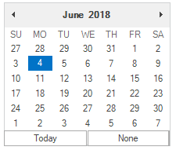

# Overview

 [MonthCalendar](https://help.syncfusion.com/cr/cref_files/windowsforms/tools/Syncfusion.Tools.Windows~Syncfusion.Windows.Forms.Tools.MonthCalendarAdv.html)
 is a control that allows you to select a date from the calendar and various customization options for the calendar. Supports rich user interface options such as multiple selection, ContextMenu, Globalization and much more.

# Key Features

* **Date-range support** : Provides maximum and minimum date support to prevent users from selecting dates within a specified range.

* **Globalization** : Supports for globalize first day of the week and day names based on the culture.

* **ContextMenu** - Supports ContextMenu for month and date for quick navigation. 

* **Multiple Selection** - Provides options to select multiple dates by dragging the mouse and also using the key modifiers.

* **Customization** - Provides options to customize font and color of Dates, Day Names, Week number and  calendar Header

* **VisualStyle** - Provides rich set of VisualStyle to customize the look and feel of MonthCalendarAdv.

* **Accessibility** - Touch, keyboard, and mouse support to make applications available to a wide variety of users.