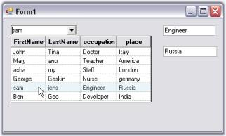

# Retrieve Columns Other Than Display and Value Members

Handle the SelectedIndexChanged Event of MultiColumnComboBox as shown below in order to retrieve respective column values.




private void MultiColumnComboBox1_SelectedIndexChanged(object sender, System.EventArgs e)
{
    for(int i=1;i<= this.MultiColumnComboBox1.ListBox.Grid.RowCount;i++)
    {
        for(int j=1;j<= this.MultiColumnComboBox1.ListBox.Grid.ColCount ;j++)
        {
            this.textBox2.Text = this.MultiColumnComboBox1 .ListBox.Grid.Model[this.MultiColumnComboBox1.SelectedIndex+1 , j].CellValue.ToString ();
            textBox1.Text = this.MultiColumnComboBox1.ListBox.Grid.Model[this.MultiColumnComboBox1.SelectedIndex+1 , j-1].CellValue.ToString ();
        }
    }
}





Private Sub MultiColumnComboBox1_SelectedIndexChanged(ByVal sender As Object, ByVal e As System.EventArgs)
Dim i As Integer=1
Do While i<= Me.MultiColumnComboBox1.ListBox.Grid.RowCount
Dim j As Integer=1
Do While j<= Me.MultiColumnComboBox1.ListBox.Grid.ColCount
Me.textBox2.Text = Me.MultiColumnComboBox1.ListBox.Grid.Model(Me.MultiColumnComboBox1.SelectedIndex+1, j).CellValue.ToString ()
textBox1.Text = Me.MultiColumnComboBox1.ListBox.Grid.Model(Me.MultiColumnComboBox1.SelectedIndex+1, j-1).CellValue.ToString ()
j += 1
Loop
i += 1
Loop
End Sub




 

