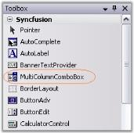

# Getting Started with Windows Forms MultiColumnComboBox

This section explains how to use the MultiColumnComboBox control to build a combo box that displays multiple columns in its drop-down list.

## Assembly deployment

Refer to the [Control Dependencies](https://help.syncfusion.com/windowsforms/control-dependencies#multicolumncombobox) section for the list of assemblies or the NuGet package details that must be referenced to use the control in any application.

Refer to [NuGet Packages](https://help.syncfusion.com/windowsforms/installation/install-nuget-packages) to learn how to install NuGet packages in a Windows Forms application.

To install via the NuGet Package Manager Console, run:

```
Install-Package Syncfusion.Tools.Windows
```

## Adding MultiColumnComboBox via designer

1. Create a new Windows Forms project in Visual Studio.

2. Add the [MultiColumnComboBox](https://help.syncfusion.com/cr/windowsforms/Syncfusion.Windows.Forms.Tools.MultiColumnComboBox.html) to the application by dragging it from the toolbox to the designer surface. The following dependent assemblies are added automatically:

	* Syncfusion.Tools.Windows



## Adding MultiColumnComboBox via code

To add the control manually, follow these steps:

1. Create a C# or VB.NET application in Visual Studio.

2. Add the following assembly references to the project:

	* Syncfusion.Tools.Windows

3. Include the required namespaces.




using System.Windows.Forms;
using Syncfusion.Windows.Forms.Tools;




Imports Syncfusion.Windows.Forms.Tools




4. Create an instance of the `MultiColumnComboBox` and add it to the form.





namespace WindowsFormsApplication1
{
    public partial class Form1 : Form
    {
        private MultiColumnComboBox multiColumnComboBox1;
        public Form1()
        {
            InitializeComponent();
            multiColumnComboBox1 = new MultiColumnComboBox();
            multiColumnComboBox1.Location = new System.Drawing.Point(20, 20);
            multiColumnComboBox1.Size = new System.Drawing.Size(200, 25);
            this.Controls.Add(multiColumnComboBox1);
        }
    }
}





Public Class Form1
    Inherits Form

    Private multiColumnComboBox1 As MultiColumnComboBox
    Public Sub New()
        InitializeComponent()
        multiColumnComboBox1 = New MultiColumnComboBox()
        multiColumnComboBox1.Location = New System.Drawing.Point(20, 20)
        multiColumnComboBox1.Size = New System.Drawing.Size(200, 25)
        Me.Controls.Add(multiColumnComboBox1)
    End Sub
End Class




{{ codesnippet1 | OrderList_Indent_Level_1 }}

For more data-binding options, refer to [Data binding](https://help.syncfusion.com/windowsforms/multicolumn-combobox/data-binding).
