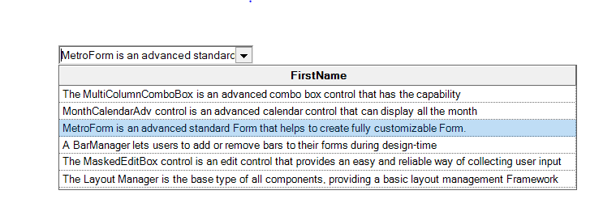
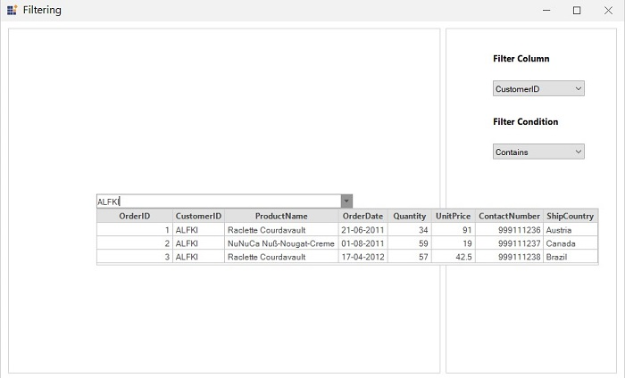

# Multiple Columns Support

MultiColumnComboBox control is a [ComboBoxAdv](/windowsforms/comboboxadv/overview) control with multiple columns. Multiple columns will be enabled by default. To disable this, set [MultiColumn](https://help.syncfusion.com/cr/windowsforms/Syncfusion.Windows.Forms.Tools.MultiColumnComboBox.html#Syncfusion_Windows_Forms_Tools_MultiColumnComboBox_MultiColumn) property to false. We can display the headers for the columns using ShowColumnHeader property. 

 

We can bind external data to the MultiColumnComboBox control. Refer [DataBinding](/windowsforms/multicolumncombobox/data-binding) topic to know more.

## Selection color

We can specify the color for the alpha blended selections using [AlphaBlendSelectionColor](https://help.syncfusion.com/cr/windowsforms/Syncfusion.Windows.Forms.Tools.MultiColumnComboBox.html#Syncfusion_Windows_Forms_Tools_MultiColumnComboBox_AlphaBlendSelectionColor) property.




this.multiColumnBoundCombo.MultiColumn = true;
this.multiColumnBoundCombo.ShowColumnHeader = true;
this.multiColumnComboBox1.AlphaBlendSelectionColor = Color.LightBlue;





Me.multiColumnBoundCombo.MultiColumn = True
Me.multiColumnBoundCombo.ShowColumnHeader = True
Me.multiColumnComboBox1.AlphaBlendSelectionColor = Color.LightBlue




## DropDownWidth

The DropDownWidth property is used to set the width for the DropDown Popup of MultiColumnComboBox. Please find the code for the same:





this.multiColumnComboBox1.DropDownWidth = 240;





Me.multiColumnComboBox1.DropDownWidth = 240





 

 Fig 1: This screenshot shows the width sets for the DropDown popup of MultiColumnComboBox

 ## Custom Filtering

[MultiColumnCombobox](https://help.syncfusion.com/cr/windowsforms/Syncfusion.Windows.Forms.Tools.MultiColumnComboBox.html) supports custom filtering through which filter can be applied to all columns. To enable filtering support, [AllowFiltering](https://help.syncfusion.com/cr/windowsforms/Syncfusion.Windows.Forms.Tools.MultiColumnComboBox.html#Syncfusion_Windows_Forms_Tools_MultiColumnComboBox_AllowFiltering) property should be set to true.
 
 



 this.multiColumnComboBox1.AllowFiltering = true;




 
 Me.multiColumnComboBox1.AllowFiltering = true;





The custom filtering can be applied by assigning a predicate to the [Filter](https://help.syncfusion.com/cr/windowsforms/Syncfusion.Windows.Forms.Tools.MultiColumnComboBox.html#Syncfusion_Windows_Forms_Tools_MultiColumnComboBox_Filter) property. Based on the filtering condition given, items are filtered and displayed in the dropdown.





private void OnFilterChanged()
{
    // The filter criteria can be given in the FilterRecords method which can be assigned to Filter property.
    this.multiColumnComboBox1.Filter = FilterRecords;
}   

public bool FilterRecords(object o)
{
    var item = o as OrderInfo;
    if (item != null && FilterText.Equals(""))
    {
        return true;
    }
    else
    {
        if (item != null)
        {
            if (FilterProperty.Equals("All Columns"))
            {
                if (item.OrderID.ToString().Contains(FilterText) ||
                    item.CustomerID.ToLower().Contains(FilterText.ToLower()) || item.ContactNumber.ToString().Contains(FilterText.ToLower()) ||
                    item.ProductName.ToString().ToLower().Contains(FilterText.ToLower()) || item.Quantity.ToString().ToLower().Contains(FilterText.ToLower()) ||
                    item.ShipCountry.ToString().ToLower().Contains(FilterText.ToLower()) ||
                    item.OrderDate.ToString().ToLower().Contains(FilterText.ToLower()))
                    return true;
                return false;
            }
            else
            {
                if (FilterColumn == null || FilterColumn.Equals("Contains"))
                    FilterColumn = "Contains";
                else if (FilterColumn.Equals("StartsWith"))
                    FilterColumn = "StartsWith";
                else if (FilterColumn.Equals("EndsWith"))
                    FilterColumn = "EndsWith";
                bool result = MakeStringFilter(item, FilterProperty, FilterColumn);
                return result;
            }
        }
    }

    return false;
}





Private Sub OnFilterChanged()
    // The filter criteria can be given in the FilterRecords method which can be assigned to Filter property.
    Me.multiColumnComboBox1.Filter = FilterRecords
End Sub

Public Function FilterRecords(ByVal o As Object) As Boolean
    Dim item = TryCast(o, OrderInfo)

    If item IsNot Nothing AndAlso FilterText.Equals("") Then
        Return True
    Else

        If item IsNot Nothing Then

            If FilterProperty.Equals("All Columns") Then
                If item.OrderID.ToString().Contains(FilterText) OrElse item.CustomerID.ToLower().Contains(FilterText.ToLower()) OrElse item.ContactNumber.ToString().Contains(FilterText.ToLower()) OrElse item.ProductName.ToString().ToLower().Contains(FilterText.ToLower()) OrElse item.Quantity.ToString().ToLower().Contains(FilterText.ToLower()) OrElse item.ShipCountry.ToString().ToLower().Contains(FilterText.ToLower()) OrElse item.OrderDate.ToString().ToLower().Contains(FilterText.ToLower()) Then Return True
                Return False
            Else

                If FilterColumn Is Nothing OrElse FilterColumn.Equals("Contains") Then
                    FilterColumn = "Contains"
                ElseIf FilterColumn.Equals("StartsWith") Then
                    FilterColumn = "StartsWith"
                ElseIf FilterColumn.Equals("EndsWith") Then
                    FilterColumn = "EndsWith"
                End If

                Dim result As Boolean = MakeStringFilter(item, FilterProperty, FilterColumn)
                Return result
            End If
        End If
    End If

    Return False
End Function





N> If AllowFiltering is enabled and the filtering is not set or it is set to null, the default filtering will be applied.
Default filtering uses [DisplayMember](https://help.syncfusion.com/cr/windowsforms/Syncfusion.Windows.Forms.Tools.ComboBoxBaseDataBound.html#Syncfusion_Windows_Forms_Tools_ComboBoxBaseDataBound_DisplayMember) as Column with `StartWith` condition.

 