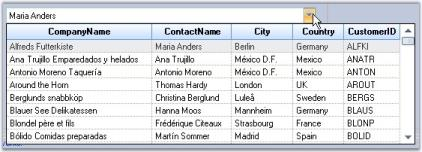

# About Syncfusion® Windows Forms Multicolumn ComboBox Control

Based on our ComboBoxBase control, the Multicolumn ComboBox is an advanced combo box control that has the capability to show multiple columns in the drop-down list. Also, since the drop-down list is bound virtually to the datasource, data binding to a very large datasource is instantaneous. 

In this version, the Multicolumn ComboBox can only be populated using data binding. You cannot manually add items to the combo box. 

This combo box automatically shows all the fields in the datasource. You can data bind using the usual DataSource, DisplayMember and ValueMember properties.

 

## Choose between different combobox controls

You can refer to the different combobox controls [here](https://help.syncfusion.com/windowsforms/combobox/overview#choose-between-different-combobox-controls).
