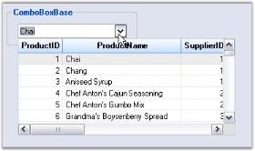

# ComboBoxBase in Windows Forms MultiColumn ListBox

The MultiColumn ListBox can be coupled to the ComboBoxBase control by using the ListControl property of ComboBoxBase class. ComboBoxBase is an advanced control provided by Syncfusion that essentially separates edit portion from drop-down portion making. It displays the MultiColumn ListBox as a dropdown i.e. user can drop the control in the drop-down area to get a multi-column drop-down effect.



this.comboBoxBase1.ListControl = this.gridListControl1;


Me.comboBoxBase1.ListControl = Me.gridListControl1



 
