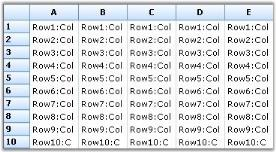
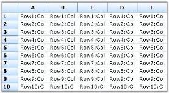
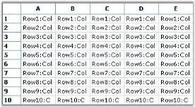
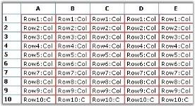
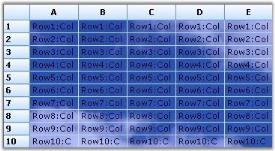

# Customizing List control in Windows Forms MultiColumn ListBox

Appearance of the GridList control can be customized by using the following properties:

* TransparentBackground: Sets a transparent background for grid cells. If its value is set to true, no background color will be displayed. If its value is set to false, the background will be filled with the chosen color. The value is false by default. Refer to the BackColor property for setting the required background color. 



this.gridListControl1.TransparentBackground = true;


Me.gridListControl1.TransparentBackground = True



 

* DisplayVertLines or DisplayHorzLines: Specifies the display of vertical or horizontal line on the grid. Ensure the display of vertical or horizontal grid line when setting this true.



this.gridListControl1.Properties.DisplayHorzLines = true;
this.gridListControl1.Properties.DisplayVertLines = true;


Me.gridListControl1.Properties.DisplayHorzLines = True
Me.gridListControl1.Properties.DisplayVertLines = True



 

* Buttons3D: Specifies appearance of the row and column headers. Render a three-dimensional header that provides a raised look when setting this property to true. 



this.gridListControl1.Properties.Buttons3D = true;


Me.gridListControl1.Properties.Buttons3D = True



 

* GridLineColor: Allows you to specify a color for grid lines. Its value can be set to the required color.



this.gridListControl1.Grid.Properties.GridLineColor = Color.Blue;


Me.gridListControl1.Grid.Properties.GridLineColor = Color.Blue



 

* BackColor: Allows you to specify the background color for the GridList control. It is mandatory to set the TransparentBackground to false.



this.gridListControl1.BackColor = Color.Beige;


Me.gridListControl1.BackColor = Color.Beige



 

* HeaderBackColor: Allows you to specify the background color of the headers.



this.gridListControl1.HeaderBackColor = Color.Red;


Me.gridListControl1.HeaderBackColor = Color.Red



* HeaderTextColor: Allows you to specify the header text color. 



this.gridListControl1.HeaderTextColor = Color.Blue;


Me.gridListControl1.HeaderTextColor = Color.Blue;



* BackgroundImage: Allows you to specify the background image used for the control.

The following code example illustrates usage of this property to set the required image as background of the control.



this.gridListControl1.BackgroundImage = Image.FromFile("Cloud.jpg");


Me.gridListControl1.BackgroundImage = Image.FromFile("Cloud.jpg")



