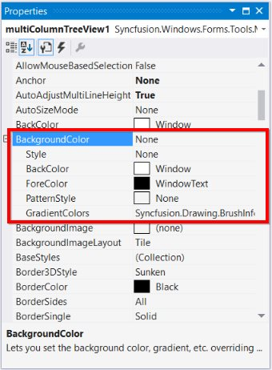
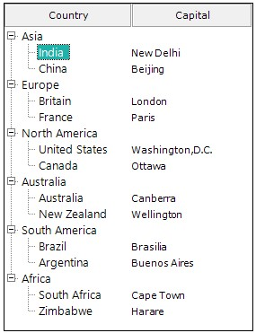
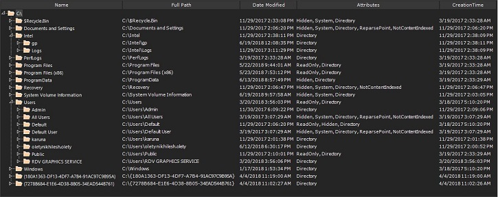
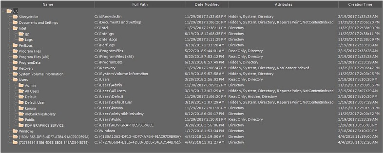
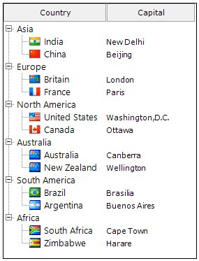

# Appearance in Windows Forms MultiColumn TreeView

## Border

### BorderStyle

BorderStyle Property has the following styles

*	None
If the BorderStyle set as none, border of MultiColumnTreeView will be collapsed

*	FixedSingle (For 2D)
      If the BorderStyle set as FixedSingle, then the border of the MultiColumnTreeView will be visible and we can customize the border.

*	Fixed3D (Default)
     If the BorderStyle set as Fixed3D, then the border of the MultiColumnTreeView will be visible in 3D and we can customize the border settings

### BorderSingle

It Indicates the following 2D border styles

*	Solid (default)

*	Dashed

*	Dotted

*	Inset

*	Outset

*	None

### BorderColor

BorderColor Property sets the color of Border

### BorderSides

BorderSides Property specify the sides of the control to which 3D border should be set.

It has the following Options

*	All
Three-dimensional border will be set for all sides

*	Right
Three-dimensional border on the right side of MultiColumnTreeView

*	Left
Three-dimensional border on the left side of MultiColumnTreeView

*	Top
Three-dimensional border on the top of MultiColumnTreeView

*	Bottom
Three-dimensional border on the bottom of MultiColumnTreeView

*	Middle

### Border3DStyle

Border3DStyle Property indicates the style of 3D border when BorderStyle is set as Fixed3D

It has the following Styles 

*	Adjust

*	Bump

*	Etched

*	Flat

*	Raised

*	RaisedInner

*	RaisedOuter

*	Sunken

*	SunkenInner

*	SunkenOuter

N> The settings will have applied only when `MultiColumnTreeView.BorderStyle` property is set to FixedSingle or Fixed3D.

**To customize the 2D border of MultiColumnTreeView, set the below properties as follows.**

*Property Table*

<table>
<tr>
<th>
MultiColumnTreeView Property</th><th>
Description</th></tr>
<tr>
<td>
BorderColor</td><td>
Indicates the color of the 2D border.</td></tr>
<tr>
<td>
BorderStyle</td><td>
Sets the 2D border style for the control.</td></tr>
<tr>
<td>
BorderSingle</td><td>
Indicates the 2D border style.</td></tr>
</table>





this.multiColumnTreeView1.BorderColor = System.Drawing.Color.SteelBlue;

this.multiColumnTreeView1.BorderSingle = System.Windows.Forms.ButtonBorderStyle.Dashed;

this.multiColumnTreeView1.BorderStyle = System.Windows.Forms.BorderStyle.FixedSingle;





Me.multiColumnTreeView1.BorderColor = System.Drawing.Color.SteelBlue

Me.multiColumnTreeView1.BorderSingle = System.Windows.Forms.ButtonBorderStyle.Dashed

Me.multiColumnTreeView1.BorderStyle = System.Windows.Forms.BorderStyle.FixedSingle





**To customize the 3D border of MultiColumnTreeView, set the below property as follows**

*Property Table*

<table>
<tr>
<th>
MultiColumnTreeView Property</th><th>
Description</th></tr>
<tr>
<td>
BorderStyle</td><td>
Sets the 3D border style for the control. It must be set as Fixed3D </td></tr>
<tr>
<td>
Border3DStyle</td><td>
Indicates the style of the 3D border when BorderStyle is set to Fixed3D.</td></tr>
<tr>
<td>
BorderSides</td><td>
Specifies the sides of the control to which border should be set.</td></tr>
<tr>
<td>
BorderColor</td><td>
Indicates the color of the 3D border.</td></tr>
</table>





this.multiColumnTreeView1.BorderStyle = BorderStyle.Fixed3D;

this.multiColumnTreeView1.BorderSides = Border3DSide.Right;

this.multiColumnTreeView1.Border3DStyle = Border3DStyle.RaisedOuter;

this.multiColumnTreeView1.BorderColor = Color.SteelBlue;





Me.multiColumnTreeView1.BorderStyle = BorderStyle.Fixed3D

Me.multiColumnTreeView1.BorderSides = Border3DSide.Right

Me.multiColumnTreeView1.Border3DStyle = Border3DStyle.RaisedOuter

Me.multiColumnTreeView1.BorderColor = Color.SteelBlue





## Color Customization

Color Customization lets you customize the MultiColumnTreeView with personalized colors to its components.

### BackColor

Indicates the background color of the control





this.multiColumnTreeView1.BackColor = Color.LightBlue ;





Me.multiColumnTreeView1.BackColor = Color.LightBlue 





### BackgroundColor

Indicates the background color of the control. It provides options to set style, back color, fore color, gradient color and gradient styles.

N> Both BackColor and Background color sets the background color of the control. If we set background color, backcolor property overridden by background color and we can set gradient color and gradient styles through background color property rather than backcolor.





this.multiColumnTreeView1.BackgroundColor = new Syncfusion.Drawing.BrushInfo(Color.Beige);





Me.multiColumnTreeView1.BackgroundColor = New Syncfusion.Drawing.BrushInfo(Color.Beige)





### Header Customization

Column headers can be customized using the `Background` property. 





this.multiColumnTreeView1.Columns[0].Background = new Syncfusion.Drawing.BrushInfo(ColorTranslator.FromHtml("#007acc"));
this.multiColumnTreeView1.Columns[1].Background = new Syncfusion.Drawing.BrushInfo(ColorTranslator.FromHtml("#007acc"));

this.multiColumnTreeView1.Columns[0].TextColor = Color.White;
this.multiColumnTreeView1.Columns[1].TextColor = Color.White ;





    Me.multiColumnTreeView1.Columns(0).Background = New Syncfusion.Drawing.BrushInfo(ColorTranslator.FromHtml("#007acc"))
    Me.multiColumnTreeView1.Columns(1).Background = New Syncfusion.Drawing.BrushInfo(ColorTranslator.FromHtml("#007acc"))
    Me.multiColumnTreeView1.Columns(0).TextColor = Color.White
    Me.multiColumnTreeView1.Columns(1).TextColor = Color.White





### BaseStyles

Apart from the Standard styles, you can create custom base styles for nodes, columns, sub items and even nodes with individual levels. 

For creating base styles follow the below steps,

1. Open the Base Style Collection Editor by clicking the BaseStyles property in property window.

2. By default, there will be three standard styles, for applying new base styles select for which you need to apply the styles in dropdown arrow and click the Add button .

In the image Node Level 1, Node Level 2 and SubItem Style Base style has been added.

### LineColor

Indicates the color of RootLines in MultiColumnTreeView.





this.multiColumnTreeView1.LineColor = Color.Red;





Me.multiColumnTreeView1.LineColor = Color.Red





### SelectedNodeBackground

Background for the selected node can be set using `SelectedNodeBackground` property.





this.multiColumnTreeView1.SelectedNodeBackground = new Syncfusion.Drawing.BrushInfo(Color.LightSeaGreen);





Me.multiColumnTreeView1.SelectedNodeBackground = New Syncfusion.Drawing.BrushInfo(Color.LightSeaGreen)





### SelectedNodeForeColor

Fore color for the selected node can be set using `SelectedNodeForeColor` property. 





this.multiColumnTreeView1.SelectedNodeForeColor = Color.White;





Me.multiColumnTreeView1.SelectedNodeForeColor = Color.White





### InactiveSelectedNodeBackground

The selection rectangle gets grayed out when the node loses focus. If the user still wishes to maintain the node’s active colors, then the `InactiveSelectedNodeBackground` and `InactiveSelectedNodeForeColor` properties can be set.





this.multiColumnTreeView1.InactiveSelectedNodeBackground = new BrushInfo(Color.Red);





Me.multiColumnTreeView1.InactiveSelectedNodeBackground = New BrushInfo(Color.Red)





### InactiveSelectedNodeForeColor

Fore Color for the selected node when control loses focus can be set using `InactiveSelectedNodeForeColor` property





this.multiColumnTreeView1.InactiveSelectedNodeForeColor = Color.White;





Me.multiColumnTreeView1.InactiveSelectedNodeForeColor = Color.White





## Customize SubItems

### Background

Background customization can be done for the sub item using `Background` property.





this.multiColumnTreeView1.Nodes[0].SubItems[1].Background = new Syncfusion.Drawing.BrushInfo(Color.Blue);





Me.multiColumnTreeView1.Nodes(0).SubItems(1).Background = New Syncfusion.Drawing.BrushInfo(Color.Blue)





### Border

#### BorderColor

Border color for the SubItem can be set using the property `BorderColor`.





this.MultiColumnTreeView1.Nodes[0].Nodes[0].Nodes[2].SubItems[1].BorderColor = Color.Red;





Me.MultiColumnTreeView1.Nodes(0).Nodes(0).Nodes(2).SubItems(1).BorderColor = Color.Red





#### BorderStyle

Border style can be set for the sub item using the `BorderStyle` property. It has same styles as explained in the Border Style for Nodes.





this.MultiColumnTreeView1.Nodes[0].Nodes[0].Nodes[2].SubItems[1].BorderStyle = BorderStyle.FixedSingle;





Me.MultiColumnTreeView1.Nodes(0).Nodes(0).Nodes(2).SubItems(1).BorderStyle = BorderStyle.FixedSingle





### Image Customization

Sub items can be customized with the Right and left image using the property `RightImage` and `LeftImage`





this.MultiColumnTreeView1.Nodes[0].Nodes[0].Nodes[2].SubItems[1].RightImage = Image.FromFile(@"Pictures/RightImage.png");

this.MultiColumnTreeView1.Nodes[0].Nodes[0].Nodes[2].SubItems[1].LeftImage = Image.FromFile(@"Pictures/LeftImage.png");





Me.MultiColumnTreeView1.Nodes(0).Nodes(0).Nodes(2).SubItems(1).RightImage = Image.FromFile("Pictures/RightImage.png")

Me.MultiColumnTreeView1.Nodes(0).Nodes(0).Nodes(2).SubItems(1).LeftImage = Image.FromFile("Pictures/LeftImage.png")





## Style

### Office2016Colorful





this.multiColumnTreeView1.Style = MultiColumnVisualStyle.Office2016Colorful;





Me.multiColumnTreeView1.Style = MultiColumnVisualStyle.Office2016Colorful





### Office2016White





this.multiColumnTreeView1.Style = MultiColumnVisualStyle.Office2016White;





Me.multiColumnTreeView1.Style = MultiColumnVisualStyle.Office2016White





### Office2016Black





this.multiColumnTreeView1.Style = MultiColumnVisualStyle.Office2016Black;





Me.multiColumnTreeView1.Style = MultiColumnVisualStyle.Office2016Black





### Office2016DarkGray





this.multiColumnTreeView1.Style = MultiColumnVisualStyle.Office2016DarkGray;





Me.multiColumnTreeView1.Style = MultiColumnVisualStyle.Office2016DarkGray





## PlusMinus

Plus Minus are used to display plus/minus images for the parent nodes using the property `ShowPlusMinus` these images can be disabled.





this.multiColumnTreeView2.ShowPlusMinus = false;





Me.multiColumnTreeView2.ShowPlusMinus = False





## Image Customization

### LeftImageList

The tree nodes can be set with left images using LeftImageList property in the property window. Left images for the individual nodes can be specified in LeftImageIndices property of individual nodes, using the MultiColumnTreeView Nodes Collection Editor.

The nodes with the images can be given an enhanced appearance using LeftImagePadding.

**Property Table**

<table>
<tr>
<th>
MultiColumnTreeView Property</th><th>
Description</th></tr>
<tr>
<td>
LeftImageList</td><td>
Indicates the image list that holds the images to be drawn on the left of the Node.</td></tr>
</table>

<table>
<tr>
<th>
TreeNodeAdv Property</th><th>
Description</th></tr>
<tr>
<td>
LeftImageIndices</td><td>
It is the image index to be drawn on the left of the node's text.</td></tr>
<tr>
<td>
LeftImagePadding</td><td>
It is the space provided between the LeftImage of the node and node.</td></tr>
<tr>
<td>
LeftStateImagePadding</td><td>
It is the space provided between, the LeftStateImage of the node and node.</td></tr>
</table>

To set the left images for all the nodes in MultiColumnTreeView follow the below steps

1. Create image list and add images in it.

2. Set the newly created image list to the LeftImageList property.

    Through code:

​




this.multiColumnTreeView1.LeftImageList = this.leftImageList;





Me.multiColumnTreeView1.LeftImageList = Me.leftImageList





{{ codesnippet1 | OrderList_Indent_Level_1 }}

3. Now set the LeftImageIndices for each node in MultiColumnTreeView.

​




multiColumnTreeView1.LeftImageIndices = new int[] {1};





multiColumnTreeView1.LeftImageIndices = New Integer() {1}





{{ codesnippet2 | OrderList_Indent_Level_1 }}

### RightImageList

The tree nodes can be set with right images using RightImageList property in the property window. right images for the individual nodes can be specified in RightImageIndices property of individual nodes, using the MultiColumnTreeView Nodes Collection Editor.

The nodes with the images can be given an enhanced appearance using RightImagePadding.

**Property Table**

<table>
<tr>
<th>
MultiColumnTreeView Property</th><th>
Description</th></tr>
<tr>
<td>
RightImageList</td><td>
Indicates the image list that holds the images to be drawn on the right of the Node.</td></tr>
</table>

<table>
<tr>
<th>
TreeNodeAdv Property</th><th>
Description</th></tr>
<tr>
<td>
RightImageIndices</td><td>
It is the image index to be drawn on the right of the node's text.</td></tr>
<tr>
<td>
RightImagePadding</td><td>
It is the space provided between the RightImage of the node and node.</td></tr>
<tr>
<td>
RightStateImagePadding</td><td>
It is the space provided between, the RightStateImage of the node and node.</td></tr>
</table>

To set the right images for all the nodes in MultiColumnTreeView follow the below steps

1. Create image list and add images in it.

2. Set the newly created image list to the RightImageList property.

    Through code:






this.multiColumnTreeView1.RightImageList = this.rightImageList;





Me.multiColumnTreeView1.RightImageList = Me.rightImageList





{{ codesnippet3 | OrderList_Indent_Level_1 }}

3. Now set the RightImageIndices for each node in MultiColumnTreeView.

​




multiColumnTreeView1.RightImageIndices = new int[] {1};





multiColumnTreeView1.RightImageIndices = New Integer() {1}





{{ codesnippet4 | OrderList_Indent_Level_1 }}

### StateImageList
		
Different images can be set for expand / collapse states of the node, using StateImageList property. To apply the left open and close images, set the ClosedImageIndex and the OpenImageIndex to the indices that points to the images in the StateImageList respectively. Nodes without child can be set with a separate image using NoChildrenImageIndex.

**Property Table**

**MultiColumnTreeView Property**

<table>
<tr>
<th>
MultiColumnTreeView Event</th><th>
Description</th></tr>
<tr>
<td>
ClosedImageIndex</td><td>
It is the StateImageList index value of the image that is displayed, when a tree node is collapsed.</td></tr>
<tr>
<td>
NoChildrenImageIndex</td><td>
It is the StateImageList index value of the image that is displayed, when a tree node has no children.</td></tr>
<tr>
<td>
OpenImageIndex</td><td>
It is the StateImageList index value of the image that is displayed, when a tree node is expanded.</td></tr>
<tr>
<td>
StateImageList</td><td>
This indicates the image list that holds the images to be drawn based on the state of the Node.</td></tr>
</table>

The above properties can also be set to individual nodes

**TreeNodeAdv Property**

<table>
<tr>
<th>
MultiColumnTreeView Event</th><th>
Description</th></tr>
<tr>
<td>
ClosedImageIndex</td><td>
It is the image index in StateImageList where the node is collapsed.</td></tr>
<tr>
<td>
NoChildrenImageIndex</td><td>
It is the image index indicating the image in the StateImageList where the node has no children.</td></tr>
<tr>
<td>
OpenImageIndex</td><td>
It is the image index in StateImageList where the node is expanded.</td></tr>
</table>

To set the state images for all the nodes in MultiColumnTreeView follow the below steps

1. Create image list and add images in it.

2. Set the newly created image list to the property `StateImageList`.

    Through code:





this.multiColumnTreeView1.StateImageList = this.stateImageList;





Me.multiColumnTreeView1.StateImageList = Me.stateImageList





{{ codesnippet5 | OrderList_Indent_Level_1 }}

3. Now set the OpenImgIndex and ClosedImgIndex for each node in MultiColumnTreeView.






treeNodeAdv1. OpenImgIndex = 1;

treeNodeAdv1. CloseImgIndex = 2;





treeNodeAdv1.OpenImgIndex = 1

treeNodeAdv1.CloseImgIndex = 2





{{ codesnippet6 | OrderList_Indent_Level_1 }}

4. Repeat step 3 until  set OpenImgIndex and ClosedImgIndex for all the nodes in MultiColumnTreeView.

