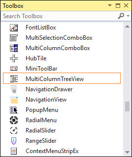
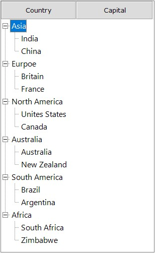
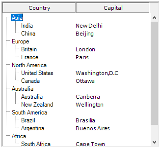

# Getting Started with Windows Forms MultiColumn TreeView

This section explains how to create a new Windows Forms project in Visual Studio and add **"MultiColumnTreeView"** with it's basic functionalities.

## Assembly deployment

Refer to the [control dependencies](https://help.syncfusion.com/windowsforms/control-dependencies#multicolumntreeview) section to get the list of assemblies or NuGet package details which needs to be added as reference to use the control in any application.

[Check here](https://help.syncfusion.com/windowsforms/installation/install-nuget-packages) to find more details about on how to install nuget packages in Windows Forms application.

## Adding a MultiColumnTreeView control through designer

The **"MultiColumnTreeView"** control can be added through designer by following steps.

Step 1. The **"MultiColumnTreeView"** control can be added to an application by dragging it from toolbox to design view. The following dependent assemblies will be added automatically.

        * Syncfusion.Grid.Base
        * Syncfusion.Grid.Windows
        * Syncfusion.Shared.Base
        * Syncfusion.Shared.Windows
        * Syncfusion.Tools.Base
        * Syncfusion.Tools.Windows

 

Step 2. Set the desired properties for **"MultiColumnTreeView"** control through the **"Properties"** dialog.

## Adding a MultiColumnTreeView control through code

Step 1. Create C# or VB application through Visual Studio.

Step 2. Add the following reference to the project.

        * Syncfusion.Grid.Base
        * Syncfusion.Grid.Windows
        * Syncfusion.Shared.Base
        * Syncfusion.Shared.Windows
        * Syncfusion.Tools.Base
        * Syncfusion.Tools.Windows

Step 3. Include the required namespace.





using Syncfusion.Windows.Forms.Tools.MultiColumnTreeView;





Imports Syncfusion.Windows.Forms.Tools.MultiColumnTreeView




{{ codesnippet1 | OrderList_Indent_Level_1 }}

Step 4. Create an instance of the **"MultiColumnTreeView"** and add it to the form.






private MultiColumnTreeView multiColumnTreeView1;
      
this.multiColumnTreeView1 = new MultiColumnTreeView();
 this.Controls.Add(this.multiColumnTreeView1);
    




Imports Syncfusion.Windows.Forms.Tools.MultiColumnTreeView
Imports Syncfusion.Windows.Forms

Private multiColumnTreeView1 As MultiColumnTreeView
Me.multiColumnTreeView1 = New MultiColumnTreeView()
Me.Controls.Add(Me.multiColumnTreeView1)





{{ codesnippet2 | OrderList_Indent_Level_1 }}

## Customize Columns

### Adding Columns

This section explains about how to add the columns into the **"MultiColumnTreeView"** control using C# code.





TreeColumnAdv countryColumn = new TreeColumnAdv();
TreeColumnAdv capitalColumn = new TreeColumnAdv();
        
countryColumn = new TreeColumnAdv();
capitalColumn = new TreeColumnAdv();

countryColumn.Text = "Country";
capitalColumn.Text = "Capital";

countryColumn.Width = 150;
capitalColumn.Width = 150;

multiColumnTreeView1.Columns.AddRange(new TreeColumnAdv[] { countryColumn, capitalColumn });
    




Dim countryColumn As New TreeColumnAdv()
Dim capitalColumn As New TreeColumnAdv()

countryColumn = New TreeColumnAdv()
capitalColumn = New TreeColumnAdv()

countryColumn.Text = "Country"
capitalColumn.Text = "Capital"

countryColumn.Width = 150
capitalColumn.Width = 150

multiColumnTreeView1.Columns.AddRange(New TreeColumnAdv() { countryColumn, capitalColumn })





 

### Adding nodes to the control

This section explains about how to add nodes into the **"MultiColumnTreeView"** control.





Syncfusion.Windows.Forms.Tools.MultiColumnTreeView.TreeNodeAdv asiaNode = new Syncfusion.Windows.Forms.Tools.MultiColumnTreeView.TreeNodeAdv();
Syncfusion.Windows.Forms.Tools.MultiColumnTreeView.TreeNodeAdv europeNode = new Syncfusion.Windows.Forms.Tools.MultiColumnTreeView.TreeNodeAdv();
Syncfusion.Windows.Forms.Tools.MultiColumnTreeView.TreeNodeAdv northAmericaNode = new Syncfusion.Windows.Forms.Tools.MultiColumnTreeView.TreeNodeAdv();
Syncfusion.Windows.Forms.Tools.MultiColumnTreeView.TreeNodeAdv australiaNode = new Syncfusion.Windows.Forms.Tools.MultiColumnTreeView.TreeNodeAdv();
Syncfusion.Windows.Forms.Tools.MultiColumnTreeView.TreeNodeAdv southAmericaNode = new Syncfusion.Windows.Forms.Tools.MultiColumnTreeView.TreeNodeAdv();
Syncfusion.Windows.Forms.Tools.MultiColumnTreeView.TreeNodeAdv africaNode = new Syncfusion.Windows.Forms.Tools.MultiColumnTreeView.TreeNodeAdv();

asiaNode.Text = "Asia";
europeNode.Text = "Europe";
northAmericaNode.Text = "North America";
australiaNode.Text = "Australia";
southAmericaNode.Text = "South America";
africaNode.Text = "Africa";

multiColumnTreeView1.Nodes.AddRange(new Syncfusion.Windows.Forms.Tools.MultiColumnTreeView.TreeNodeAdv[] { asiaNode, europeNode, northAmericaNode, australiaNode, southAmericaNode, africaNode });
    




Dim asiaNode As New Syncfusion.Windows.Forms.Tools.MultiColumnTreeView.TreeNodeAdv()
Dim europeNode As New Syncfusion.Windows.Forms.Tools.MultiColumnTreeView.TreeNodeAdv()
Dim northAmericaNode As New Syncfusion.Windows.Forms.Tools.MultiColumnTreeView.TreeNodeAdv()
Dim australiaNode As New Syncfusion.Windows.Forms.Tools.MultiColumnTreeView.TreeNodeAdv()
Dim southAmericaNode As New Syncfusion.Windows.Forms.Tools.MultiColumnTreeView.TreeNodeAdv()
Dim africaNode As New Syncfusion.Windows.Forms.Tools.MultiColumnTreeView.TreeNodeAdv()

asiaNode.Text = "Asia"
europeNode.Text = "Europe"
northAmericaNode.Text = "North America"
australiaNode.Text = "Australia"
southAmericaNode.Text = "South America"
africaNode.Text = "Africa"

multiColumnTreeView1.Nodes.AddRange(New Syncfusion.Windows.Forms.Tools.MultiColumnTreeView.TreeNodeAdv() { asiaNode, europeNode, northAmericaNode, australiaNode, southAmericaNode, africaNode })





### Adding child nodes to the parent node

This section explains about how to add **"Child Nodes"** to the parent nodes.





Syncfusion.Windows.Forms.Tools.MultiColumnTreeView.TreeNodeAdv indiaNode = new Syncfusion.Windows.Forms.Tools.MultiColumnTreeView.TreeNodeAdv();
Syncfusion.Windows.Forms.Tools.MultiColumnTreeView.TreeNodeAdv chinaNode = new Syncfusion.Windows.Forms.Tools.MultiColumnTreeView.TreeNodeAdv();
Syncfusion.Windows.Forms.Tools.MultiColumnTreeView.TreeNodeAdv britainNode = new Syncfusion.Windows.Forms.Tools.MultiColumnTreeView.TreeNodeAdv();
Syncfusion.Windows.Forms.Tools.MultiColumnTreeView.TreeNodeAdv franceNode = new Syncfusion.Windows.Forms.Tools.MultiColumnTreeView.TreeNodeAdv();
Syncfusion.Windows.Forms.Tools.MultiColumnTreeView.TreeNodeAdv unitedStatesNode = new Syncfusion.Windows.Forms.Tools.MultiColumnTreeView.TreeNodeAdv();
Syncfusion.Windows.Forms.Tools.MultiColumnTreeView.TreeNodeAdv CanadaNode = new Syncfusion.Windows.Forms.Tools.MultiColumnTreeView.TreeNodeAdv();
Syncfusion.Windows.Forms.Tools.MultiColumnTreeView.TreeNodeAdv australiaChildNode = new Syncfusion.Windows.Forms.Tools.MultiColumnTreeView.TreeNodeAdv();
Syncfusion.Windows.Forms.Tools.MultiColumnTreeView.TreeNodeAdv newZealandNode = new Syncfusion.Windows.Forms.Tools.MultiColumnTreeView.TreeNodeAdv();
Syncfusion.Windows.Forms.Tools.MultiColumnTreeView.TreeNodeAdv brazilNode = new Syncfusion.Windows.Forms.Tools.MultiColumnTreeView.TreeNodeAdv();
Syncfusion.Windows.Forms.Tools.MultiColumnTreeView.TreeNodeAdv argentinaNode = new Syncfusion.Windows.Forms.Tools.MultiColumnTreeView.TreeNodeAdv();
Syncfusion.Windows.Forms.Tools.MultiColumnTreeView.TreeNodeAdv southAfricaNode = new Syncfusion.Windows.Forms.Tools.MultiColumnTreeView.TreeNodeAdv();
Syncfusion.Windows.Forms.Tools.MultiColumnTreeView.TreeNodeAdv zimbabweNode = new Syncfusion.Windows.Forms.Tools.MultiColumnTreeView.TreeNodeAdv();

            
indiaNode.Text = "India";
chinaNode.Text = "China";
britainNode.Text = "Britain";
franceNode.Text = "France";
unitedStatesNode.Text = "United States";
CanadaNode.Text = "Canada";
australiaChildNode.Text = "Australia";
newZealandNode.Text = "New Zealand";
brazilNode.Text = "Brazil";
argentinaNode.Text = "Argentina";
southAfricaNode.Text = "South Africa";
zimbabweNode.Text = "Zimbabwe";

asiaNode.Nodes.AddRange(new Syncfusion.Windows.Forms.Tools.MultiColumnTreeView.TreeNodeAdv[] { indiaNode, chinaNode });
europeNode.Nodes.AddRange(new Syncfusion.Windows.Forms.Tools.MultiColumnTreeView.TreeNodeAdv[] { britainNode, franceNode });
northAmericaNode.Nodes.AddRange(new Syncfusion.Windows.Forms.Tools.MultiColumnTreeView.TreeNodeAdv[] { unitedStatesNode, CanadaNode });
australiaNode.Nodes.AddRange(new Syncfusion.Windows.Forms.Tools.MultiColumnTreeView.TreeNodeAdv[] { australiaChildNode, newZealandNode });
southAmericaNode.Nodes.AddRange(new Syncfusion.Windows.Forms.Tools.MultiColumnTreeView.TreeNodeAdv[] { brazilNode, argentinaNode });
africaNode.Nodes.AddRange(new Syncfusion.Windows.Forms.Tools.MultiColumnTreeView.TreeNodeAdv[] { southAfricaNode, zimbabweNode });
    




Dim indiaNode As New Syncfusion.Windows.Forms.Tools.MultiColumnTreeView.TreeNodeAdv()
Dim chinaNode As New Syncfusion.Windows.Forms.Tools.MultiColumnTreeView.TreeNodeAdv()
Dim britainNode As New Syncfusion.Windows.Forms.Tools.MultiColumnTreeView.TreeNodeAdv()
Dim franceNode As New Syncfusion.Windows.Forms.Tools.MultiColumnTreeView.TreeNodeAdv()
Dim unitedStatesNode As New Syncfusion.Windows.Forms.Tools.MultiColumnTreeView.TreeNodeAdv()
Dim CanadaNode As New Syncfusion.Windows.Forms.Tools.MultiColumnTreeView.TreeNodeAdv()
Dim australiaChildNode As New Syncfusion.Windows.Forms.Tools.MultiColumnTreeView.TreeNodeAdv()
Dim newZealandNode As New Syncfusion.Windows.Forms.Tools.MultiColumnTreeView.TreeNodeAdv()
Dim brazilNode As New Syncfusion.Windows.Forms.Tools.MultiColumnTreeView.TreeNodeAdv()
Dim argentinaNode As New Syncfusion.Windows.Forms.Tools.MultiColumnTreeView.TreeNodeAdv()
Dim southAfricaNode As New Syncfusion.Windows.Forms.Tools.MultiColumnTreeView.TreeNodeAdv()
Dim zimbabweNode As New Syncfusion.Windows.Forms.Tools.MultiColumnTreeView.TreeNodeAdv()

indiaNode.Text = "India"
chinaNode.Text = "China"
britainNode.Text = "Britain"
franceNode.Text = "France"
unitedStatesNode.Text = "United States"
CanadaNode.Text = "Canada"
australiaChildNode.Text = "Australia"
newZealandNode.Text = "New Zealand"
brazilNode.Text = "Brazil"
argentinaNode.Text = "Argentina"
southAfricaNode.Text = "South Africa"
zimbabweNode.Text = "Zimbabwe"

asiaNode.Nodes.AddRange(New Syncfusion.Windows.Forms.Tools.MultiColumnTreeView.TreeNodeAdv() { indiaNode, chinaNode })
europeNode.Nodes.AddRange(New Syncfusion.Windows.Forms.Tools.MultiColumnTreeView.TreeNodeAdv() { britainNode, franceNode })
northAmericaNode.Nodes.AddRange(New Syncfusion.Windows.Forms.Tools.MultiColumnTreeView.TreeNodeAdv() { unitedStatesNode, CanadaNode })
australiaNode.Nodes.AddRange(New Syncfusion.Windows.Forms.Tools.MultiColumnTreeView.TreeNodeAdv() { australiaChildNode, newZealandNode })
southAmericaNode.Nodes.AddRange(New Syncfusion.Windows.Forms.Tools.MultiColumnTreeView.TreeNodeAdv() { brazilNode, argentinaNode })
africaNode.Nodes.AddRange(New Syncfusion.Windows.Forms.Tools.MultiColumnTreeView.TreeNodeAdv() { southAfricaNode, zimbabweNode })





 

### Adding SubItems

This section explains about how to add **"SubItems"** to the nodes.





Syncfusion.Windows.Forms.Tools.MultiColumnTreeView.TreeNodeAdvSubItem delhiSubItem = new TreeNodeAdvSubItem();
Syncfusion.Windows.Forms.Tools.MultiColumnTreeView.TreeNodeAdvSubItem beijingSubItem = new TreeNodeAdvSubItem();
Syncfusion.Windows.Forms.Tools.MultiColumnTreeView.TreeNodeAdvSubItem londonSubItem = new TreeNodeAdvSubItem();
Syncfusion.Windows.Forms.Tools.MultiColumnTreeView.TreeNodeAdvSubItem parisSubItem = new TreeNodeAdvSubItem();
Syncfusion.Windows.Forms.Tools.MultiColumnTreeView.TreeNodeAdvSubItem washingtonSubItem = new TreeNodeAdvSubItem();
Syncfusion.Windows.Forms.Tools.MultiColumnTreeView.TreeNodeAdvSubItem ottawaSubItem = new TreeNodeAdvSubItem();
Syncfusion.Windows.Forms.Tools.MultiColumnTreeView.TreeNodeAdvSubItem canberraSubItem = new TreeNodeAdvSubItem();
Syncfusion.Windows.Forms.Tools.MultiColumnTreeView.TreeNodeAdvSubItem wellingtonSubItem = new TreeNodeAdvSubItem();
Syncfusion.Windows.Forms.Tools.MultiColumnTreeView.TreeNodeAdvSubItem brasiliaSubItem = new TreeNodeAdvSubItem();
Syncfusion.Windows.Forms.Tools.MultiColumnTreeView.TreeNodeAdvSubItem buenosSubItem = new TreeNodeAdvSubItem();
Syncfusion.Windows.Forms.Tools.MultiColumnTreeView.TreeNodeAdvSubItem capeTownSubItem = new TreeNodeAdvSubItem();
Syncfusion.Windows.Forms.Tools.MultiColumnTreeView.TreeNodeAdvSubItem harereSubItem = new TreeNodeAdvSubItem();
            

delhiSubItem.Text = "New Delhi";
beijingSubItem.Text = "Beijing";
londonSubItem.Text = "London";
parisSubItem.Text = "Paris";
washingtonSubItem.Text = "Washington,D.C";
ottawaSubItem.Text = "Ottawa";
canberraSubItem.Text = "Canberra";
wellingtonSubItem.Text = "Wellington";
brasiliaSubItem.Text = "Brasilia";
buenosSubItem.Text = "Buenos Aires";
capeTownSubItem.Text = "Cape Town";
harereSubItem.Text = "Harere";

indiaNode.SubItems.Add(delhiSubItem);
chinaNode.SubItems.Add(beijingSubItem);
britainNode.SubItems.Add(londonSubItem);
franceNode.SubItems.Add(parisSubItem);
unitedStatesNode.SubItems.Add(washingtonSubItem);
CanadaNode.SubItems.Add(ottawaSubItem);
australiaChildNode.SubItems.Add(canberraSubItem);
newZealandNode.SubItems.Add(wellingtonSubItem);
brazilNode.SubItems.Add(brasiliaSubItem);
argentinaNode.SubItems.Add(buenosSubItem);
southAfricaNode.SubItems.Add(capeTownSubItem);
zimbabweNode.SubItems.Add(harereSubItem);
    




Dim delhiSubItem As Syncfusion.Windows.Forms.Tools.MultiColumnTreeView.TreeNodeAdvSubItem = New TreeNodeAdvSubItem()
Dim beijingSubItem As Syncfusion.Windows.Forms.Tools.MultiColumnTreeView.TreeNodeAdvSubItem = New TreeNodeAdvSubItem()
Dim londonSubItem As Syncfusion.Windows.Forms.Tools.MultiColumnTreeView.TreeNodeAdvSubItem = New TreeNodeAdvSubItem()
Dim parisSubItem As Syncfusion.Windows.Forms.Tools.MultiColumnTreeView.TreeNodeAdvSubItem = New TreeNodeAdvSubItem()
Dim washingtonSubItem As Syncfusion.Windows.Forms.Tools.MultiColumnTreeView.TreeNodeAdvSubItem = New TreeNodeAdvSubItem()
Dim ottawaSubItem As Syncfusion.Windows.Forms.Tools.MultiColumnTreeView.TreeNodeAdvSubItem = New TreeNodeAdvSubItem()
Dim canberraSubItem As Syncfusion.Windows.Forms.Tools.MultiColumnTreeView.TreeNodeAdvSubItem = New TreeNodeAdvSubItem()
Dim wellingtonSubItem As Syncfusion.Windows.Forms.Tools.MultiColumnTreeView.TreeNodeAdvSubItem = New TreeNodeAdvSubItem()
Dim brasiliaSubItem As Syncfusion.Windows.Forms.Tools.MultiColumnTreeView.TreeNodeAdvSubItem = New TreeNodeAdvSubItem()
Dim buenosSubItem As Syncfusion.Windows.Forms.Tools.MultiColumnTreeView.TreeNodeAdvSubItem = New TreeNodeAdvSubItem()
Dim capeTownSubItem As Syncfusion.Windows.Forms.Tools.MultiColumnTreeView.TreeNodeAdvSubItem = New TreeNodeAdvSubItem()
Dim harereSubItem As Syncfusion.Windows.Forms.Tools.MultiColumnTreeView.TreeNodeAdvSubItem = New TreeNodeAdvSubItem()

delhiSubItem.Text = "New Delhi"
beijingSubItem.Text = "Beijing"
londonSubItem.Text = "London"
parisSubItem.Text = "Paris"
washingtonSubItem.Text = "Washington,D.C"
ottawaSubItem.Text = "Ottawa"
canberraSubItem.Text = "Canberra"
wellingtonSubItem.Text = "Wellington"
brasiliaSubItem.Text = "Brasilia"
buenosSubItem.Text = "Buenos Aires"
capeTownSubItem.Text = "Cape Town"
harereSubItem.Text = "Harere"

indiaNode.SubItems.Add(delhiSubItem)
chinaNode.SubItems.Add(beijingSubItem)
britainNode.SubItems.Add(londonSubItem)
franceNode.SubItems.Add(parisSubItem)
unitedStatesNode.SubItems.Add(washingtonSubItem)
CanadaNode.SubItems.Add(ottawaSubItem)
australiaChildNode.SubItems.Add(canberraSubItem)
newZealandNode.SubItems.Add(wellingtonSubItem)
brazilNode.SubItems.Add(brasiliaSubItem)
argentinaNode.SubItems.Add(buenosSubItem)
southAfricaNode.SubItems.Add(capeTownSubItem)
zimbabweNode.SubItems.Add(harereSubItem)





 

## Customize Nodes

The TreeNodeAdv can be customized with the following options.

### Root lines

We can display the root lines between the root nodes by setting the property `ShowRootLines` to `true`. Whereas the property `ShowLines` displays connecting the line for rest of nodes in the control, except between the root nodes. By default, `ShowRootLines` and `ShowLines` is set as `true`.
When `ShowLines` is set to `false`, the connecting lines will not be displayed for the entire control.

<table>
<tr>
<th>
MultiColumnTreeView Property</th><th>
Description</th></tr>
<tr>
<td>
ShowRootLines</td><td>
Indicates whether lines are displayed between root nodes.
</td></tr>
</table>

Refer the below code,





this.multiColumnTreeView1.ShowRootLines = true;





Me.multiColumnTreeView1.ShowRootLines = True





### Plus Minus

Plus minus symbols will be shown according to the state of the node, plus (+) will be shown if the node is in expanded state and minus (-) will be shown if the node is minimized.

<table>
<tr>
<th>
MultiColumnTreeView Property</th><th>
Description</th></tr>
<tr>
<td>
ShowPlusMinus</td><td>
Indicates if the Plus minus symbols will be shown for the nodes.</td></tr>
</table>





//setting plus minus for all the nodes
this.multiColumnTreeView1.ShowPlusMinus = true;

//setting plus minus for specified node
this.multiColumnTreeView1.Nodes[0].ShowPlusMinus = true;





Me.multiColumnTreeView1.ShowPlusMinus = True

Me.multiColumnTreeView1.Nodes(0).ShowPlusMinus = True





 

### Tool Tip 

ToolTip is a special control which automatically appears as a popup when a node is partially visible. It displays the total text of the node.

 

### Check Box

The `ShowCheckBoxes` property when set will display check box for all the nodes. To apply checkbox to individual nodes, set the `TreeNodeAdv.ShowCheckBox` property, only for the required nodes in the NodeCollection Editor.

The `InteractiveCheckBoxes` indicates whether the state of the parent node’s checkbox is based on the check state of its child nodes checkboxes. To set this for individual nodes set the `InteractiveCheckBox` property of the TreeNodeAdv.

<table>
<tr>
<th>
MultiColumnTreeView Property</th><th>
Description</th></tr>
<tr>
<td>
ShowCheckBoxes</td><td>
Indicates if the checkbox will be shown for the nodes.</td></tr>
<tr>
<td>
InteractiveCheckBoxes</td><td>
Indicates if the state of the node's checkbox indicates the check state of the child node's checkboxes.</td></tr>
</table>

Refer below code,





//setting check boxes for all the nodes
this.multiColumnTreeView1.ShowCheckBoxes = true;

//setting check box for specified node
this.multiColumnTreeView1.Nodes[0].ShowCheckBox = true;

//setting interactive check boxes for all the nodes
this.multiColumnTreeView1.InteractiveCheckBoxes = true;

//setting interactive check boxes for specified nodes
this.multiColumnTreeView1.Nodes[0].InteractiveCheckBox = true;





Me.multiColumnTreeView1.ShowCheckBoxes = True

Me.multiColumnTreeView1.Nodes(0).ShowCheckBox = True

Me.multiColumnTreeView1.InteractiveCheckBoxes = True

Me.multiColumnTreeView1.Nodes(0).InteractiveCheckBox = True





 

### Option Button

`ShowOptionButtons` property, when set, will add option buttons to all the nodes. This can be applied for the required nodes alone, by setting the property for the respective nodes in the NodeCollection Editor.





//Shows options for all the nodes
this.multiColumnTreeView1.ShowOptionButtons = true;

//Shows option button to specified node
this.multiColumnTreeView1.Nodes[0].ShowOptionButton = true;





Me.multiColumnTreeView1.ShowOptionButtons = True

Me.multiColumnTreeView1.Nodes(0).ShowOptionButton = True





 
 

## Assigning Active Nodes

Assigning a node to an Active Node makes the node selected.





 this.multiColumnTreeView1.ActiveNode = this.multiColumnTreeView1.Nodes[0];





Me.multiColumnTreeView1.ActiveNode = Me.multiColumnTreeView1.Nodes(0)





N> You can also explore our [WinForms MultiColumn TreeView example](https://github.com/syncfusion/winforms-demos/tree/master/multicolumntreeview) that shows how to render the MultiColumn TreeView in Windows Forms.

