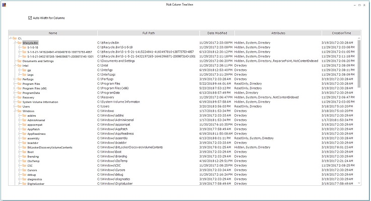
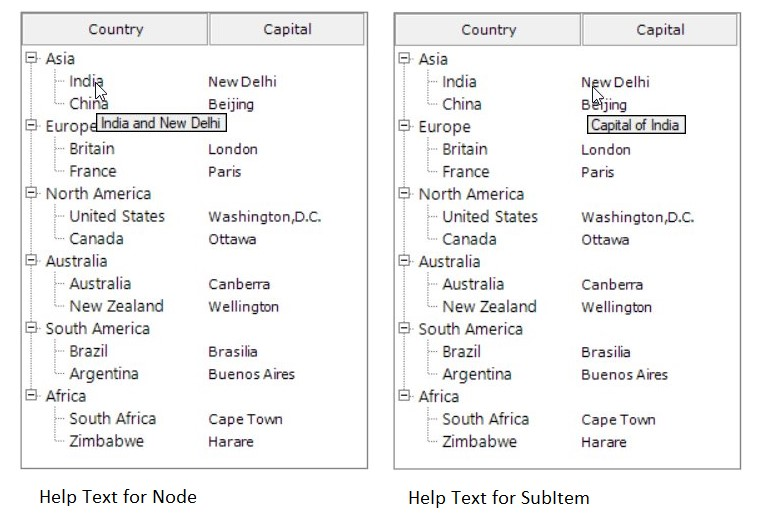

# MultiColumnTreeView Features in Windows Forms MultiColumn TreeView

MultiColumnTreeView contains following features,

## NodeSelection

### SelectionMode

`SelectionMode` defines the ability to select number of nodes at a time, there are three modes.

•	Single – Allows the user to select only a single node.

•	MultiSelectSameLevel – Allows to multi select only when the multiple nodes are same level.

•	MultiSelectAll – Allows to multi select the nodes irrespective of node level.





this.MultiColumnTreeView1.SelectionMode = Syncfusion.Windows.Forms.Tools.MultiColumnTreeView.TreeSelectionMode.MultiSelectAll;





Me.MultiColumnTreeView1.SelectionMode = Syncfusion.Windows.Forms.Tools.MultiColumnTreeView.TreeSelectionMode.MultiSelectAll





`SelectedNode` property gets the node value when the user selects a node in the MulticolumnTreeView.
This property will be useful when the Selection Mode is Single.

`SelectedNode` can also be used to set a node as selected.





this.MultiColumnTreeView1.SelectedNode = this.MultiColumnTreeView1.Nodes[0].Nodes[1];





Me.MultiColumnTreeView1.SelectedNode = Me.MultiColumnTreeView1.Nodes(0).Nodes(1)





`SelectedNodes` is used to get the nodes selected in MultiColumnTreeView, it can be used in all  selection modes .

`ActiveNode` is the node that is being active, it allows to get or set a node as ActiveNode at an instance.





this.MultiColumnTreeView1.ActiveNode = this.MultiColumnTreeView1.Nodes[4].Nodes[1];





Me.MultiColumnTreeView1.ActiveNode = Me.MultiColumnTreeView1.Nodes(4).Nodes(1)





## Keyboard and Mouse based selection

Mouse based selection allows the user to select the nodes using mouse drag, simply click on any area in MultiColumnTreeView and drag. All the nodes available in the drag region will be selected .
Use the property ` AllowMouseBasedSelection`, to select the nodes using mouse.





this.MultiColumnTreeView1.AllowMouseBasedSelection = true;





Me.MultiColumnTreeView1.AllowMouseBasedSelection = True





MultiColumnTreeView supports to search the nodes with the keyboard buttons. Simply tap any alphabet in keyboard and MultiColumnTreeView will show the node starting with that alphabet and keep tapping the button to show all the nodes starting with that alphabet.





this.MultiColumnTreeView1.AllowKeyboardSearch = true;





Me.MultiColumnTreeView1.AllowKeyboardSearch = True





## Auto Size for columns

MultiColumnTreeView has the support for calculating the width of the Nodes and SubItems by calculating the width of Text and images in it and assigns the largest node width to its column.

It can be done by using the property `AutoSizeMode`, it has two options None and AllCellsExceptHeader.

*	None – No Auto size to the columns
*	AllCellsExceptHeader – Calculates the nodes width and assigns  the width to the column, this option will not calculate width of the header text.





this.multiColumnTreeView1.AutoSizeMode = Syncfusion.Windows.Forms.Tools.MultiColumnTreeView.AutoSizeMode.AllCellsExceptHeader;





Me.multiColumnTreeView1.AutoSizeMode = Syncfusion.Windows.Forms.Tools.MultiColumnTreeView.AutoSizeMode.AllCellsExceptHeader





## Undo & Redo

Undo action is used to erase the last change done to the node and takes back to the older state.

Redo is the opposite of Undo, the redo command reverses the Undo and takes the node to the current state. Redo can be performed only after an Undo action.
The actions can be recorded into the history manager such that the undo and redo operations can be performed. 

**Property Table**

<table>
<tr>
<th>
MultiColumnTreeView  Property</th><th>
Description</th></tr>
<tr>
<td>
HistoryManager</td><td>
To record the actions performed</td></tr>
</table>

**HistoryManager Method Table**

<table>
<tr>
<th>
HistoryManager Tool</th><th>
Description</th></tr>
<tr>
<td>
Undo</td><td>
Undo the previous action.</td></tr>
<tr>
<td>
Redo</td><td>
Redo the previous action. Redo action can be performed only after an undo action.</td></tr>
</table>





this.multiColumnTreeView1.HistoryManager.Undo();

this.multiColumnTreeView1.HistoryManager.Redo();





    Me.multiColumnTreeView1.HistoryManager.Undo()
    Me.multiColumnTreeView1.HistoryManager.Redo()





## ToolTip & HelpText

### Help Text

`HelpText` is a popup that appears when hovered on any node or SubItem, it will display the information given to that HelpText property.

*Assigning help text to a node* 





this.multiColumnTreeView1.Nodes[0].Node[0].HelpText = "India and New Delhi";





Me.multiColumnTreeView1.Nodes(0).Node(0).HelpText = "India and New Delhi"





*Assigning help text to a subItem*





this.multiColumnTreeView1.Nodes[0].Node[0].SubItems[1].HelpText = "Capital of India";





Me.multiColumnTreeView1.Nodes(0).Node(0).SubItems(1).HelpText = "Capital of India"





### ToolTip

ToolTip is a special control which automatically appears as a popup when a node is partially visible. It displays the total text of the node.

## Performance

The MultiColumnTreeView performance can be improved with the following properties and methods.

### SuspendExpandRecalculate

When the SuspendExpandRecalculate property to true, the populating time nearly reduces to half of its original time by recalculating the nodes maximum height while expanding and collapsing.





this.multiColumnTreeView1.SuspendExpandRecalculate = true;





Me.multiColumnTreeView1.SuspendExpandRecalculate = True





<table>
<tr>
<th>
MultiColumnTreeView Methods</th><th>
Description</th></tr>
<tr>
<td>
BeginUpdate</td><td>
Calling this method will stop the redraws of the control and makes the node addition faster than normal.</td></tr>
<tr>
<td>
EndUpdate</td><td>
Resumes the painting of the control suspended by BeginUpdate method.</td></tr>
</table>





this.multiColumnTreeView1.BeginUpdate();

//Add more node here

this.multiColumnTreeView1.EndUpdate();





Me.multiColumnTreeView1.BeginUpdate()

' Add more node here

Me.multiColumnTreeView1.EndUpdate()




