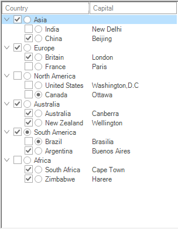

# Windows Forms MultiColumn TreeView Overview

[WinForms MultiColumn TreeView](https://www.syncfusion.com/winforms-ui-controls/multicolumn-treeview) is an advanced treeview control with multiple columns. This control displays content as a tree with additional columns that show related data for each node, and its robust features deliver a visually appealing tree structure. The Style Architecture for the control lets users define styles for nodes at different levels of the tree and column styles for individual columns.

## Components of MultiColumnTreeView

*	**TreeColumnAdv** - Represents a column in the MultiColumnTreeView control.
*	**TreeNodeAdv** - Represents a node that can be added to the control and supports sub-items.
*	**TreeNodeAdvSubItem** - Represents a sub-item displayed in additional columns of a node.
*	**Custom Control** - Represents a control that can be embedded in a node of the first column.

## Key Features

**Style Architecture** - Supports a flexible style architecture to let users define the styles for nodes at different levels of the Tree. It helps the users to specify the styles for a specific node.

**Columns** - Supports adding multiple columns and sub-items.

**CheckBox and OptionButton support** - Interactive check boxes that can be checked or unchecked, indicating the check state of the child node's check boxes. Nodes can also hold option buttons.

**Load on demand** - Delays loading of nodes in the tree until the user expands a parent node.

**Image settings** - Tree nodes can hold left images, right images, and images for different node states such as expand and collapse.

**Appearance** - Provides the background and foreground properties for customizing the appearance of the control.

**Customization** - Customizes the text, font, and nodes.

**ToolTip** - Allows showing or hiding tooltips for the nodes in the first column wherever necessary.

**Custom Control** - Supports adding custom controls to a tree node in the first column only.

**Multiline Support** - TreeNodeAdv provides an option to enable multiline text for each node by using the `Multiline` property on `TreeNodeAdvStyleInfo`. This must be set for each individual node and is available through the NodeCollection Editor.

**Enhanced performance** - MultiColumnTreeView can be populated with a large number of nodes. Performance when expanding or collapsing nodes can be improved by setting the `SuspendExpandRecalculate` property. See [Performance](performance) for details.
