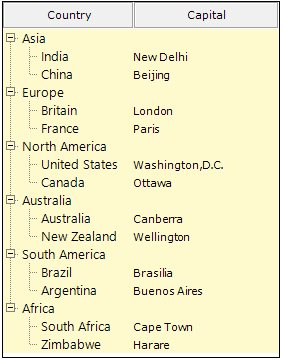
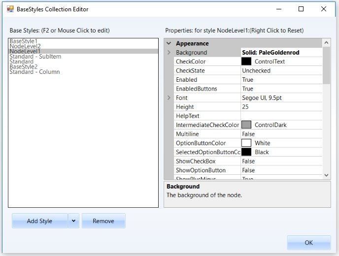

# Style Architecture in Windows Forms MultiColumn TreeView

The tree control employs an extensive Styles Architecture, that let users specify node styles globally, specifically for a class of nodes. This is possible by using a style information instance for each class of nodes, represented by a MultiColumnTreeView.TreeNodeAdvStyleInfo. Users will notice that for some of these classes of nodes, the style needs to be declared with a name at the tree level and stored in the tree’s BaseStyles hatch table.

As illustrated below, implicit style inheritance is enforced by the Framework while explicit style inheritance can be setup by the programmer. For all styles, explicit inheritance precedes implicit inheritance.

### Implicit Style Inheritance

When a style is not set in a style info object, it inherits the style from the previous level and so on until it reaches the default global style on top of the hierarchy. This is called implicit style inheritance and is illustrated below.

*	Node Specific Style: At the bottom of the hierarchy is the node specific style which lets users specify a style directly on a TreeNodeAdv. Refer Node specific Style.

*	Node’s Child Style: Each node also exposes a ChildStyle property where you can specify the style for the immediate children of that node. Refer Child Style for setting style of children nodes.

*	Node Level Styles: The Framework also lets you specify a style for all nodes at a level in the tree hierarchy, the top-most level being 1. Refer Node Level Style for setting node level style settings.

*	Standard Style or Global Style: A standard, global style is exposed by the MultiColumnTreeView control to be applied on all the nodes in the tree. Refer Standard Style for setting style in a Tree level.

*	Column Style: This lets you specify the styles for the columns.

*	SubItem Style: This lets you specify the styles for the Sub Items of the nodes.

### Explicit Style Inheritance

Any StyleInfo instance can also inherit explicitly from a specific named StyleInfo object. This can be done using the BaseStyle property of the TreeNodeAdvStyleInfo type. As noted previously, such named styles should be available in the tree control’s BaseStyles Collection Editor. You can also add custom styles using this editor.

<table>
<tr>
<th>
MultiColumnTreeView Property</th><th>
Description</th></tr>
<tr>
<td>
BaseStyle</td><td>
Indicates the base style of the nodes.</td></tr>
</table>

StandardStyle is the default style for the nodes. It can be edited using MultiColumnTreeView.StandardStyle property. It can also be edited through BaseStyles Collection Editor dialog.

The MultiColumnTreeView control provides the below default styles which can be edited through BaseStyles Collection Editor also. In BaseStyle Collection Editor, StandardColumnStyle represents Standard - Column, StandardStyle represents Standard Styles and StandardSubItemStyle represents Standard - SubItem. User can customize these styles and apply to specific nodes through Nodes Collection Editor.

<table>
<tr>
<th>
MultiColumnTreeView Property</th><th>
Description</th></tr>
<tr>
<td>
StandardColumnStyle</td><td>
Indicates the default styles that all the columns will inherit.</td></tr>
<tr>
<td>
StandardStyle</td><td>
Indicates the styles that all the nodes inherit from.</td></tr>
<tr>
<td>
StandardSubItemStyle</td><td>
Indicates the style that all the sub items will inherit from.</td></tr>
</table>

## StandardStyle 

Setting a Common Style for all the Nodes in the MultiColumnTreeView

We can modify the background for all the children of a parent node by editing the StandardStyle property.
The below image displays a gradient style for all the columns of the MultiColumnTreeView control.

### StandardStyle Settings

The below properties let you customize the standard style settings.

<table>
<tr>
<th>
TreeNodeAdvSubItemStyleInfo Property</th><th>
Description</th></tr>
<tr>
<td>
Background</td><td>
Gets or Sets the background for the node.</td></tr>
<tr>
<td>
CheckColor</td><td>
Indicates the check color.</td></tr>
<tr>
<td>
CheckState</td><td>
Indicates the Check state of the node.</td></tr>
<tr>
<td>
Enabled</td><td>
Specifies if the node is enabled.</td></tr>
<tr>
<td>
EnabledButtons</td><td>
Specifies if the buttons are enabled for the node.</td></tr>
<tr>
<td>
Font</td><td>
Gets or Sets the font for the node text.</td></tr>
<tr>
<td>
Height</td><td>
Gets or Sets the height for the node.</td></tr>
<tr>
<td>
HelpText</td><td>
Gets or Sets the tooltip for the node.</td></tr>
<tr>
<td>
IntermediateCheckColor</td><td>
Specifies the color of intermediate check symbol.</td></tr>
<tr>
<td>
Multiline</td><td>
Indicate whether multiline is enabled for the node.</td></tr>
<tr>
<td>
OptionButtonColor</td><td>
Gets or Sets the color of the option button.</td></tr>
<tr>
<td>
SelectedOptionButtonColor</td><td>
Gets or Sets the color of the selected option button.</td></tr>
<tr>
<td>
ShowCheckBox</td><td>
Gets or Sets the visibility of the Checkbox.</td></tr>
<tr>
<td>
ShowOptionButton</td><td>
Gets or Sets the visibility of the option button.</td></tr>
<tr>
<td>
ShowPlusMinus</td><td>
Gets or Sets the visibility of the plus / minus control.</td></tr>
<tr>
<td>
TextColor</td><td>
Gets or Sets the text color.</td></tr>
<tr>
<td>
ThemesEnabled</td><td>
Indicated if the node's controls will be themed.</td></tr>
<tr>
<td>
BaseStyle</td><td>
Specifies the base style of the node.</td></tr>
<tr>
<td>
EnsureDefaultOptionedChild</td><td>
Specifies if at least one child of the parent node should be optioned at all times.</td></tr>
<tr>
<td>
InteractiveCheckbox</td><td>
Gets or Sets the visibility of the InteractiveCheckbox for the node.</td></tr>
<tr>
<td>
ClosedImageIndex</td><td>
Indicates the image index for closed node.</td></tr>
<tr>
<td>
CollapseImageIndex</td><td>
Indicates the image index in the NodeStateImageList, when the node is collapsed.</td></tr>
<tr>
<td>
ExpandImageIndex</td><td>
Indicates the image index in the NodeStateImageList, when the node is Expanded.</td></tr>
<tr>
<td>
LeftImageIndices</td><td>
Specifies the ImageIndex for the left image.</td></tr>
<tr>
<td>
LeftImagePadding</td><td>
Padding for the left image.</td></tr>
<tr>
<td>
LeftStateImagePadding</td><td>
Padding for the left state image.</td></tr>
<tr>
<td>
NoChildrenImageIndex</td><td>
Indicates the image index in the StateImageList where node has no children.</td></tr>
<tr>
<td>
OpenImageIndex</td><td>
Indicates the image index for the open node.</td></tr>
<tr>
<td>
RightImageIndices</td><td>
Specifies the image index for the right image.</td></tr>
<tr>
<td>
RightImagePadding</td><td>
Padding for the right image.</td></tr>
<tr>
<td>
RightStateImagePadding</td><td>
Padding for the right state image.</td></tr>
<tr>
<td>
ComparerOptions</td><td>
Comparer options during sorting.</td></tr>
<tr>
<td>
Comparer</td><td>
IComparer object that compares two nodes.</td></tr>
<tr>
<td>
Culture</td><td>
Indicates the culture of the nodes during sorting.</td></tr>
<tr>
<td>
SortOrder</td><td>
Specifies the sort order of the node.</td></tr>
<tr>
<td>
SortType</td><td>
Specifies the sort type of the node.</td></tr>
</table>

Image Showing three Standard styles  for Nodes, SubItem and Column.

The below image displays a gradient style  for all the columns of the MultiColumnTreeView control by changing the properties of Standard Style 

## Node Custom Style
	
Make a Node’s Style Inherit from Another Base Style
Apart from the  Standard Style , we can also create custom Base styles using the BaseStyles Collection Editor. Select the Base Style option, then click Add Style.

This new base style can be applied to any of the nodes, using TreeNodeAdv.BaseStyle property of the respective nodes.

This overrides the Standard Style settings for the specified nodes and displays the image as follows.

### Style Settings

The below properties let you customize the Base style settings.

<table>
<tr>
<th>
TreeNodeAdvSubItemStyleInfo Property</th><th>
Description</th></tr>
<tr>
<td>
Background</td><td>
Gets or Sets the background for the node.</td></tr>
<tr>
<td>
CheckColor</td><td>
Indicates the check color.</td></tr>
<tr>
<td>
CheckState</td><td>
Indicates the Check state of the node.</td></tr>
<tr>
<td>
Enabled</td><td>
Specifies if the node is enabled.</td></tr>
<tr>
<td>
EnabledButtons</td><td>
Specifies if the buttons are enabled for the node.</td></tr>
<tr>
<td>
Font</td><td>
Gets or Sets the font for the node text.</td></tr>
<tr>
<td>
Height</td><td>
Gets or Sets the height for the node.</td></tr>
<tr>
<td>
HelpText</td><td>
Gets or Sets the tooltip for the node.</td></tr>
<tr>
<td>
IntermediateCheckColor</td><td>
Specifies the color of intermediate check symbol.</td></tr>
<tr>
<td>
Multiline</td><td>
Indicate whether multiline is enabled for the node.</td></tr>
<tr>
<td>
OptionButtonColor</td><td>
Gets or Sets the color of the option button.</td></tr>
<tr>
<td>
SelectedOptionButtonColor</td><td>
Gets or Sets the color of the selected option button.</td></tr>
<tr>
<td>
ShowCheckBox</td><td>
Gets or Sets the visibility of the Checkbox.</td></tr>
<tr>
<td>
ShowOptionButton</td><td>
Gets or Sets the visibility of the option button.</td></tr>
<tr>
<td>
ShowPlusMinus</td><td>
Gets or Sets the visibility of the plus / minus control.</td></tr>
<tr>
<td>
TextColor</td><td>
Gets or Sets the text color.</td></tr>
<tr>
<td>
ThemesEnabled</td><td>
Indicated if the node's controls will be themed.</td></tr>
<tr>
<td>
BaseStyle</td><td>
Specifies the base style of the node.</td></tr>
<tr>
<td>
EnsureDefaultOptionedChild</td><td>
Specifies if at least one child of the parent node should be optioned at all times.</td></tr>
<tr>
<td>
InteractiveCheckbox</td><td>
Gets or Sets the visibility of the InteractiveCheckbox for the node.</td></tr>
<tr>
<td>
ClosedImageIndex</td><td>
Indicates the image index for closed node.</td></tr>
<tr>
<td>
CollapseImageIndex</td><td>
Indicates the image index in the NodeStateImageList, when the node is collapsed.</td></tr>
<tr>
<td>
ExpandImageIndex</td><td>
Indicates the image index in the NodeStateImageList, when the node is Expanded.</td></tr>
<tr>
<td>
LeftImageIndices</td><td>
Specifies the ImageIndex for the left image.</td></tr>
<tr>
<td>
LeftImagePadding</td><td>
Padding for the left image.</td></tr>
<tr>
<td>
LeftStateImagePadding</td><td>
Padding for the left state image.</td></tr>
<tr>
<td>
NoChildrenImageIndex</td><td>
Indicates the image index in the StateImageList where node has no children.</td></tr>
<tr>
<td>
OpenImageIndex</td><td>
Indicates the image index for the open node.</td></tr>
<tr>
<td>
RightImageIndices</td><td>
Specifies the image index for the right image.</td></tr>
<tr>
<td>
RightImagePadding</td><td>
Padding for the right image.</td></tr>
<tr>
<td>
RightStateImagePadding</td><td>
Padding for the right state image.</td></tr>
<tr>
<td>
ComparerOptions</td><td>
Comparer options during sorting.</td></tr>
<tr>
<td>
Comparer</td><td>
IComparer object that compares two nodes.</td></tr>
<tr>
<td>
Culture</td><td>
Indicates the culture of the nodes during sorting.</td></tr>
<tr>
<td>
SortOrder</td><td>
Specifies the sort order of the node.</td></tr>
<tr>
<td>
SortType</td><td>
Specifies the sort type of the node.</td></tr>
</table>

## Node Level Style
	
Setting a Common Style for all the Nodes in a Level
MultiColumnTreeView lets you add node level styles using the BaseStyles Collection Editor. By default, this style will be applied to all the nodes in the Level1 for NodeLevel1 style, Level2 for NodeLevel2 style and so on.
You can apply this style to any of the node by using TreeNodeAdv.BaseStyle property for a node. Refer to Style Settings table in Node Specific Style.

## Column Style

Standard - Column style is default style that will applied for all the columns of the MultiColumnTreeView control. The style settings can be edited by the user.

###Column Style Properties

The below properties control the appearance of the columns.

<table>
<tr>
<th>
TreeColumnAdv Property</th><th>
Description</th></tr>
<tr>
<td>
AllowTextOverlap</td><td>
Indicates whether the text can overlap or not. By default it false.</td></tr>
<tr>
<td>
AreaBackground</td><td>
Gets / sets the background for the column area.</td></tr>
<tr>
<td>
Background</td><td>
Sets the background for the column (column header).</td></tr>
<tr>
<td>
Font</td><td>
Sets the foreground style for the columns.</td></tr>
<tr>
<td>
HorizontalAlignment</td><td>
Sets the horizontal alignment of the text in the columns.</td></tr>
<tr>
<td>
TextColor</td><td>
Sets the text color for the columns.</td></tr>
<tr>
<td>
Vertical Alignment</td><td>
Sets the vertical alignment of the text in the columns.</td></tr>
<tr>
<td>
BaseStyle</td><td>
Sets the base style to be applied to the column.</td></tr>
<tr>
<td>
Width</td><td>
Specifies Column width.</td></tr>
<tr>
<td>
Border3DStyle</td><td>
Sets the 3D border style for the column.</td></tr>
<tr>
<td>
BorderColor</td><td>
Border color for the column.</td></tr>
<tr>
<td>
BorderSides</td><td>
Specifies the sides of the column which should have border.</td></tr>
<tr>
<td>
BorderStyle</td><td>
Sets 2D or 3D border. The options are,FixedSingle andFixed3D.</td></tr>
<tr>
<td>
BorderSingle</td><td>
Specifies the 2D border style for the columns, when BorderStyle is set to Fixed Single. The options are, Dotted,Dashed, Solid,Inset andOutset.</td></tr>
</table>

### Adding ColumnStyle
The editor also lets you add user defined column styles like other styles as follows.

The user-defined column style can be applied to any of the columns, using Columns Editor. This setting overrides the default settings.

## SubItem Styles

Standard - SubItem style in the BaseStyles Collection Editor will be applied by default to all the sub items that are added to the tree nodes. User can also edit the default style settings.

### Properties

The below properties let you customize the sub items using the Styles editor.

<table>
<tr>
<th>
TreeNodeAdvSubItemStyleInfo Property</th><th>
Description</th></tr>
<tr>
<td>
Alignment</td><td>
Sets the alignment of the SubItem text.</td></tr>
<tr>
<td>
Background</td><td>
Sets the background for the sub item.</td></tr>
<tr>
<td>
LineAlignment</td><td>
Sets the vertical alignment of the sub item text.</td></tr>
<tr>
<td>
TextColor</td><td>
Sets the color for the SubItem text.</td></tr>
<tr>
<td>
BaseStyle</td><td>
Specifies the BaseStyle that it should inherit from.</td></tr>
<tr>
<td>
Border3DStyle</td><td>
Specifies the 3D style for the border.</td></tr>
<tr>
<td>
BorderColor</td><td>
Sets the border color.</td></tr>
<tr>
<td>
BorderSides</td><td>
Specifies the sides which should have borders.</td></tr>
<tr>
<td>
BorderSingle</td><td>
Specifies the 2D style for the border when BorderStyle is set to FixedSingle. Options are,Dotted,Dashed,Solid,Inset and Outset.</td></tr>
<tr>
<td>
BorderStyle</td><td>
Sets the border style, either FixedSingle or Fixed 3D</td></tr>
</table>

User can add and define a SubItem style using the BaseStyles Collection Editor as follows.

