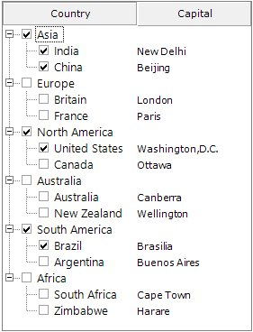
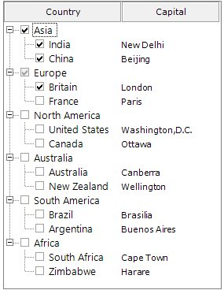
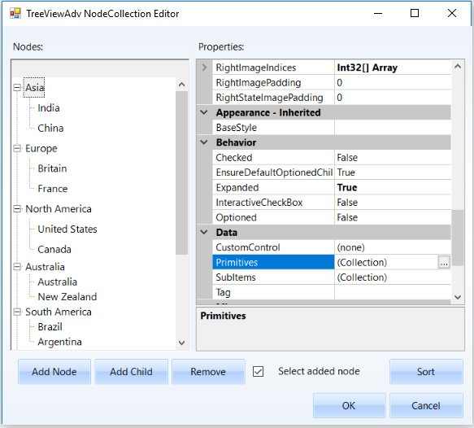
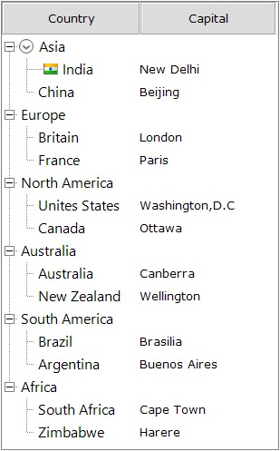

# TreeNodeAdv Features in Windows Forms MultiColumn TreeView

This section discusses the following topics.

## OptionButton

Option button allows the user to select only one node out of all nodes.

**Property Table**

*MultiColumnTreeView Properties*

<table>
<tr>
<th>
MultiColumnTreeView Property</th><th>
Description</th></tr>
<tr>
<td>
ShowOptionButtons</td><td>
Indicates if the option button will be shown for the nodes.</td></tr>
</table>

*TreeNodeAdv properties*

<table>
<tr>
<th>
TreeNodeAdv Property</th><th>
Description</th></tr>
<tr>
<td>
ShowOptionButton</td><td>
Indicates if the option button will be shown for the node.</td></tr>
<tr>
<td>
Optioned</td><td>
Gets or sets optioned state to a node</td></tr>
<tr>
<td>
OptionButtonColor</td><td>
Gets or sets the option button back color for selected option node.</td></tr>
</table>





//Option button for all nodes in MultiColumnTreeView
this.multiColumnTreeView1.ShowOptionButtons = true;

//Option button for particular nodes
this.multiColumnTreeView1.Nodes[0].ShowOptionButton = true;

this.multiColumnTreeView1.Nodes[0].Optioned = true; 
    




Me.multiColumnTreeView1.ShowOptionButtons = True

Me.multiColumnTreeView1.Nodes(0).ShowOptionButton = True

Me.multiColumnTreeView1.Nodes(0).Optioned = True





## CheckBox

The ShowCheckBoxes property when set will display check box for all the nodes. To apply checkbox to individual nodes, set the TreeNodeAdv.ShowCheckBox property, only for the required nodes in the NodeCollection Editor.

The InteractiveCheckBoxes indicates whether the state of the parent node’s checkbox is based on the check state of its child nodes checkboxes. To set this for individual nodes set the InteractiveCheckBox property of the TreeNodeAdv.

**Property Table**

*MultiColumnTreeView Properties*

<table>
<tr>
<th>
MultiColumnTreeView Property</th><th>
Description</th></tr>
<tr>
<td>
ShowCheckBoxes</td><td>
Indicates if the checkbox will be shown for the nodes.</td></tr>
<tr>
<td>
InteractiveCheckBoxes</td><td>
Indicates if the state of the node's checkbox indicates the check state of the child node's checkboxes.</td></tr>
<tr>
<td>
CheckedNodes</td><td>
Gets the Checked nodes collection </td></tr>
</table>

*TreeNodeAdv Properties*

<table>
<tr>
<th>
TreeNodeAdv Property</th><th>
Description</th></tr>
<tr>
<td>
ShowCheckBox</td><td>
Indicates if the checkbox of the node is visible.</td></tr>
<tr>
<td>
InteractiveCheckBox</td><td>
Indicates if the node will have an interactive checkbox.</td></tr>
</table>





//Check box for all nodes in MultiColumnTreeView
this.multiColumnTreeView1.ShowCheckBoxes = true;

//Check box for particular nodes
this.multiColumnTreeView1.Nodes[0].ShowCheckBox = true;

this.multiColumnTreeView1.Nodes[0].Checked = true;

    




Me.multiColumnTreeView1.ShowCheckBoxes = True

Me.multiColumnTreeView1.Nodes(0).ShowCheckBox = True

Me.multiColumnTreeView1.Nodes(0).Checked = True





**Tristate CheckBox Settings**

In the MultiColumnTreeView, the partial checking of the child nodes is supported. They are Checked State, Unchecked State and Intermediate State.
The CheckColor and CheckState property is used to set the color and the state of the check mark of the selected node. The options for the CheckState property are Checked, Unchecked and Indeterminate.

*Property Table*

<table>
<tr>
<th>
TreeNodeAdv Property</th><th>
Description</th></tr>
<tr>
<td>
CheckColor</td><td>
Indicates the color of the check mark.</td></tr>
<tr>
<td>
CheckState</td><td>
Indicates the check state of the node.</td></tr>
<tr>
<td>
IntermediateCheckColor</td><td>
Indicates the color of the check mark when it is in intermediate state or when its CheckState property is set to indeterminate.</td></tr>
<tr>
<td>
Checked</td><td>
This indicates if the node's checkbox is checked.</td></tr>
<tr>
<td>
EnsureDefaultOptionedChild</td><td>
This specifies if at least one child of the parent node should be selected always.</td></tr>
</table>

## CustomControls

TreeNodeAdv can hold controls using custom control feature. This increases the functionality of the node, the nodes can hold controls like combo box, calendar etc.

## Editing the Node  

### LabelEdit

Indicates whether the label text of the tree nodes can be edited. By default, it is false . To edit the node,LabelEdit property must be set as true. BeforeEdit event occurs before a node gets into edit node.
For further details refer [editing event](https://help.syncfusion.com/windowsforms/multicolumn-treeview/multicolumntreeview-events#node-editing). 





this.multiColumnTreeView1.LabelEdit = true;





Me.multiColumnTreeView1.LabelEdit = True





## Primitives
	
The MultiColumnTreeView control supports a set of primitive collections, that can be set through the Primitives Collection Editor available with each node in the MultiColumnTreeView controls.

The types of primitives available are LabelPrimitive, LeftImagePrimitive, RightImagePrimitive, CheckBoxPrimitive, OptionButtonPrimitive and CustomControlPrimitive.

The Primitive Collection Editor available for each node provides index property. Using this index set, for each primitive, the position for each of these node contents can be set.

*	LabelPrimitive - LabelPrimitive is used to display the text of the label.

*	LeftImagePrimitive - LeftImagePrimitive is used to display the image to the left of the nodes.

*	RightImagePrimitive - RightImagePrimitive is used to display the image that is added to the right of the nodes.

*	StateImagePrimitive - StateImagePrimitive is used to display the state image of the node depending on its state, whether expanded or collapsed.

*	CheckBoxPrimitive - CheckBoxPrimitive is used to display the checkbox for the nodes. When user clicks on this, the node will be checked.

*	OptionButtonPrimitive - OptionButtonPrimitive is used to display the Option button available for the nodes. When the user clicks this primitive, the corresponding node will be selected.

*	CustomControlPrimitives - CustomControlPrimitive displays the custom control for the nodes. User can use the functionality of the custom control primitive which is added to the nodes.

For adding the Primitives to the nodes, follow the steps below.

1.	Open the Primitives Collection Editor .

2.	Select the type of primitive in the combo box present at bottom left of the window and click Add.

3.	Now the selected Primitive  is added to that selected node.

