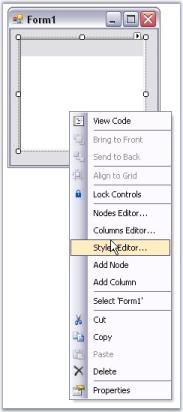
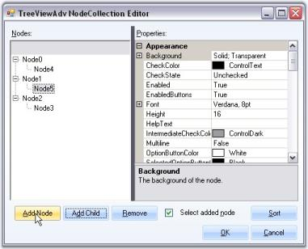

# DesignTime Features

MultiColumnTreeView provides the shortcuts to access various properties.

TaskWindow can be accessed using smart tag as follows.

  
 
 Figure : MultiColumnTreeView Tasks Window

The above window lets you open the NodeCollection Editor, modify the appearance settings, assign imagelists, enable 
options like editing the node text, load on demand, owner draw nodes and HotTracking properties. It also lets you set
the layout settings for the control.

## Context Menu at DesignTime

You can access the below options using this context menu at the design time.

* Nodes Editor, opens the NodeCollection Editor
* Columns Editor, opens the Columns Editor which lets you add columns.
* Add Columns, lets you directly add new columns.
* Styles Editor, opens the BaseStyles Collection Editor.
* Add Node, lets you add new nodes.

  
 
 Figure : Design-Time Context Menu
 
 
## Editors for the MultiColumnTreeView

The following Editors are available for changing the appearance and behavior of the MultiColumnTreeView control.

### TreeViewAdv NodeCollection Editor

This editor lets you add nodes, SubItems for the nodes and customize them using various property settings.

  
 
 Figure : TreeViewAdv NodeCollection Editor

This editor can be accessed using the below options.

* Through the Context Menu of the control during designtime.
* Tasks Windows.
* Using MultiColumnTreeView.Nodes property in the property Grid.
* Command at the bottom of the property grid.

  

Figure : Properties Grid Commands

### Columns Editor

This lets you add columns and customize those columns appearance with style settings.

  
  
 Figure : Columns Editor

This editor can be accessed using the following options.

* Through the Context Menu of the control during designtime.
* Using MultiColumnTreeView.Columns property in the property Grid.
* Command at the bottom of the property grid.

#### TreeNodeAdvSubItems Collection Editor

This editor lets you add subitems to the nodes and customize the subitems using the property settings. It can be accessed through Node Collection Editor and selecting the SubItems Collection property.

  
 
 Figure : TreeNodeAdvSubItem Collection Editor

### Styles Editor

This editor comes with default styles and also lets you add new style and apply to the nodes, subitems, and so on. The property settings are discussed in Styles Architecture.

 

Figure : BaseStyles Collection Editor

This editor can be accessed using the below options.

* Through the Context Menu of the control during designtime.
* Using MultiColumnTreeView.BaseStyles property in the property Grid.
* Command at the bottom of the property grid.
