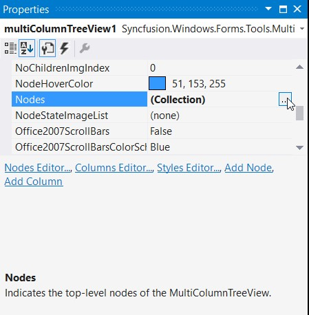
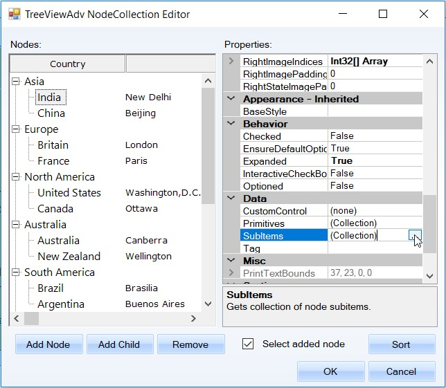
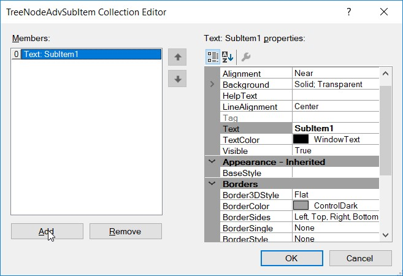
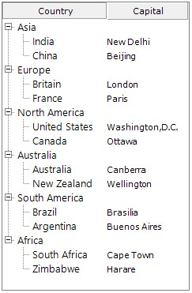
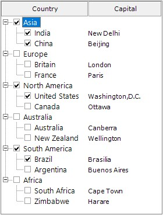

# Getting Started

##Assembly Deployment

The following list of assemblies needs to be added as reference to use MultiColumnTreeView in any application,

<table>
<tr>
<th>
Required assemblies</th><th>
Description</th></tr>
<tr>
<td>
Syncfusion.Grid.Base</td><td>
Syncfusion.Grid.Base contains classes that contains fundamentals and base classes of GridControl</td></tr>
<tr>
<td>
Syncfusion.Grid.Windows</td><td>
Syncfusion.Grid.Windows contains classes that handles all UI operations, fundamentals and base classes of GridControl which are used in the MultiColumnTreeView control</td></tr>
<tr>
<td>
Syncfusion.Shared.Base</td><td>
Syncfusion.Shared.Base contains style related properties of MultiColumnTreeView and various editor controls</td></tr>
<tr>
<td>
Syncfusion.Shared.Windows</td><td>
Syncfusion.Shared.Windows contains style related properties of MultiColumnTreeView and various editor controls</td></tr>
<tr>
<td>
Syncfusion.Tools.Base</td><td>
Syncfusion.Tools.Base contains base class which used for MultiColumnTreeView control</td></tr>
<tr>
<td>
Syncfusion.Tools.Windows</td><td>
Syncfusion.Tools.Windows contains the class that handles all UI operations and contains helper class of MultiColumnTreeView control</td></tr>
</table>

## Adding control via Designer

MultiColumnTreeView control can be added to the application by dragging it from Toolbox and dropping it in Designer. The required assembly references will be added automatically.

 

## Adding control manually in C#

To add control manually, do the below steps,

1.	Add the below required assembly references to the project,

*	Syncfusion.Grid.Base
*	Syncfusion.Grid.Windows
*	Syncfusion.Shared.Base
*	Syncfusion.Shared.Windows
*	Syncfusion.Tools.Base
*	Syncfusion.Tools.Windows

2.	Create the MultiColumnTreeView control instance and add it to the Form





using Syncfusion.Windows.Forms.Tools.MultiColumnTreeView;
using Syncfusion.Windows.Forms;

private MultiColumnTreeView multiColumnTreeView1;
      
this.multiColumnTreeView1 = new MultiColumnTreeView();
 this.Controls.Add(this.multiColumnTreeView1);
    




Imports Syncfusion.Windows.Forms.Tools.MultiColumnTreeView
Imports Syncfusion.Windows.Forms

Private multiColumnTreeView1 As MultiColumnTreeView
        
     Me.multiColumnTreeView1 = New MultiColumnTreeView()
     Me.Controls.Add(Me.multiColumnTreeView1)





## Adding Columns

For adding columns, follow the steps below.

*	Open the `Columns Editor` using property grid.

 
 
*	The following window will be opened, then select the `Add Column`.

 

**Through Coding**





private TreeColumnAdv countryColumn;
private TreeColumnAdv capitalColumn;

this.countryColumn = new TreeColumnAdv();
this.capitalColumn = new TreeColumnAdv();

this.countryColumn.Text = "Country";
this.capitalColumn.Text = "Capital";

this.countryColumn.Width = 150;
this.capitalColumn.Width = 150;

this.multiColumnTreeView1.Columns.AddRange(new TreeColumnAdv[] { this.countryColumn, this.capitalColumn });
    




    Private countryColumn As TreeColumnAdv
    Private capitalColumn As TreeColumnAdv

    Me.countryColumn = New TreeColumnAdv()
    Me.capitalColumn = New TreeColumnAdv()

    Me.countryColumn.Text = "Country"
    Me.capitalColumn.Text = "Capital"

    Me.countryColumn.Width = 150
    Me.capitalColumn.Width = 150

    Me.multiColumnTreeView1.Columns.AddRange(New TreeColumnAdv() {Me.countryColumn, Me.capitalColumn})





 

## Adding Node to the control

For adding nodes to the multicolumntreeview follow the steps below

*	Click the smart tag of the multicolumntreeview and select the `Edit Nodes Collection` or click the `Nodes Editor…` command in property grid.

 

It can also be opened through Property Window.

 
  
*	MultiColumnTreeView Node Collection Editor will be opened and click `Add Node` to add a node into multicolumntreeview.

 
 
*	Child can be added to a node using the `Add Child`

 

**Adding Parent nodes through Coding**




        private Syncfusion.Windows.Forms.Tools.MultiColumnTreeView.TreeNodeAdv asiaNode;
        private Syncfusion.Windows.Forms.Tools.MultiColumnTreeView.TreeNodeAdv europeNode;
        private Syncfusion.Windows.Forms.Tools.MultiColumnTreeView.TreeNodeAdv northAmericaNode;
        private Syncfusion.Windows.Forms.Tools.MultiColumnTreeView.TreeNodeAdv australiaNode;
        private Syncfusion.Windows.Forms.Tools.MultiColumnTreeView.TreeNodeAdv southAmericaNode;
        private Syncfusion.Windows.Forms.Tools.MultiColumnTreeView.TreeNodeAdv africaNode;

            this.asiaNode = new TreeNodeAdv();
            this.europeNode = new TreeNodeAdv();
            this.northAmericaNode = new TreeNodeAdv();
            this.australiaNode = new TreeNodeAdv();
            this.southAmericaNode = new TreeNodeAdv();
            this.africaNode = new TreeNodeAdv();

            this.asiaNode.Text = "Asia";
            this.europeNode.Text = "Europe";
            this.northAmericaNode.Text = "North America";
            this.australiaNode.Text = "Australia";
            this.southAmericaNode.Text = "South America";
            this.africaNode.Text = "Africa";

            this.multiColumnTreeView1.Nodes.AddRange(new TreeNodeAdv[] { this.asiaNode, this.europeNode, this.northAmericaNode, this.australiaNode, this.southAmericaNode, this.africaNode });
    




    Private asiaNode As Syncfusion.Windows.Forms.Tools.MultiColumnTreeView.TreeNodeAdv
    Private europeNode As Syncfusion.Windows.Forms.Tools.MultiColumnTreeView.TreeNodeAdv
    Private northAmericaNode As Syncfusion.Windows.Forms.Tools.MultiColumnTreeView.TreeNodeAdv
    Private australiaNode As Syncfusion.Windows.Forms.Tools.MultiColumnTreeView.TreeNodeAdv
    Private southAmericaNode As Syncfusion.Windows.Forms.Tools.MultiColumnTreeView.TreeNodeAdv
    Private africaNode As Syncfusion.Windows.Forms.Tools.MultiColumnTreeView.TreeNodeAdv

    Me.asiaNode = New TreeNodeAdv()
    Me.europeNode = New TreeNodeAdv()
    Me.northAmericaNode = New TreeNodeAdv()
    Me.australiaNode = New TreeNodeAdv()
    Me.southAmericaNode = New TreeNodeAdv()
    Me.africaNode = New TreeNodeAdv()

    Me.asiaNode.Text = "Asia"
    Me.europeNode.Text = "Europe"
    Me.northAmericaNode.Text = "North America"
    Me.australiaNode.Text = "Australia"
    Me.southAmericaNode.Text = "South America"
    Me.africaNode.Text = "Africa"

    Me.multiColumnTreeView1.Nodes.AddRange(New TreeNodeAdv() {Me.asiaNode, Me.europeNode, Me.northAmericaNode, Me.australiaNode, Me.southAmericaNode, Me.africaNode})





**Adding Child Nodes to the parent nodes through coding**





        private Syncfusion.Windows.Forms.Tools.MultiColumnTreeView.TreeNodeAdv indiaNode;
        private Syncfusion.Windows.Forms.Tools.MultiColumnTreeView.TreeNodeAdv chinaNode;
        private Syncfusion.Windows.Forms.Tools.MultiColumnTreeView.TreeNodeAdv britainNode;
        private Syncfusion.Windows.Forms.Tools.MultiColumnTreeView.TreeNodeAdv franceNode;
        private Syncfusion.Windows.Forms.Tools.MultiColumnTreeView.TreeNodeAdv unitedStatesNode;
        private Syncfusion.Windows.Forms.Tools.MultiColumnTreeView.TreeNodeAdv canadaNode;
        private Syncfusion.Windows.Forms.Tools.MultiColumnTreeView.TreeNodeAdv australiaChildNode;
        private Syncfusion.Windows.Forms.Tools.MultiColumnTreeView.TreeNodeAdv newZealandNode;
        private Syncfusion.Windows.Forms.Tools.MultiColumnTreeView.TreeNodeAdv brazilNode;
        private Syncfusion.Windows.Forms.Tools.MultiColumnTreeView.TreeNodeAdv argentinaNode;
        private Syncfusion.Windows.Forms.Tools.MultiColumnTreeView.TreeNodeAdv southAfricaNode;
        private Syncfusion.Windows.Forms.Tools.MultiColumnTreeView.TreeNodeAdv zimbabweNode;

            this.indiaNode = new TreeNodeAdv();
            this.chinaNode = new TreeNodeAdv();
            this.britainNode = new TreeNodeAdv();
            this.franceNode = new TreeNodeAdv();
            this.unitedStatesNode = new TreeNodeAdv();
            this.canadaNode = new TreeNodeAdv();
            this.australiaChildNode = new TreeNodeAdv();
            this.newZealandNode = new TreeNodeAdv();
            this.brazilNode = new TreeNodeAdv();
            this.argentinaNode = new TreeNodeAdv();
            this.southAfricaNode = new TreeNodeAdv();
            this.zimbabweNode = new TreeNodeAdv();

            this.indiaNode.Text = "India";
            this.chinaNode.Text = "China";
            this.britainNode.Text = "Britain";
            this.franceNode.Text = "France";
            this.unitedStatesNode.Text = "United States";
            this.canadaNode.Text = "Canada";
            this.australiaChildNode.Text = "Australia";
            this.newZealandNode.Text = "New Zealand";
            this.brazilNode.Text = "Brazil";
            this.argentinaNode.Text = "Argentina";
            this.southAfricaNode.Text = "South Africa";
            this.zimbabweNode.Text = "Zimbabwe";

            this.asiaNode.Nodes.AddRange(new TreeNodeAdv[] { this.indiaNode, this.chinaNode });
            this.europeNode.Nodes.AddRange(new TreeNodeAdv[] { this.britainNode, this.franceNode });
            this.northAmericaNode.Nodes.AddRange(new TreeNodeAdv[] { this.unitedStatesNode, this.canadaNode });
            this.australiaNode.Nodes.AddRange(new TreeNodeAdv[] { this.australiaChildNode, this.newZealandNode });
            this.southAmericaNode.Nodes.AddRange(new TreeNodeAdv[] { this.brazilNode, this.argentinaNode });
            this.africaNode.Nodes.AddRange(new TreeNodeAdv[] { this.southAfricaNode, this.zimbabweNode });
    




    Private indiaNode As Syncfusion.Windows.Forms.Tools.MultiColumnTreeView.TreeNodeAdv
    Private chinaNode As Syncfusion.Windows.Forms.Tools.MultiColumnTreeView.TreeNodeAdv
    Private britainNode As Syncfusion.Windows.Forms.Tools.MultiColumnTreeView.TreeNodeAdv
    Private franceNode As Syncfusion.Windows.Forms.Tools.MultiColumnTreeView.TreeNodeAdv
    Private unitedStatesNode As Syncfusion.Windows.Forms.Tools.MultiColumnTreeView.TreeNodeAdv
    Private canadaNode As Syncfusion.Windows.Forms.Tools.MultiColumnTreeView.TreeNodeAdv
    Private australiaChildNode As Syncfusion.Windows.Forms.Tools.MultiColumnTreeView.TreeNodeAdv
    Private newZealandNode As Syncfusion.Windows.Forms.Tools.MultiColumnTreeView.TreeNodeAdv
    Private brazilNode As Syncfusion.Windows.Forms.Tools.MultiColumnTreeView.TreeNodeAdv
    Private argentinaNode As Syncfusion.Windows.Forms.Tools.MultiColumnTreeView.TreeNodeAdv
    Private southAfricaNode As Syncfusion.Windows.Forms.Tools.MultiColumnTreeView.TreeNodeAdv
    Private zimbabweNode As Syncfusion.Windows.Forms.Tools.MultiColumnTreeView.TreeNodeAdv

        Me.indiaNode = New TreeNodeAdv()
        Me.chinaNode = New TreeNodeAdv()
        Me.britainNode = New TreeNodeAdv()
        Me.franceNode = New TreeNodeAdv()
        Me.unitedStatesNode = New TreeNodeAdv()
        Me.canadaNode = New TreeNodeAdv()
        Me.australiaChildNode = New TreeNodeAdv()
        Me.newZealandNode = New TreeNodeAdv()
        Me.brazilNode = New TreeNodeAdv()
        Me.argentinaNode = New TreeNodeAdv()
        Me.southAfricaNode = New TreeNodeAdv()
        Me.zimbabweNode = New TreeNodeAdv()

        Me.indiaNode.Text = "India"
        Me.chinaNode.Text = "China"
        Me.britainNode.Text = "Britain"
        Me.franceNode.Text = "France"
        Me.unitedStatesNode.Text = "United States"
        Me.canadaNode.Text = "Canada"
        Me.australiaChildNode.Text = "Australia"
        Me.newZealandNode.Text = "New Zealand"
        Me.brazilNode.Text = "Brazil"
        Me.argentinaNode.Text = "Argentina"
        Me.southAfricaNode.Text = "South Africa"
        Me.zimbabweNode.Text = "Zimbabwe"

        Me.asiaNode.Nodes.AddRange(New TreeNodeAdv() {Me.indiaNode, Me.chinaNode})
        Me.europeNode.Nodes.AddRange(New TreeNodeAdv() {Me.britainNode, Me.franceNode})
        Me.northAmericaNode.Nodes.AddRange(New TreeNodeAdv() {Me.unitedStatesNode, Me.canadaNode})
        Me.australiaNode.Nodes.AddRange(New TreeNodeAdv() {Me.australiaChildNode, Me.newZealandNode})
        Me.southAmericaNode.Nodes.AddRange(New TreeNodeAdv() {Me.brazilNode, Me.argentinaNode})
        Me.africaNode.Nodes.AddRange(New TreeNodeAdv() {Me.southAfricaNode, Me.zimbabweNode})





* Image after adding Child Nodes

 

## Adding SubItems

•	For adding subitems to a node, click the SubItem property in node property grid.

 
 
•	Then `TreeNodeAdv SubItem Collection Editor` will be opened and click **Add** to add a subitem to the node.

 

**Through Coding**





        private Syncfusion.Windows.Forms.Tools.MultiColumnTreeView.TreeNodeAdvSubItem delhiSubItem;
        private Syncfusion.Windows.Forms.Tools.MultiColumnTreeView.TreeNodeAdvSubItem beijingSubItem;
        private Syncfusion.Windows.Forms.Tools.MultiColumnTreeView.TreeNodeAdvSubItem londonSubItem;
        private Syncfusion.Windows.Forms.Tools.MultiColumnTreeView.TreeNodeAdvSubItem parisSubItem;
        private Syncfusion.Windows.Forms.Tools.MultiColumnTreeView.TreeNodeAdvSubItem washingtonSubItem;
        private Syncfusion.Windows.Forms.Tools.MultiColumnTreeView.TreeNodeAdvSubItem ottawaSubItem;
        private Syncfusion.Windows.Forms.Tools.MultiColumnTreeView.TreeNodeAdvSubItem canberraSubItem;
        private Syncfusion.Windows.Forms.Tools.MultiColumnTreeView.TreeNodeAdvSubItem wellingtonSubItem;
        private Syncfusion.Windows.Forms.Tools.MultiColumnTreeView.TreeNodeAdvSubItem brasiliaSubItem;
        private Syncfusion.Windows.Forms.Tools.MultiColumnTreeView.TreeNodeAdvSubItem buenosSubItem;
        private Syncfusion.Windows.Forms.Tools.MultiColumnTreeView.TreeNodeAdvSubItem capeTownSubItem;
        private Syncfusion.Windows.Forms.Tools.MultiColumnTreeView.TreeNodeAdvSubItem harereSubItem;

            this.delhiSubItem = new TreeNodeAdvSubItem();
            this.beijingSubItem = new TreeNodeAdvSubItem();
            this.londonSubItem = new TreeNodeAdvSubItem();
            this.parisSubItem = new TreeNodeAdvSubItem();
            this.washingtonSubItem = new TreeNodeAdvSubItem();
            this.ottawaSubItem = new TreeNodeAdvSubItem();
            this.canberraSubItem = new TreeNodeAdvSubItem();
            this.wellingtonSubItem = new TreeNodeAdvSubItem();
            this.brasiliaSubItem = new TreeNodeAdvSubItem();
            this.buenosSubItem = new TreeNodeAdvSubItem();
            this.capeTownSubItem = new TreeNodeAdvSubItem();
            this.harereSubItem = new TreeNodeAdvSubItem();

            this.delhiSubItem.Text = "New Delhi";
            this.beijingSubItem.Text = "Beijing";
            this.londonSubItem.Text = "London";
            this.parisSubItem.Text = "Paris";
            this.washingtonSubItem.Text = "Washington,D.C";
            this.ottawaSubItem.Text = "Ottawa";
            this.canberraSubItem.Text = "Canberra";
            this.wellingtonSubItem.Text = "Wellington";
            this.brasiliaSubItem.Text = "Brasilia";
            this.buenosSubItem.Text = "Buenos Aires";
            this.capeTownSubItem.Text = "Cape Town";
            this.harereSubItem.Text = "Harere";

            this.indiaNode.SubItems.Add(this.delhiSubItem);
            this.chinaNode.SubItems.Add(this.beijingSubItem);
            this.britainNode.SubItems.Add(this.londonSubItem);
            this.franceNode.SubItems.Add(this.parisSubItem);
            this.unitedStatesNode.SubItems.Add(this.washingtonSubItem);
            this.canadaNode.SubItems.Add(this.ottawaSubItem);
            this.australiaChildNode.SubItems.Add(this.canberraSubItem);
            this.newZealandNode.SubItems.Add(this.wellingtonSubItem);
            this.brazilNode.SubItems.Add(this.brasiliaSubItem);
            this.argentinaNode.SubItems.Add(this.buenosSubItem);
            this.southAfricaNode.SubItems.Add(this.capeTownSubItem);
            this.zimbabweNode.SubItems.Add(this.harereSubItem);
    




    Private delhiSubItem As Syncfusion.Windows.Forms.Tools.MultiColumnTreeView.TreeNodeAdvSubItem
    Private beijingSubItem As Syncfusion.Windows.Forms.Tools.MultiColumnTreeView.TreeNodeAdvSubItem
    Private londonSubItem As Syncfusion.Windows.Forms.Tools.MultiColumnTreeView.TreeNodeAdvSubItem
    Private parisSubItem As Syncfusion.Windows.Forms.Tools.MultiColumnTreeView.TreeNodeAdvSubItem
    Private washingtonSubItem As Syncfusion.Windows.Forms.Tools.MultiColumnTreeView.TreeNodeAdvSubItem
    Private ottawaSubItem As Syncfusion.Windows.Forms.Tools.MultiColumnTreeView.TreeNodeAdvSubItem
    Private canberraSubItem As Syncfusion.Windows.Forms.Tools.MultiColumnTreeView.TreeNodeAdvSubItem
    Private wellingtonSubItem As Syncfusion.Windows.Forms.Tools.MultiColumnTreeView.TreeNodeAdvSubItem
    Private brasiliaSubItem As Syncfusion.Windows.Forms.Tools.MultiColumnTreeView.TreeNodeAdvSubItem
    Private buenosSubItem As Syncfusion.Windows.Forms.Tools.MultiColumnTreeView.TreeNodeAdvSubItem
    Private capeTownSubItem As Syncfusion.Windows.Forms.Tools.MultiColumnTreeView.TreeNodeAdvSubItem
    Private harereSubItem As Syncfusion.Windows.Forms.Tools.MultiColumnTreeView.TreeNodeAdvSubItem

        Me.delhiSubItem = New TreeNodeAdvSubItem()
        Me.beijingSubItem = New TreeNodeAdvSubItem()
        Me.londonSubItem = New TreeNodeAdvSubItem()
        Me.parisSubItem = New TreeNodeAdvSubItem()
        Me.washingtonSubItem = New TreeNodeAdvSubItem()
        Me.ottawaSubItem = New TreeNodeAdvSubItem()
        Me.canberraSubItem = New TreeNodeAdvSubItem()
        Me.wellingtonSubItem = New TreeNodeAdvSubItem()
        Me.brasiliaSubItem = New TreeNodeAdvSubItem()
        Me.buenosSubItem = New TreeNodeAdvSubItem()
        Me.capeTownSubItem = New TreeNodeAdvSubItem()
        Me.harereSubItem = New TreeNodeAdvSubItem()

        Me.delhiSubItem.Text = "New Delhi"
        Me.beijingSubItem.Text = "Beijing"
        Me.londonSubItem.Text = "London"
        Me.parisSubItem.Text = "Paris"
        Me.washingtonSubItem.Text = "Washington,D.C"
        Me.ottawaSubItem.Text = "Ottawa"
        Me.canberraSubItem.Text = "Canberra"
        Me.wellingtonSubItem.Text = "Wellington"
        Me.brasiliaSubItem.Text = "Brasilia"
        Me.buenosSubItem.Text = "Buenos Aires"
        Me.capeTownSubItem.Text = "Cape Town"
        Me.harereSubItem.Text = "Harere"

        Me.indiaNode.SubItems.Add(Me.delhiSubItem)
        Me.chinaNode.SubItems.Add(Me.beijingSubItem)
        Me.britainNode.SubItems.Add(Me.londonSubItem)
        Me.franceNode.SubItems.Add(Me.parisSubItem)
        Me.unitedStatesNode.SubItems.Add(Me.washingtonSubItem)
        Me.canadaNode.SubItems.Add(Me.ottawaSubItem)
        Me.australiaChildNode.SubItems.Add(Me.canberraSubItem)
        Me.newZealandNode.SubItems.Add(Me.wellingtonSubItem)
        Me.brazilNode.SubItems.Add(Me.brasiliaSubItem)
        Me.argentinaNode.SubItems.Add(Me.buenosSubItem)
        Me.southAfricaNode.SubItems.Add(Me.capeTownSubItem)
        Me.zimbabweNode.SubItems.Add(Me.harereSubItem)





 

## Customize Nodes

TreeNodeAdv can be customized with the following options

### Root lines

We can display the Root lines between  the root nodes by setting the property `ShowRootLines` to True. Whereas the property `ShowLines` displays connecting line for rest of the nodes in the control except between the root nodes. By default, `ShowRootLines` and `ShowLines` is set as `true`.
When `ShowLines` is set to False, the connecting lines will not be displayed for the entire control

*Property Table* 

<table>
<tr>
<th>
MultiColumnTreeView Property</th><th>
Description</th></tr>
<tr>
<td>
ShowRootLines</td><td>
Indicates if the Rootlines will be shown for the nodes.</td></tr>
</table>

*Through code*





this.multiColumnTreeView1.ShowRootLines = true;





Me.multiColumnTreeView1.ShowRootLines = True





 

### Plus Minus

Plus minus symbols will be shown according to the state of the node, plus (+) will be shown if the node is in expanded state and minus (-) will be shown if the node is minimized.

*Property Table*

<table>
<tr>
<th>
MultiColumnTreeView Property</th><th>
Description</th></tr>
<tr>
<td>
ShowPlusMinus</td><td>
Indicates if the Plus minus symbols will be shown for the nodes.</td></tr>
</table>

*Through code*





//setting plus minus for all the nodes
this.multiColumnTreeView1.ShowPlusMinus = true;

//setting plus minus for specified node
this.multiColumnTreeView1.Nodes[0].ShowPlusMinus = true;





Me.multiColumnTreeView1.ShowPlusMinus = True

Me.multiColumnTreeView1.Nodes(0).ShowPlusMinus = True





 

### Tool Tip 

ToolTip is a special control which automatically appears as a popup when a node is partially visible. It displays the total text of the node.

 

### Check Box

The `ShowCheckBoxes` property when set will display check box for all the nodes. To apply checkbox to individual nodes, set the `TreeNodeAdv.ShowCheckBox` property, only for the required nodes in the NodeCollection Editor.

The `InteractiveCheckBoxes` indicates whether the state of the parent node’s checkbox is based on the check state of its child nodes checkboxes. To set this for individual nodes set the `InteractiveCheckBox` property of the TreeNodeAdv.

<table>
<tr>
<th>
MultiColumnTreeView Property</th><th>
Description</th></tr>
<tr>
<td>
ShowCheckBoxes</td><td>
Indicates if the checkbox will be shown for the nodes.</td></tr>
<tr>
<td>
InteractiveCheckBoxes</td><td>
Indicates if the state of the node's checkbox indicates the check state of the child node's checkboxes.</td></tr>
</table>

*Through code*





//setting check boxes for all the nodes
this.multiColumnTreeView1.ShowCheckBoxes = true;

//setting check box for specified node
this.multiColumnTreeView1.Nodes[0].ShowCheckBox = true;

//setting interactive check boxes for all the nodes
this.multiColumnTreeView1.InteractiveCheckBoxes = true;

//setting interactive check boxes for specified nodes
this.multiColumnTreeView1.Nodes[0].InteractiveCheckBox = true;





    Me.multiColumnTreeView1.ShowCheckBoxes = True

    Me.multiColumnTreeView1.Nodes(0).ShowCheckBox = True

    Me.multiColumnTreeView1.InteractiveCheckBoxes = True

    Me.multiColumnTreeView1.Nodes(0).InteractiveCheckBox = True





 

### Option Button

`ShowOptionButtons` property, when set, will add option buttons to all the nodes. This can be applied for the required nodes alone, by setting the property for the respective nodes in the NodeCollection Editor.





//Shows options for all the nodes
this.multiColumnTreeView1.ShowOptionButtons = true;

//Shows option button to specified node
this.multiColumnTreeView1.Nodes[0].ShowOptionButton = true;





    Me.multiColumnTreeView1.ShowOptionButtons = True

    Me.multiColumnTreeView1.Nodes(0).ShowOptionButton = True





 
 

## Assigning Active Nodes

Assigning a node to an Active Node makes the node selected.





 this.multiColumnTreeView1.ActiveNode = this.multiColumnTreeView1.Nodes[0];





Me.multiColumnTreeView1.ActiveNode = Me.multiColumnTreeView1.Nodes(0)





