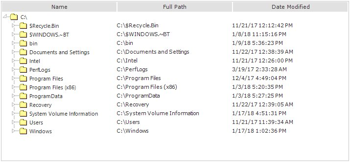

# MultiColumnTreeView Appearance

The appearance of the MultiColumnTreeView can be customized using background, foreground, border and spacing properties similar to TreeView control. The below topics are covered in this section.

## SubItem Appearance

The background, foreground and border settings of a sub item can be specified using SubItem Style Editor. Refer to SubItem Styles for all the style settings.

  

treeNodeAdvSubItem1.Background = new Syncfusion.Drawing.BrushInfo(System.Drawing.Color.SandyBrown);

treeNodeAdvSubItem1.Border3DStyle = System.Windows.Forms.Border3DStyle.SunkenInner;

treeNodeAdvSubItem1.BorderColor = System.Drawing.Color.SteelBlue;

treeNodeAdvSubItem1.BorderSingle = System.Windows.Forms.ButtonBorderStyle.Dotted;

treeNodeAdvSubItem1.BorderStyle = System.Windows.Forms.BorderStyle.FixedSingle;

treeNodeAdvSubItem1.TextColor = System.Drawing.Color.Navy;

treeNodeAdvSubItem2.Background = new Syncfusion.Drawing.BrushInfo(System.Drawing.Color.SandyBrown);

treeNodeAdvSubItem2.Border3DStyle = System.Windows.Forms.Border3DStyle.SunkenOuter;

treeNodeAdvSubItem2.BorderColor = System.Drawing.Color.SteelBlue;

treeNodeAdvSubItem2.BorderSingle = System.Windows.Forms.ButtonBorderStyle.Dotted;

treeNodeAdvSubItem2.BorderStyle = System.Windows.Forms.BorderStyle.FixedSingle;

treeNodeAdvSubItem2.TextColor = System.Drawing.Color.Navy;



 

treeNodeAdvSubItem1.Background = New Syncfusion.Drawing.BrushInfo(System.Drawing.Color.SandyBrown) 

treeNodeAdvSubItem1.Border3DStyle = System.Windows.Forms.Border3DStyle.SunkenInner 

treeNodeAdvSubItem1.BorderColor = System.Drawing.Color.SteelBlue 

treeNodeAdvSubItem1.BorderSingle = System.Windows.Forms.ButtonBorderStyle.Dotted 

treeNodeAdvSubItem1.BorderStyle = System.Windows.Forms.BorderStyle.FixedSingle 

treeNodeAdvSubItem1.TextColor = System.Drawing.Color.Navy 

treeNodeAdvSubItem2.Background = New Syncfusion.Drawing.BrushInfo(System.Drawing.Color.SandyBrown) 

treeNodeAdvSubItem2.Border3DStyle = System.Windows.Forms.Border3DStyle.SunkenOuter 

treeNodeAdvSubItem2.BorderColor = System.Drawing.Color.SteelBlue 

treeNodeAdvSubItem2.BorderSingle = System.Windows.Forms.ButtonBorderStyle.Dotted 

treeNodeAdvSubItem2.BorderStyle = System.Windows.Forms.BorderStyle.FixedSingle 

treeNodeAdvSubItem2.TextColor = System.Drawing.Color.Navy 



A MultiColumnTreeView with above settings is displayed below.

 

Figure : MultiColumnTreeView with Customized Appearance

## Column Appearance

The appearance of different columns can be customized through Column Styles settings.

MultiColumnTreeView.ColumnHeaderBackground property sets the background column headers for the control. These settings are 
overridden by above ColumnStyles settings.

ColumnsHeaderBackground property in the Properties Grid
{:.caption}

Gradient colors set for Header Background
{:.caption}

### Adding HighlightBorderColor property

Essential tool is now enhanced with HighlightBorderColor property to set the highlight color of the column header in MultiColumnTreeView.

The following code illustrates how to set HighlightBorderColor property.

  

this.treeColumnAdv1.HighlightBorderColor = Color.Brown;

 
 
 

Me.treeColumnAdv1.HighlightBorderColor = Color.Brown;



Column Header Highlight Border Color changed
{:.caption}

## Visual Style

VisualStyles provides rich and professional look and feel UI for the TreeViewAdv control. Some of the available VisualStyles are as follows:

* Default
* Office2007
* Office2010
* Metro
* Office2016Colorful
* Office2016White
* Office2016Black
* Office2016DarkGray

## Visual Style

The visual style can be applied for the MultiColumnTreeViewAdv using `Style` property.





//Set the visual Style of the MultiColumnTreeViewAdv control.

this.multiColumnTreeView1.Style = MultiColumnVisualStyle.Office2016Colorful;





'Set the visual Style of the MultiColumnTreeViewAdv control.

Me.multiColumnTreeViewAdv1.Style = MultiColumnVisualStyle.Office2016Colorful
 




 
