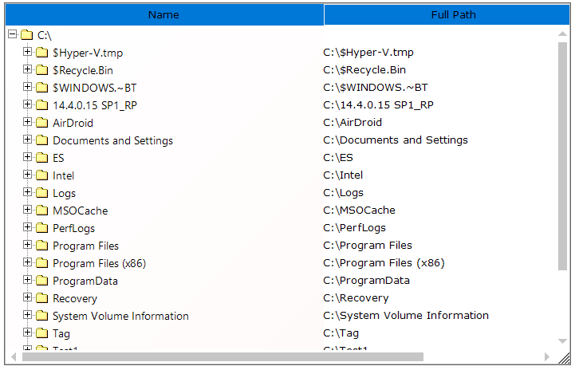
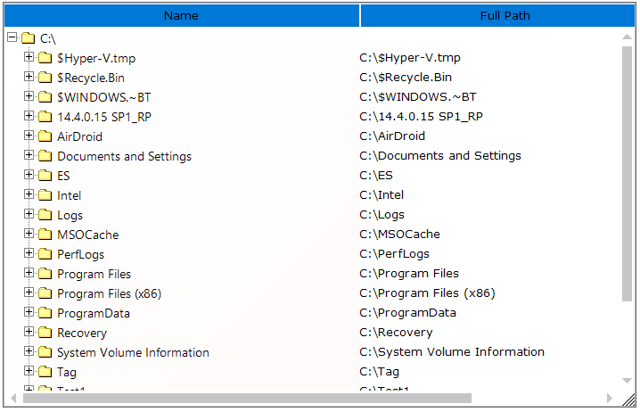
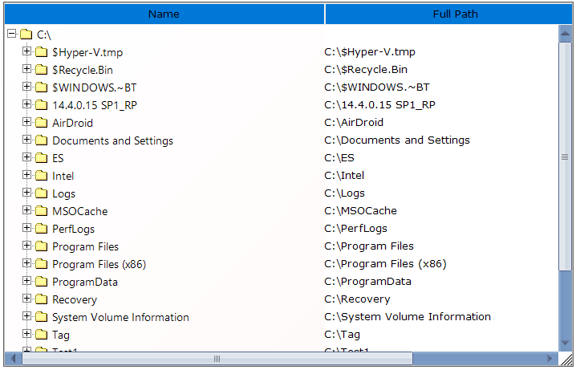

# RunTime Features

# RunTime Features

This section will walk you through the following runtime features of MultiColumnTreeViewAdv Control.

## Context Menu

MultiColumnTreeViewAdv control provides option for displaying context menu on right clicking on any node in the MultiColumnTreeViewAdv control. It also let users add custom menu items.

### Adding Custom Menu Items

1.  Declare and initialize a context menu.

    ~~~ cs

		// Create and initialize a context Menu required

		private System.Windows.Forms.ContextMenu contextMenu1;

		this.contextMenu1 = new System.Windows.Forms.ContextMenu();

		//Associate the context menu with the TreeView control

		this.multiColumnTreeView1.ContextMenu = this.contextMenu1;

    ~~~
    {:.prettyprint }

    ~~~ vbnet

		' Create and initialize a context Menu required

		Private WithEvents contextMenu1 As System.Windows.Forms.ContextMenu

		Me.contextMenu1 = New System.Windows.Forms.ContextMenu()

		'Associate the context menu with the TreeView control

		Me.multiColumnTreeView1.ContextMenu = Me.contextMenu1

    ~~~
    {:.prettyprint }

2. Add the context menu items.

   ~~~ cs

		private System.Windows.Forms.MenuItem editItem;

		this.editItem = new System.Windows.Forms.MenuItem();

		//Add context Menu items

		this.contextMenu1.MenuItems.AddRange(new System.Windows.Forms.MenuItem[] {this.editItem});

		//Pop the context Menu

		this.contextMenu1.Popup += new System.EventHandler(this.contextMenu1_Popup);

		//Set the context menu items

		this.editItem.Index = 0;

		this.editItem.Text = "&Edit";

		this.editItem.Click += new System.EventHandler(this.editItem_Click);

   ~~~
   {:.prettyprint }
 
   ~~~ vbnet

		Private WithEvents editItem As System.Windows.Forms.MenuItem

		Me.editItem = New System.Windows.Forms.MenuItem()

		'Add context Menu items

		Me.contextMenu1.MenuItems.AddRange(New System.Windows.Forms.MenuItem() {Me.editItem})

		'Set the context Menu items

		Me.editItem.Index = 0

		Me.editItem.Text = "&Edit"

   ~~~
   {:.prettyprint }

3. Defining context menu pop-up.

   ~~~ cs

		// Declared to NULL if the right click is outside the node area .

		private TreeNodeAdv rightMouseDownNodeCached = null;

		// Context menu pop up

		private void contextMenu1_Popup(object sender, System.EventArgs e)

		{

		this.rightMouseDownNodeCached = this.multiColumnTreeView1.RMouseDownNode;

		// This will be null if the user clicked in the empty portion of the tree.

		if(this.multiColumnTreeView1.RMouseDownNode == null)

		{

		this.copyItem.Visible = false;

		this.cutItem.Visible = false;

		this.editItem.Visible = false;

		}

		else

		{

		this.copyItem.Visible = true;

		this.cutItem.Visible = true;

		this.editItem.Visible = true;

		}

		}

   ~~~
   {:.prettyprint }

   ~~~ vbnet

		' Declared to NULL if the right click is outside the node area .

		Private rightMouseDownNodeCached As TreeNodeAdv =  Nothing

		' Context menu Popup

		Private Sub contextMenu1_Popup(ByVal sender As Object, ByVal e As System.EventArgs) Handles contextMenu1.Popup

		Me.rightMouseDownNodeCached = Me.multiColumnTreeView1.RMouseDownNode

		' This will be null if the user clicked in the empty portion of the tree.

		If Me.multiColumnTreeView1.RMouseDownNode Is Nothing Then

		Me.copyItem.Visible = False

		Me.cutItem.Visible = False

		Me.editItem.Visible = False

		Else

		Me.copyItem.Visible = True

		Me.cutItem.Visible = True

		Me.editItem.Visible = True

		End If

		End Sub

   ~~~
   {:.prettyprint }

Editing the nodes using "Edit" Menu Item

We can include editing functionality when you click the Edit menu item using the EditItem_Click event. In the below example, it calls the BeginEdit method and begins editing the node that is selected.

Methods Table

<table>
<tr>
<th>
MultiColumnTreeView Methods</th><th>
Description</th></tr>
<tr>
<td>
BeginEdit</td><td>
Edits the selected node.</td></tr>
<tr>
<td>
BeginEdit(Overloaded)</td><td>
Edits the specified node that is passed as the parameter. The parameter is,node - Indicates the particular node to edit.</td></tr>
<tr>
<td>
EndEdit</td><td>
Forces to end the editing of the selected node. It saves or cancels the editing of the selected node based on the bool value passed as parameter.true - Cancels the editing without saving.false - Saves the changes.</td></tr>
</table>



//Edits the Selected node

this.multiColumnTreeView1.BeginEdit();

//Edits the Specified node

//Context menu item's click events

private void editItem_Click(object sender, System.EventArgs e)

{

if(this.rightMouseDownNodeCached != null)

// You can also alternatively turn on F2 label editing for all nodes using the LabelEdit property of the tree.

this.multiColumnTreeView1.BeginEdit(this.rightMouseDownNodeCached);

}

this.multiColumnTreeView1.EndEdit(false);





'Edits the Selected node

Me.multiColumnTreeView1.BeginEdit()

'Edits the Specified node

'Context menu item's click events

Private  Sub editItem_Click(ByVal sender As Object, ByVal e As System.EventArgs)

If Not Me.rightMouseDownNodeCached Is Nothing Then

'You can also alternatively turn on F2 label editing for all nodes using the LabelEdit property of the tree.

Me.multiColumnTreeView1.BeginEdit(Me.rightMouseDownNodeCached)

End If

End Sub

Me.multiColumnTreeView1.EndEdit(False)



A sample which includes the Context Menu feature is available in the below installation path.

…\My Documents\Syncfusion\EssentialStudio\Version Number\Windows\Tools.Windows\Samples\Advanced Editor Functions\ActionGroupingDemo



Node Editing Events



### Scrolling

MultiColumnTreeView control provides scrollbar support to show additional content that is available but not visible by default. The following properties are supported by treeview scrolling.

#### Displaying ScrollTips

The text of the ScrollTip can be set through ScrollTipFormat property. It lets you identify the scroll position.

Property Table

<table>
<tr>
<th>
MultiColumnTreeView Properties</th><th>
Description</th></tr>
<tr>
<td>
HorizontalScrollTips</td><td>
Specifies if the control should display scroll tip when the user is dragging a horizontal scrollbar thumb.</td></tr>
<tr>
<td>
VerticalScrollTips</td><td>
Specifies if the control should display scroll tip when the user is dragging a vertical scrollbar thumb.</td></tr>
<tr>
<td>
HorizontalThumbTrack</td><td>
Specifies if the control should scroll together with scrollbar, when the user is dragging a horizontal scrollbar thumb.</td></tr>
<tr>
<td>
VerticalThumbTrack</td><td>
Specifies if the control should scroll together with the scrollbar, when the user is dragging a vertical scrollbar thumb.</td></tr>
</table>



this.multiColumnTreeView1.ScrollTipFormat = "Position {0}";





Me.multiColumnTreeView1.ScrollTipFormat = "Position {0}"



### Scrolling using Mouse

The following properties support scrolling using mouse wheel.

Property Table

<table>
<tr>
<th>
MultiColumnTreeView Properties</th><th>
Description</th></tr>
<tr>
<td>
SmoothMouseWheelScrolling</td><td>
Lets you control the scrolling behavior when the user rolls the mouse wheel.</td></tr>
<tr>
<td>
MouseWheelScrollLine</td><td>
Specifies the value which controls the scrolling behavior, when the user rolls the mouse wheel. Default value is 3.</td></tr>
<tr>
<td>
EnableIntellijMouse</td><td>
Specifies whether scrolling is allowed using middle mouse button.</td></tr>
<tr>
<td>
AccelerateScrolling</td><td>
Specifies the acceleration behavior for scrollbars.FastImmediateNoneDefault</td></tr>
<tr>
<td>
AllowIncreaseSmallChange</td><td>
When set to true, the scroll control can increase the scrollbar.small change property when doing accelerated scrolling.</td></tr>
</table>

### Office2007 Look and Feel for ScrollBars

MultiColumnTreeView provides support for Office2007Scrollbars with all three color schemes.

Color schemes can be selected using Office2007ScrollBarsColorScheme property.

When the control is been used under a splitter window and if it is sharing the scrollbars with the parent control or the parent window, then setting FillSplitterPane property to true, will toggle support for doing that.

Property Table

<table>
<tr>
<th>
MultiColumnTreeView Properties</th><th>
Description</th></tr>
<tr>
<td>
FillSplitterPane</td><td>
Provides support for using the control inside dynamic splitter window and sharing the scrollbars with the parent window.</td></tr>
</table>



this.multiColumnTreeView1.AllowIncreaseSmallChange = true;

this.multiColumnTreeView1.FillSplitterPane = true;





Me.multiColumnTreeView1.AllowIncreaseSmallChange = True

Me.multiColumnTreeView1.FillSplitterPane = True




Scrolling Events


### Hot Tracking

Hot Tracking is a feature available for nodes of the MultiColumnTreeView control. This gives a hot tracked appearance to the nodes when the mouse cursor is hovering over a corresponding node.

Enabling the HotTracking property to true and when the mouse hovers over any node, 

* The fore color will change to blue and the text will be underlined with blue color, giving the node label a hyperlink appearance.
* In the below image the node "France" is given a link approach by setting the HotTracking property to true and by moving the mouse over the node.

### Tooltip

The MultiColumnTreeView control can display help text for individual nodes, when the mouse is moved over a node, by setting the HelpText property of the nodes. 

Property Table

<table>
<tr>
<th>
treeNodeAdv Properties</th><th>
Description</th></tr>
<tr>
<td>
HelpText</td><td>
Indicates the help text of the node.</td></tr>
</table>



treeNodeAdv9.HelpText = "ToolTip for TreeView";





TreeNodeAdv9.HelpText = "ToolTip for TreeView"



N> Context Menu, Hot Tracking and Tooltip features can be applied only to the nodes in the first column.

