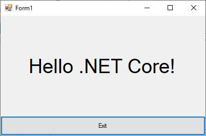

# .NET core support

This section explains how to create the project in .NET core application.

## Create a .NET core project

**Step 1**: Open Visual Studio and click a new project. Next, select Windows Forms App in the available list. Then, select C# from Language list and choose your platform. After that, select **Windows Forms App (.NET core)** template, and click Next. 

**Step 2**: Next, you can see `Configure your new project` window and then click create.

 

**Step 3**: Finally, Windows Forms sample project was created and run the application.

**Step 4**: Next, before adding your controls, you need to remove the default loaded controls as given in the below screenshot. 

N> If you do not remove the code, you cannot see your control in output window.

**Step 5**: After that, you can add your control by creating an instance. Windows Forms visual designer is not yet available in WinForms Core.

## Adding controls in .NET core application

The below section explains how to add your controls in .NET core application.

### Assembly deployment

In Solution Explorer, Right click of the dependencies. Select `Add a reference`. Now, open the assembly window. Click browse, you can select your needed assemblies from netcoreapp3.0.

N> You can only get assemblies from `netcoreapp3.0` for .NET core application and assembly is placed in this location. **Location**: C:\Program Files (x86)\Syncfusion\Essential Studio\Windows\17.1.0.38\precompiledassemblies

### Add NuGet Package

Find more details regarding how to install the NuGet packages in WinForms application in the following link: [Steps to install NuGet packages](https://help.syncfusion.com/windowsforms/nuget-packages).

### Add ButtonAdv control through code

We are going to demo for how to add the control in .NET core application. For example, using ButtonAdv controls.

**Step 1**: Create a .NET core project.

**Step 2**:	Add the following assembly for ButtonAdv control

* Syncfusion.Shared.Base

**Step 3**: Create an instance of the control.

Below code snippet achieved to add the control in to the .NET core project.




ButtonAdv button = new ButtonAdv();

button.Text = ”ButtonAdv”;

this.controls.add(button);




**Step 4**: Run the application.

