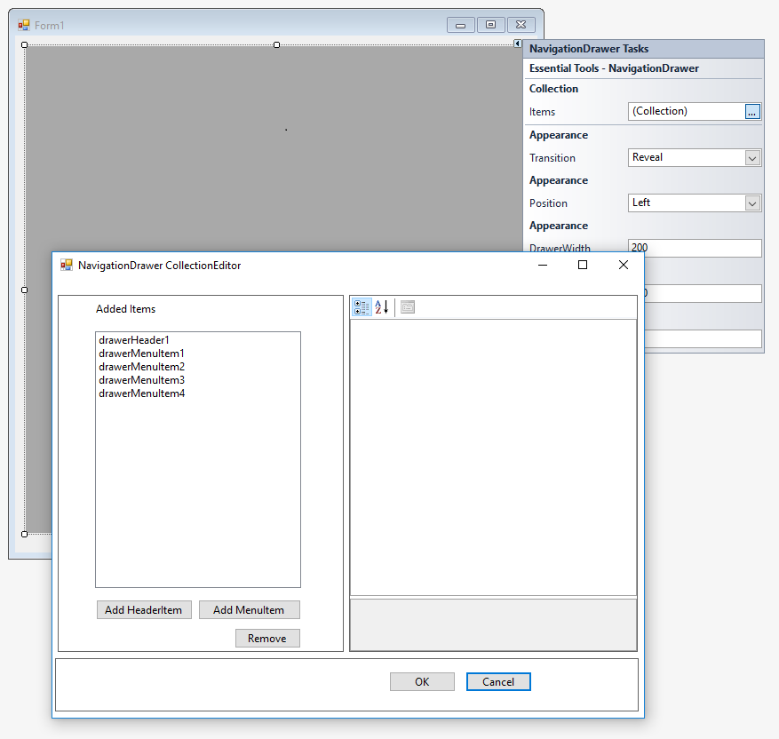
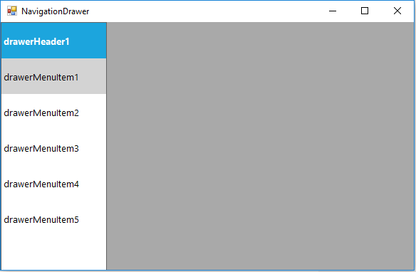

# Getting Started with Windows Forms Navigation Drawer

This section explains how to display the items and adjust the image positions using Windows Forms NavigationDrawer control.

## Assembly deployment

Refer to the [control dependencies](https://help.syncfusion.com/windowsforms/control-dependencies#navigationdrawer) section to get the list of assemblies or NuGet package that needs to be added as a reference to use the control in any application.

You can find more details about installing the NuGet packages in a Windows Forms application in the following link:
 
[How to install nuget packages](https://help.syncfusion.com/windowsforms/visual-studio-integration/nuget-packages)

## Create a simple application with NavigationDrawer

In this walk through, user will create a Windows Forms application that contains [NavigationDrawer](https://help.syncfusion.com/cr/windowsforms/Syncfusion.Windows.Forms.Tools.NavigationDrawer.html) control.

## Create a project

Create a new Windows Forms project in Visual Studio to display the NavigationDrawer control with its sliding panel at different sides.

## Adding control via designer

The `NavigationDrawer` control can be added to an application by dragging it from the toolbox and dropping it in designer. The following assembly references will be added automatically.

* Syncfusion.Grid.Base.dll
* Syncfusion.Grid.Windows.dll
* Syncfusion.Shared.Base.dll
* Syncfusion.Shared.Windows.dll
* Syncfusion.Tools.Base.dll
* Syncfusion.Tools.Windows.dll

 

**Add items to NavigationDrawer**

The header and menu items can be added to drawer using the [Items](https://help.syncfusion.com/cr/windowsforms/Syncfusion.Windows.Forms.Tools.NavigationDrawer.html#Syncfusion_Windows_Forms_Tools_NavigationDrawer_Items) collection in smart tags of NavigationDrawer.

## Adding control manually in C#

To add the control manually in C#, follow the given steps:

**1.** Add the following required assembly references to the project: 

  * Syncfusion.Grid.Base.dll
  * Syncfusion.Grid.Windows.dll
  * Syncfusion.Shared.Base.dll
  * Syncfusion.Shared.Windows.dll
  * Syncfusion.Tools.Base.dll
  * Syncfusion.Tools.Windows.dll

**2.** Include the **Syncfusion.Windows.Forms.Tools** namespace. 

  
  
  using Syncfusion.Windows.Forms.Tools;
  
  
  Imports Syncfusion.Windows.Forms.Tools
  
  

**3.** Create a NavigationDrawer instance, and add it to the window.

  
  
  NavigationDrawer navigationDrawer1 = new NavigationDrawer();
  this.Controls.Add(navigationDrawer1);
  
  
  Dim navigationDrawer1 As NavigationDrawer = New NavigationDrawer
  Me.Controls.Add(navigationDrawer1)
  
  

**4.** Set the width and height to the drawer view.

  
  
  this.navigationDrawer1.DrawerWidth = this.Width/4;
  this.navigationDrawer1.DrawerHeight = this.Height;
  
  
  Me.navigationDrawer1.DrawerWidth = Me.Width/4
  Me.navigationDrawer1.DrawerHeight = Me.Height
  
  

**5.** Add header to the NavigationDrawer.

 Create a [DrawerHeader](https://help.syncfusion.com/cr/windowsforms/Syncfusion.Windows.Forms.Tools.DrawerHeader.html) instance, and add it to the [Items](https://help.syncfusion.com/cr/windowsforms/Syncfusion.Windows.Forms.Tools.NavigationDrawer.html#Syncfusion_Windows_Forms_Tools_NavigationDrawer_Items) collection in NavigationDrawer.

  
  
  DrawerHeader drawerHeader1 = new DrawerHeader();
  this.navigationDrawer1.Items.Add(this.drawerHeader1);
  
  
  Dim drawerHeader1 As DrawerHeader = New DrawerHeader
  Me.navigationDrawer1.Items.Add(Me.drawerHeader1)
  
  

 

**6.** Add MenuItems to NavigationDrawer.

Create a [DrawerMenuItem](https://help.syncfusion.com/cr/windowsforms/Syncfusion.Windows.Forms.Tools.DrawerMenuItem.html) instance, and add it to the [Items](https://help.syncfusion.com/cr/windowsforms/Syncfusion.Windows.Forms.Tools.NavigationDrawer.html#Syncfusion_Windows_Forms_Tools_NavigationDrawer_Items) collection in the NavigationDrawer class.



DrawerMenuItem drawerMenuItem1 = new DrawerMenuItem();
DrawerMenuItem drawerMenuItem2 = new DrawerMenuItem();
DrawerMenuItem drawerMenuItem3 = new DrawerMenuItem();
DrawerMenuItem drawerMenuItem4 = new DrawerMenuItem();
DrawerMenuItem drawerMenuItem5 = new DrawerMenuItem();

this.navigationDrawer1.Items.Add(this.drawerMenuItem1);
this.navigationDrawer1.Items.Add(this.drawerMenuItem2);
this.navigationDrawer1.Items.Add(this.drawerMenuItem3);
this.navigationDrawer1.Items.Add(this.drawerMenuItem4);
this.navigationDrawer1.Items.Add(this.drawerMenuItem5);


Dim drawerMenuItem1 As DrawerMenuItem = New DrawerMenuItem
Dim drawerMenuItem2 As DrawerMenuItem = New DrawerMenuItem
Dim drawerMenuItem3 As DrawerMenuItem = New DrawerMenuItem
Dim drawerMenuItem4 As DrawerMenuItem = New DrawerMenuItem

Me.navigationDrawer1.Items.Add(Me.drawerMenuItem1)
Me.navigationDrawer1.Items.Add(Me.drawerMenuItem2)
Me.navigationDrawer1.Items.Add(Me.drawerMenuItem3)
Me.navigationDrawer1.Items.Add(Me.drawerMenuItem4)



## Sidebar placement

You can change the sliding position of the NavigationDrawer control by using [Position](https://help.syncfusion.com/cr/windowsforms/Syncfusion.Windows.Forms.Tools.NavigationDrawer.html#Syncfusion_Windows_Forms_Tools_NavigationDrawer_Position) property.

The sliding position options of the NavigationDrawer is given below,
 
* **Left**– Slides from left direction.
* **Right**– Slides from right direction.
* **Top**– Slides from Top direction.
* **Bottom**– Slides from Bottom direction.





//Setting side bar position 
this.navigationDrawer1.Position = SlidePosition.Left;





'Setting side bar position 
Me.navigationDrawer1.Position = SlidePosition.Left





* **Left**

* **Right**

* **Top**

* **Bottom**

 
## Setting image to an item

The `NavigationDrawer` allows setting image to each menu item using [Image](https://help.syncfusion.com/cr/windowsforms/Syncfusion.Windows.Forms.Tools.DrawerMenuItem.html#Syncfusion_Windows_Forms_Tools_DrawerMenuItem_Image) property.



//Setting image to the menu item 
this.drawerMenuItem1.Image = Image.FromFile(@"../../Audit-WF.png"); 


'Setting side bar position 
Me.drawerMenuItem1.Image = Image.FromFile(@"../../Audit-WF.png")



## Positioning Text and Image

The text and image positions can be adjusted for the menu items using the [TextAlign](https://help.syncfusion.com/cr/windowsforms/Syncfusion.Windows.Forms.Tools.DrawerMenuItem.html#Syncfusion_Windows_Forms_Tools_DrawerMenuItem_TextAlign) and [TextImageRelation](https://help.syncfusion.com/cr/windowsforms/Syncfusion.Windows.Forms.Tools.DrawerMenuItem.html#Syncfusion_Windows_Forms_Tools_DrawerMenuItem_TextImageRelation) property.



//Setting TextImageRelation to an item 
this.drawerMenuItem1.TextAlign = TextAlignment.Center;
this.drawerMenuItem1.TextImageRelation = TextImageRelation.TextBeforeImage; 


'Setting TextImageRelation to an item 
Me.drawerMenuItem1.TextAlign = TextAlignment.Center
Me.drawerMenuItem1.TextImageRelation = TextImageRelation.TextBeforeImage



