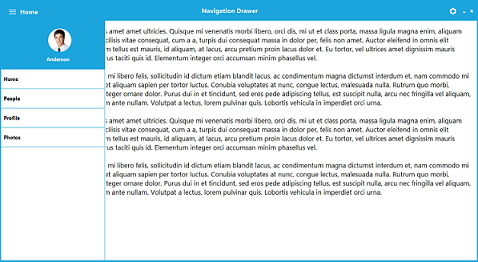

# About Syncfusion® Windows Forms NavigationDrawer Control

[WinForms NavigationDrawer](https://www.syncfusion.com/winforms-ui-controls/navigation-drawer) is a sliding panel menu that comes out from the edge of the window and allows the contents to be placed in a hidden panel. It can be shown by swiping from any of the four screen edges or by demand.

## Key features

* **Position** - Provides an option to set the sliding position of the Drawer panel. For more details, refer to the [Position](https://help.syncfusion.com/windowsforms/navigation-drawer/concepts-and-features#position) section.

* **Transition** - Provides options to set the transition type of the drawer while opening. For more details, refer to the [Transition](https://help.syncfusion.com/windowsforms/navigation-drawer/concepts-and-features#transition) section.

* **Toggle drawer** - Provides an option to toggle between the sliding panel visibility. For more details, refer to the [Toggle drawer](https://help.syncfusion.com/windowsforms/navigation-drawer/concepts-and-features#toggle-drawer) section.

* **Animation duration** - Specifies a TimeSpan by which the DrawerContent opens up to the view. Animation duration is applied only when the `ToggleDrawer` function is used. For more details, refer to the [Animation duration](https://help.syncfusion.com/windowsforms/navigation-drawer/concepts-and-features#animation-duration) section.

## See also

* [Getting Started](https://help.syncfusion.com/windowsforms/navigation-drawer/getting-started)
* [Concepts and Features](https://help.syncfusion.com/windowsforms/navigation-drawer/concepts-and-features)
* [Style](https://help.syncfusion.com/windowsforms/navigation-drawer/style)
* [Events](https://help.syncfusion.com/windowsforms/navigation-drawer/events)

