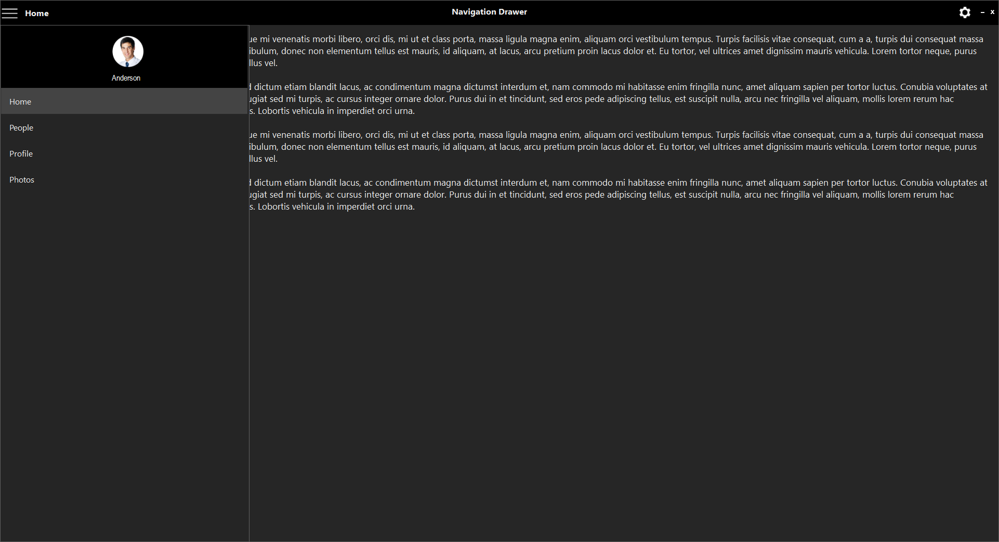

# Style in Windows Forms Navigation Drawer

[Windows Forms Navigation Drawer](https://www.syncfusion.com/winforms-ui-controls/navigation-drawer) control has rich set of themes for professional representation. You can easily modify the look and feel of the NavigationDrawer using the built-in themes.

It has the below themes.

    •	Default

    •	Office2016Colorful

    •	Office2016White

    •	Office2016DarkGray

    •	Office2016Black

The following code example allows you to set the [style](https://help.syncfusion.com/cr/windowsforms/Syncfusion.Windows.Forms.Tools.NavigationDrawer.html#Syncfusion_Windows_Forms_Tools_NavigationDrawer_Style) for the NavigationDrawer.

## Default

This option helps to set the Default theme.





this.navigationDrawer1.Style = Syncfusion.Windows.Forms.Tools.NavigationDrawerStyle.Default;





Me.navigationDrawer1.Style = Syncfusion.Windows.Forms.Tools.NavigationDrawerStyle.Default





## Office2016Colorful

This option helps to set the Office2016Colorful theme.





this.navigationDrawer1.Style = Syncfusion.Windows.Forms.Tools.NavigationDrawerStyle.Office2016Colorful;





Me.navigationDrawer1.Style = Syncfusion.Windows.Forms.Tools.NavigationDrawerStyle.Office2016Colorful





## Office2016White

This option helps to set the Office2016White theme.





this.navigationDrawer1.Style = Syncfusion.Windows.Forms.Tools.NavigationDrawerStyle.Office2016White;





Me.navigationDrawer1.Style = Syncfusion.Windows.Forms.Tools.NavigationDrawerStyle.Office2016White





## Office2016DarkGray

This option helps to set the Office2016DarkGray theme.





this.navigationDrawer1.Style = Syncfusion.Windows.Forms.Tools.NavigationDrawerStyle.Office2016DarkGray;





Me.navigationDrawer1.Style = Syncfusion.Windows.Forms.Tools.NavigationDrawerStyle.Office2016DarkGray





## Office2016Black

This option helps to set the Office2016Black theme.





this.navigationDrawer1.Style = Syncfusion.Windows.Forms.Tools.NavigationDrawerStyle.Office2016Black;





Me.navigationDrawer1.Style = Syncfusion.Windows.Forms.Tools.NavigationDrawerStyle.Office2016Black





