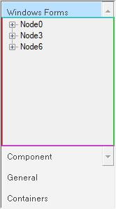

# Border settings

## GroupBar settings

The border style of the GroupBar can be set using the [BorderStyle](https://help.syncfusion.com/cr/windowsforms/Syncfusion.Shared.Base~Syncfusion.Windows.Forms.Tools.GroupBar~BorderStyle.html) property.



 

this.groupBar1.BorderStyle = System.Windows.Forms.BorderStyle.Fixed3D;

 

 
 


Me.groupBar1.BorderStyle = System.Windows.Forms.BorderStyle.Fixed3D 





  

## GroupBar item client area border settings

The border of the GroupBar Item client area can be set and customized using the following properties.

* [DrawClientBorder](https://help.syncfusion.com/cr/windowsforms/Syncfusion.Shared.Base~Syncfusion.Windows.Forms.Tools.GroupBar~DrawClientBorder.html)
* [ClientBorderColors](https://help.syncfusion.com/cr/windowsforms/Syncfusion.Shared.Base~Syncfusion.Windows.Forms.Tools.GroupBarItem~ClientBorderColors.html)





this.groupBar1.DrawClientBorder = true;

this.groupBarItem2.ClientBorderColors = new Syncfusion.Windows.Forms.Tools.BorderColors(System.Drawing.Color.Red, System.Drawing.Color.Aqua, System.Drawing.Color.Lime, System.Drawing.Color.Magenta);





Me.groupBar1.DrawClientBorder = True

Me.groupBarItem2.ClientBorderColors = New Syncfusion.Windows.Forms.Tools.BorderColors(System.Drawing.Color.Red, System.Drawing.Color.Aqua, System.Drawing.Color.Lime, System.Drawing.Color.Magenta)





 

