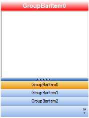

---
layout: post
title: How to Change Header BackColor in Windows Forms GroupBar | Syncfusion®
description: Change the header BackColor in Syncfusion® Windows Forms GroupBar control when using Office 2003 visual style, stacked mode, and more.
platform: WindowsForms
control: GroupBar
documentation: ug
---
# How to Change Header BackColor in Windows Forms GroupBar

The following code examples demonstrate how to change the header background color of a stacked GroupBar item when the Office2003 visual style is applied.





//To set the Office2003 visual style

this.groupBar1.VisualStyle = Syncfusion.Windows.Forms.VisualStyle.Office2003;

//To enable stacked mode

groupBar1.StackedMode = true;

//To customize the GroupBarItem's Header BackColor

Syncfusion.Windows.Forms.Office2003Colors.GroupBarHeaderColorDark = Color.Red;

Syncfusion.Windows.Forms.Office2003Colors.GroupBarHeaderColorLight = Color.White;

 



'To set the Office2003 visual style

Me.groupBar1.VisualStyle = Syncfusion.Windows.Forms.VisualStyle.Office2003

'To enable stacked mode

groupBar1.StackedMode = True

'To customize the GroupBarItem's Header BackColor

Syncfusion.Windows.Forms.Office2003Colors.GroupBarHeaderColorDark = Color.Red

Syncfusion.Windows.Forms.Office2003Colors.GroupBarHeaderColorLight = Color.White





N> In GroupBar, [StackedMode](https://help.syncfusion.com/cr/windowsforms/Syncfusion.Windows.Forms.Tools.GroupBar.html#Syncfusion_Windows_Forms_Tools_GroupBar_StackedMode) property should be enabled to customize the appearance of the GroupBar header.

