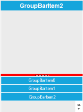

---
layout: post
title: How to Customize Splitter Color in GroupBar | Syncfusion
description: Customize the splitter color in Syncfusion® Windows Forms GroupBar control using appearance settings, color customization options, and more.
platform: WindowsForms
control: GroupBar
documentation: ug
---
# How to Customize Splitter Color in Windows Forms GroupBar

## Appearance settings

The following properties help customize the splitter color in the GroupBar.

* [StackedMode](https://help.syncfusion.com/cr/windowsforms/Syncfusion.Windows.Forms.Tools.GroupBar.html#Syncfusion_Windows_Forms_Tools_GroupBar_StackedMode)
* [SplitterColor](https://help.syncfusion.com/cr/windowsforms/Syncfusion.Windows.Forms.Tools.GroupBar.html#Syncfusion_Windows_Forms_Tools_GroupBar_Splittercolor)
* [EnableSplittercolorCustomization](https://help.syncfusion.com/cr/windowsforms/Syncfusion.Windows.Forms.Tools.GroupBar.html#Syncfusion_Windows_Forms_Tools_GroupBar_EnableSplittercolorCustomization)



  

 this.groupBar1.StackedMode = true;

// To customize the splitter color

this.groupBar1.Splittercolor = Color.Red;

// To define whether to use default splitter color or customized color

this.groupBar1.EnableSplittercolorCustomization = true;



 

 Me.groupBar1.StackedMode = True

' To customize the splitter color

Me.groupBar1.Splittercolor = Color.Red

' To define whether to use default splitter color or customized color

Me.groupBar1.EnableSplittercolorCustomization = True





 
