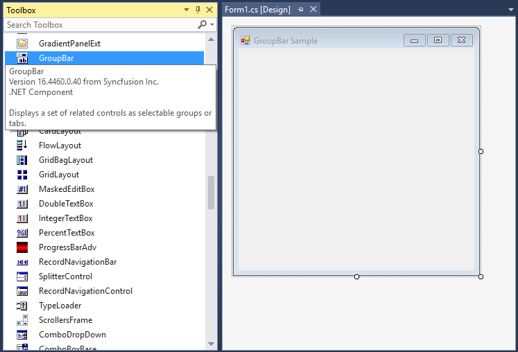
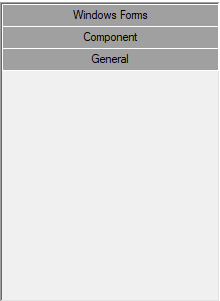
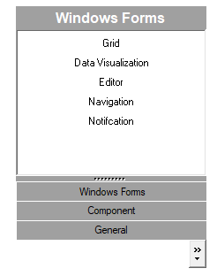

# Getting Started with Windows Forms Navigation Pane (GroupBar)

## Assembly deployment

Refer to the [control dependencies](https://help.syncfusion.com/windowsforms/control-dependencies#groupbar) section to get the list of assemblies or NuGet package that needs to be added as a reference to use the control in any application.
 
You can find more details about installing the NuGet package in a Windows Forms application in the following link: 
 
[How to install nuget packages](https://help.syncfusion.com/windowsforms/visual-studio-integration/nuget-packages)

## Create a simple application with GroupBar

You can create a Windows Forms application with the GroupBar control using the following steps:

## Create a project

Create a new Windows Forms project in Visual Studio to display the GroupBar control.

## Add control through designer

The GroupBar control can be added to an application by dragging it from the toolbox to a designer view. The Syncfusion.Shared.Base assembly reference will be added automatically.

 

## Add control manually in code

To add the control manually in C#, follow the given steps:

**1.** Add the **Syncfusion.Shared.Base** assembly reference to the project.

**2.** Include the GroupBar control namespace **Syncfusion.Windows.Forms.Tools;**.

  
  
  using Syncfusion.Windows.Forms.Tools;
  
  
  Imports Syncfusion.Windows.Forms.Tools
  
   

**3.** Create a GroupBar control instance, and add it to the form.



GroupBar groupBar1 = new GroupBar();
this.Controls.Add(groupBar1);


Dim groupBar1 As GroupBar = New GroupBar()
Me.Controls.Add(groupBar1)



## Add group bar items

You can add the group bar items inside the Groupbar control using the [GroupBarItems](https://help.syncfusion.com/cr/windowsforms/Syncfusion.Windows.Forms.Tools.GroupBar.html#Syncfusion_Windows_Forms_Tools_GroupBar_GroupBarItems) collection property.



GroupBarItem groupBarItem0 = new GroupBarItem();
GroupBarItem groupBarItem1 = new GroupBarItem();
GroupBarItem groupBarItem2 = new GroupBarItem();
GroupBarItem groupBarItem3 = new GroupBarItem();
GroupBarItem groupBarItem4 = new GroupBarItem();
GroupBarItem groupBarItem5 = new GroupBarItem();

this.groupBarItem0.Text = "GroupBarItem0";
this.groupBarItem1.Text = "GroupBarItem1";
this.groupBarItem2.Text = "GroupBarItem2";
this.groupBarItem3.Text = "GroupBarItem3";
this.groupBarItem4.Text = "GroupBarItem4";
this.groupBarItem5.Text = "GroupBarItem5";

this.groupBar1.GroupBarItems.AddRange(new GroupBarItem[] {
            this.groupBarItem0,
            this.groupBarItem1,
            this.groupBarItem2,
            this.groupBarItem3,
            this.groupBarItem4,
            this.groupBarItem5});


Dim groupBarItem0 As GroupBarItem = New GroupBarItem()
Dim groupBarItem1 As GroupBarItem = New GroupBarItem()
Dim groupBarItem2 As GroupBarItem = New GroupBarItem()
Dim groupBarItem3 As GroupBarItem = New GroupBarItem()
Dim groupBarItem4 As GroupBarItem = New GroupBarItem()
Dim groupBarItem5 As GroupBarItem = New GroupBarItem()

Me.groupBarItem0.Text = "GroupBarItem0"
Me.groupBarItem1.Text = "GroupBarItem1"
Me.groupBarItem2.Text = "GroupBarItem2"
Me.groupBarItem3.Text = "GroupBarItem3"
Me.groupBarItem4.Text = "GroupBarItem4"
Me.groupBarItem5.Text = "GroupBarItem5"

Me.groupBar1.GroupBarItems.AddRange(new GroupBarItem[] {
            Me.groupBarItem0,
            Me.groupBarItem1,
            Me.groupBarItem2,
            Me.groupBarItem3,
            Me.groupBarItem4,
            Me.groupBarItem5})



## Display mode

You can change the visual mode of the GroupBar control like stack by enabling the [StackedMode](https://help.syncfusion.com/cr/windowsforms/Syncfusion.Windows.Forms.Tools.GroupBar.html#Syncfusion_Windows_Forms_Tools_GroupBar_StackedMode) property.



this.groupBar1.StackedMode = true;


Me.groupBar1.StackedMode = True



