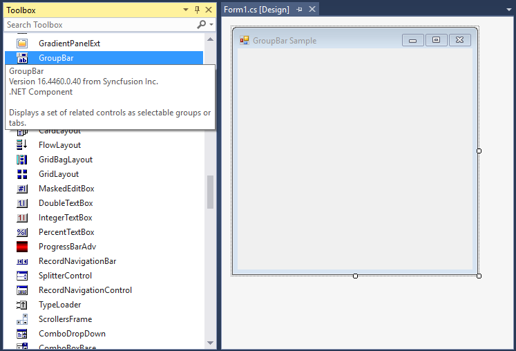
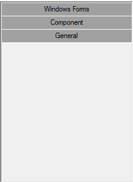
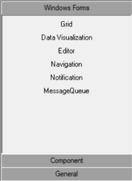
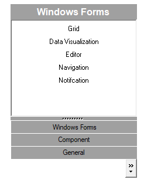

# Getting Started with Windows Forms Navigation Pane (GroupBar)

## Assembly deployment

Refer to the [control dependencies](https://help.syncfusion.com/windowsforms/control-dependencies#groupbar) section to get the list of assemblies or NuGet package that needs to be added as a reference to use the control in any application.
 
You can find more details about installing the NuGet package in a Windows Forms application in the following link: 
 
[How to install NuGet packages](https://help.syncfusion.com/windowsforms/installation/install-nuget-packages)

To generate the license validated application, refer to the [licensing](https://help.syncfusion.com/windowsforms/licensing/overview) documentation.

## Create a simple application with GroupBar

You can create a Windows Forms application with the GroupBar control using the following steps:

1. [Create a project](#create-a-project)
2. [Add control through designer](#add-control-through-designer)
3. [Add control manually in code](#add-control-manually-in-code)
4. [Add group bar items](#add-group-bar-items)

## Create a project

Create a new Windows Forms project in Visual Studio to display the GroupBar control.

## Add control through designer

The GroupBar control can be added to an application by dragging it from the toolbox to a designer view. The Syncfusion.Shared.Base assembly reference will be added automatically.

 

## Add control manually in code

To add the control manually in C#, follow the given steps:

1. Add the **Syncfusion.Shared.Base** assembly reference to the project.

2. Include the GroupBar control namespace **Syncfusion.Windows.Forms.Tools;**.




using Syncfusion.Windows.Forms.Tools;


Imports Syncfusion.Windows.Forms.Tools

 

{{ codesnippet1 | OrderList_Indent_Level_1 }}

3. Create a GroupBar control instance, and add it to the form.




GroupBar groupBar1 = new GroupBar();
this.Controls.Add(groupBar1);


Dim groupBar1 As GroupBar = New GroupBar()
Me.Controls.Add(groupBar1)



{{ codesnippet2 | OrderList_Indent_Level_1 }}

## Add group bar items

You can add the group bar items inside the GroupBar control using the [GroupBarItems](https://help.syncfusion.com/cr/windowsforms/Syncfusion.Windows.Forms.Tools.GroupBar.html#Syncfusion_Windows_Forms_Tools_GroupBar_GroupBarItems) collection property. Images can also be set for the items using their [Image](https://help.syncfusion.com/cr/windowsforms/Syncfusion.Windows.Forms.Tools.GroupBarItem.html#Syncfusion_Windows_Forms_Tools_GroupBarItem_Image) property. For more details, refer to the [GroupBar Items Settings](https://help.syncfusion.com/windowsforms/navigation-pane/groupbar-items-settings) documentation.




GroupBarItem groupBarItem0 = new GroupBarItem();
GroupBarItem groupBarItem1 = new GroupBarItem();
GroupBarItem groupBarItem2 = new GroupBarItem();

groupBarItem0.Text = "Windows Forms";
groupBarItem1.Text = "Component";
groupBarItem2.Text = "General";

this.groupBar1.GroupBarItems.AddRange(new GroupBarItem[] {
groupBarItem0,
groupBarItem1,
groupBarItem2});



Dim groupBarItem0 As GroupBarItem = New GroupBarItem()
Dim groupBarItem1 As GroupBarItem = New GroupBarItem()
Dim groupBarItem2 As GroupBarItem = New GroupBarItem()

groupBarItem0.Text = "Windows Forms"
groupBarItem1.Text = "Component"
groupBarItem2.Text = "General"

Me.groupBar1.GroupBarItems.AddRange(New GroupBarItem() {
            groupBarItem0,
            groupBarItem1,
            groupBarItem2})



## Add child items to the group bar items

You can add child items to GroupBarItems in the GroupBar by using the [GroupView](https://help.syncfusion.com/cr/windowsforms/Syncfusion.Windows.Forms.Tools.GroupView.html). The following code snippet demonstrates how to add child items to GroupBarItems using the GroupView. The [GroupViewItem](https://help.syncfusion.com/cr/windowsforms/Syncfusion.Windows.Forms.Tools.GroupViewItem.html) constructor used below takes the item text, image index, a value indicating whether the item is visible, the image to be displayed, and the item tag, in that order.




GroupView groupView0 = new GroupView();
groupView0.Name = "Windows Forms";
groupView0.GroupViewItems.AddRange(new GroupViewItem[] 
{
    new GroupViewItem("Grid", 11, true, null, "Grid"),
    new GroupViewItem("Data Visualization", 11, true, null, "FileSystemWatcher"),
    new GroupViewItem("Editor", 11, true, null, "EventLog"),
    new GroupViewItem("Navigation", 11, true, null, "DirectoryEntry"),
    new GroupViewItem("Notification", 11, true, null, "DirectorySearcher"),
    new GroupViewItem("MessageQueue", 11, true, null, "MessageQueue")
});

GroupView groupView1 = new GroupView();
groupView1.Name = "Component";
groupView1.GroupViewItems.AddRange(new GroupViewItem[] 
{
    new GroupViewItem("Pointer", 11, true, null, "Pointer"),
    new GroupViewItem("FileSystemWatcher", 22, true, null, "FileSystemWatcher"),
    new GroupViewItem("EventLog", 23, true, null, "EventLog"),
    new GroupViewItem("DirectoryEntry", 24, true, null, "DirectoryEntry"),
    new GroupViewItem("DirectorySearcher", 25, true, null, "DirectorySearcher"),
    new GroupViewItem("MessageQueue", 26, true, null, "MessageQueue")
});

GroupView groupView2 = new GroupView();
groupView2.Name = "General";
groupView2.GroupViewItems.AddRange(new GroupViewItem[] 
{
    new GroupViewItem("Pointer", 11, true, null, "Pointer"),
    new GroupViewItem("Label", 12, true, null, "Label"),
    new GroupViewItem("LinkLabel", 13, true, null, "LinkLabel"),
    new GroupViewItem("Button", 14, true, null, "Button"),
    new GroupViewItem("TextBox", 15, true, null, "TextBox"),
    new GroupViewItem("MainMenu", 16, true, null, "MainMenu"),
    new GroupViewItem("CheckBox", 17, true, null, "CheckBox"),
    new GroupViewItem("RadioButton", 18, true, null, "RadioButton")
});

groupBarItem0.Client = groupView0;
groupBarItem1.Client = groupView1;
groupBarItem2.Client = groupView2;

this.groupBar1.Controls.Add(groupView0);
this.groupBar1.Controls.Add(groupView1);
this.groupBar1.Controls.Add(groupView2);

this.groupBar1.GroupBarItems.AddRange(new GroupBarItem[] {
groupBarItem0,
groupBarItem1,
groupBarItem2});



Dim groupView0 As GroupView = New GroupView()
groupView0.Name = "Windows Forms"
groupView0.GroupViewItems.AddRange(New GroupViewItem() 
{
    New GroupViewItem("Grid", 11, True, Nothing, "Grid"),
    New GroupViewItem("Data Visualization", 11, True, Nothing, "FileSystemWatcher"),
    New GroupViewItem("Editor", 11, True, Nothing, "EventLog"),
    New GroupViewItem("Navigation", 11, True, Nothing, "DirectoryEntry"),
    New GroupViewItem("Notification", 11, True, Nothing, "DirectorySearcher"),
    New GroupViewItem("MessageQueue", 11, True, Nothing, "MessageQueue")
})

Dim groupView1 As GroupView = New GroupView()
groupView1.Name = "Component"
groupView1.GroupViewItems.AddRange(New GroupViewItem() 
{
    New GroupViewItem("Pointer", 11, True, Nothing, "Pointer"),
    New GroupViewItem("FileSystemWatcher", 22, True, Nothing, "FileSystemWatcher"),
    New GroupViewItem("EventLog", 23, True, Nothing, "EventLog"),
    New GroupViewItem("DirectoryEntry", 24, True, Nothing, "DirectoryEntry"),
    New GroupViewItem("DirectorySearcher", 25, True, Nothing, "DirectorySearcher"),
    New GroupViewItem("MessageQueue", 26, True, Nothing, "MessageQueue")
})

Dim groupView2 As GroupView = New GroupView()
groupView2.Name = "General"
groupView2.GroupViewItems.AddRange(New GroupViewItem() 
{
    New GroupViewItem("Pointer", 11, True, Nothing, "Pointer"),
    New GroupViewItem("Label", 12, True, Nothing, "Label"),
    New GroupViewItem("LinkLabel", 13, True, Nothing, "LinkLabel"),
    New GroupViewItem("Button", 14, True, Nothing, "Button"),
    New GroupViewItem("TextBox", 15, True, Nothing, "TextBox"),
    New GroupViewItem("MainMenu", 16, True, Nothing, "MainMenu"),
    New GroupViewItem("CheckBox", 17, True, Nothing, "CheckBox"),
    New GroupViewItem("RadioButton", 18, True, Nothing, "RadioButton")
})

groupBarItem0.Client = groupView0
groupBarItem1.Client = groupView1
groupBarItem2.Client = groupView2

Me.groupBar1.Controls.Add(groupView0)
Me.groupBar1.Controls.Add(groupView1)
Me.groupBar1.Controls.Add(groupView2)

Me.groupBar1.GroupBarItems.AddRange(New GroupBarItem() {
            groupBarItem0,
            groupBarItem1,
            groupBarItem2})




>**NOTE**:
The `groupBarItem0`, `groupBarItem1`, and `groupBarItem2` instances used above are created as shown in the [add group bar items](#add-group-bar-items) section.

## Display mode

You can change the visual mode of the GroupBar control like stack by enabling the [StackedMode](https://help.syncfusion.com/cr/windowsforms/Syncfusion.Windows.Forms.Tools.GroupBar.html#Syncfusion_Windows_Forms_Tools_GroupBar_StackedMode) property.



this.groupBar1.StackedMode = true;


Me.groupBar1.StackedMode = True



