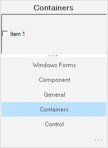

# GroupBar Settings in Windows Forms Navigation Pane (GroupBar)

The look and feel of the GroupBar can be controlled through the appearance properties of the control. These properties are discussed in detail in the below topics.

## Integrated scrolling

Scroll buttons can be included for the client controls in the GroupBar by setting the [IntegratedScrolling](https://help.syncfusion.com/cr/windowsforms/Syncfusion.Windows.Forms.Tools.GroupBar.html#Syncfusion_Windows_Forms_Tools_GroupBar_IntegratedScrolling) property to `true`.





this.groupBar1.IntegratedScrolling = true;



 

Me.groupBar1.IntegratedScrolling = True 





 

## StackedGroupBar

The following are the properties available for GroupBar Items when the GroupBar is in the Stacked Mode. The Stacked Mode can be enabled by setting the [StackedMode](https://help.syncfusion.com/cr/windowsforms/Syncfusion.Windows.Forms.Tools.GroupBar.html#Syncfusion_Windows_Forms_Tools_GroupBar_StackedMode) property to `true`.

* [InNavigationPane](https://help.syncfusion.com/cr/windowsforms/Syncfusion.Windows.Forms.Tools.GroupBarItem.html#Syncfusion_Windows_Forms_Tools_GroupBarItem_InNavigationPane)
* [NavigationPaneIcon](https://help.syncfusion.com/cr/windowsforms/Syncfusion.Windows.Forms.Tools.GroupBarItem.html#Syncfusion_Windows_Forms_Tools_GroupBarItem_NavigationPaneIcon)
* [NavigationPaneImage](https://help.syncfusion.com/cr/windowsforms/Syncfusion.Windows.Forms.Tools.GroupBarItem.html#Syncfusion_Windows_Forms_Tools_GroupBarItem_NavigationPaneImage)
* [ShowChevron](https://help.syncfusion.com/cr/windowsforms/Syncfusion.Windows.Forms.Tools.GroupBar.html#Syncfusion_Windows_Forms_Tools_GroupBar_ShowChevron)



  

// StackeMode set to true.

this.groupBarItem1.InNavigationPane = true;

this.groupBarItem1.NavigationPaneIcon = ((System.Drawing.Icon)(resources.GetObject("groupBarItem1.NavigationPaneIcon")));

this.groupBarItem1.NavigationPaneImage = ((System.Drawing.Image)(resources.GetObject("groupBarItem1.NavigationPaneImage")));





' StackeMode set to true.

Me.groupBarItem1.InNavigationPane = True

Me.groupBarItem1.NavigationPaneIcon = DirectCast((Resources.GetObject("groupBarItem1.NavigationPaneIcon")), System.Drawing.Icon)

Me.groupBarItem1.NavigationPaneImage = DirectCast((Resources.GetObject("groupBarItem1.NavigationPaneImage")), System.Drawing.Image)





If you want to display an icon or image for the GroupBar Item displayed in the GroupBar's navigation pane, set the [InNavigationPane](https://help.syncfusion.com/cr/windowsforms/Syncfusion.Windows.Forms.Tools.GroupBarItem.html#Syncfusion_Windows_Forms_Tools_GroupBarItem_InNavigationPane) property to `true` and associate icons or images with the [NavigationPaneIcon](https://help.syncfusion.com/cr/windowsforms/Syncfusion.Windows.Forms.Tools.GroupBarItem.html#Syncfusion_Windows_Forms_Tools_GroupBarItem_NavigationPaneIcon) and [NavigationPaneImage](https://help.syncfusion.com/cr/windowsforms/Syncfusion.Windows.Forms.Tools.GroupBarItem.html#Syncfusion_Windows_Forms_Tools_GroupBarItem_NavigationPaneImage) 
properties respectively.

  

Stacked GroupBar Item automatically shows the Chevron, which can be made invisible by setting the [ShowChevron](https://help.syncfusion.com/cr/windowsforms/Syncfusion.Windows.Forms.Tools.GroupBar.html#Syncfusion_Windows_Forms_Tools_GroupBar_ShowChevron) property to `false`.

N> You should set [LargeImageMode](https://help.syncfusion.com/cr/windowsforms/Syncfusion.Windows.Forms.Tools.GroupBarItem.html#Syncfusion_Windows_Forms_Tools_GroupBarItem_LargeImageMode) of GroupBarItem to `true` to display the item images in the GroupBar's navigation pane.

### Navigation pane

You can set the navigation pane button width and height by using [NavigationPaneButtonWidth](https://help.syncfusion.com/cr/windowsforms/Syncfusion.Windows.Forms.Tools.GroupBar.html#Syncfusion_Windows_Forms_Tools_GroupBar_NavigationPaneButtonWidth) and [NavigationPaneHeight](https://help.syncfusion.com/cr/windowsforms/Syncfusion.Windows.Forms.Tools.GroupBar.html#Syncfusion_Windows_Forms_Tools_GroupBar_NavigationPaneHeight) properties respectively.



  

// StackeMode set to true.

this.groupBar1.NavigationPaneButtonWidth = 25;

this.groupBar1.NavigationPaneHeight = 35;



 

' StackeMode set to true.

Me.groupBar1.NavigationPaneButtonWidth = 25

Me.groupBar1.NavigationPaneHeight = 35





The Navigation Pane is displayed when the GroupBar is in the Stacked Mode. It's height and width can be adjusted by setting the [NavigationPaneButtonWidth](https://help.syncfusion.com/cr/windowsforms/Syncfusion.Windows.Forms.Tools.GroupBar.html#Syncfusion_Windows_Forms_Tools_GroupBar_NavigationPaneButtonWidth) and [NavigationPaneHeight](https://help.syncfusion.com/cr/windowsforms/Syncfusion.Windows.Forms.Tools.GroupBar.html#Syncfusion_Windows_Forms_Tools_GroupBar_NavigationPaneHeight) properties to integer values.

 
 

 
## Collapse/expand settings

This section discusses settings of a groupbar in its collapsed state.

N> [AllowCollapse](https://help.syncfusion.com/cr/windowsforms/Syncfusion.Windows.Forms.Tools.GroupBar.html#Syncfusion_Windows_Forms_Tools_GroupBar_AllowCollapse) property should be set to `true` to effect the below settings.
 
* [Collapsed](https://help.syncfusion.com/cr/windowsforms/Syncfusion.Windows.Forms.Tools.GroupBar.html#Syncfusion_Windows_Forms_Tools_GroupBar_Collapsed)
* [CollapsedText](https://help.syncfusion.com/cr/windowsforms/Syncfusion.Windows.Forms.Tools.GroupBar.html#Syncfusion_Windows_Forms_Tools_GroupBar_CollapsedText)
* [CollapsedWidth](https://help.syncfusion.com/cr/windowsforms/Syncfusion.Windows.Forms.Tools.GroupBar.html#Syncfusion_Windows_Forms_Tools_GroupBar_CollapsedWidth)





this.groupBar1.AllowCollapse = true;

this.groupBar1.Collapsed = true;

this.groupBar1.CollapsedText = "Navigation Pane";

this.groupBar1.CollapsedWidth = 45;



 

Me.groupBar1.AllowCollapse = True

Me.groupBar1.Collapsed = True

Me.groupBar1.CollapsedText = "Navigation Pane"

this.groupBar1.CollapsedWidth = 45;





### Image for collapse/expand states

The below properties set images for the collapse button based on the button states.

* [CollapseImage](https://help.syncfusion.com/cr/windowsforms/Syncfusion.Windows.Forms.Tools.GroupBar.html#Syncfusion_Windows_Forms_Tools_GroupBar_CollapseImage)
* [ExpandImage](https://help.syncfusion.com/cr/windowsforms/Syncfusion.Windows.Forms.Tools.GroupBar.html#Syncfusion_Windows_Forms_Tools_GroupBar_ExpandImage)



  

this.groupBar1.CollapseImage = ((System.Drawing.Image)(resources.GetObject("groupBar1.CollapseImage")));

this.groupBar1.ExpandImage = ((System.Drawing.Image)(resources.GetObject("groupBar1.ExpandImage")));



 

Me.groupBar1.CollapseImage = DirectCast((resources.GetObject("groupBar1.CollapseImage")), System.Drawing.Image) 

Me.groupBar1.ExpandImage = DirectCast((resources.GetObject("groupBar1.ExpandImage")), System.Drawing.Image) 




