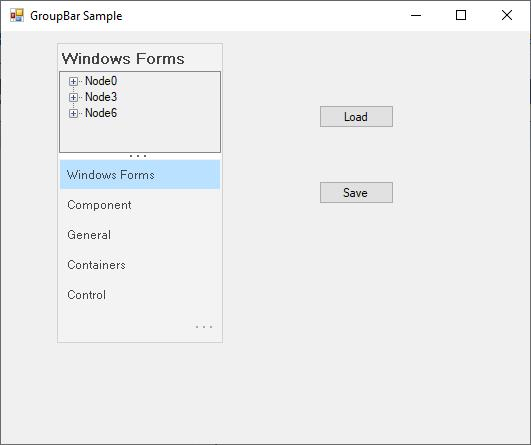
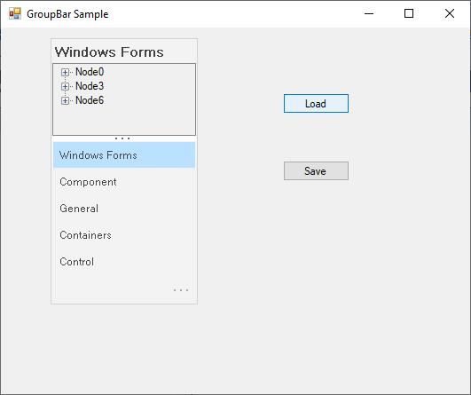

# Serialization Of Layout State in Windows Forms Navigation Pane

The Layout state of GroupBar can be saved and loaded using the [AppStateSerializer](https://help.syncfusion.com/cr/windowsforms/Syncfusion.Runtime.Serialization.AppStateSerializer.html) class. To achieve this, follow the step-by-step procedure.

1. Include the required namespaces.






		using Syncfusion.Windows.Forms;

		using Syncfusion.Windows.Forms.Tools;

		using Syncfusion.Runtime.Serialization;

    

	

		Imports Syncfusion.Windows.Forms

		Imports Syncfusion.Windows.Forms.Tools

		Imports Syncfusion.Runtime.Serialization





{{ codesnippet1 | OrderList_Indent_Level_1 }}

2. Drag and drop a GroupBar control from the toolbox onto the form, add GroupBar Items using the GroupBar Item CollectionEditor and add two buttons to the form for 'Load' and 'Save' as shown below.

   

3. Store the layout information of the selected GroupBar Item in an XML file using the [AppStateSerializer](https://help.syncfusion.com/cr/windowsforms/Syncfusion.Runtime.Serialization.AppStateSerializer.html) class. In the Form_Closing and Save_Button click, call the following method,







		private void SaveState ()

		{

		// Create a temporary storage.

		ArrayList temp = new ArrayList();

		foreach (GroupBarItem item in this.groupBar1.GroupBarItems)

		{

		// Store the index of each GroupBar Item in the Navigation Pane.

		if (item.InNavigationPane == true)

		temp.Add(this.groupBar1.GroupBarItems.IndexOf(item));

		}

		// Store the index of the selected GroupBar Item.

		temp.Add(this.groupBar1.SelectedItem);

		// Persist this information to an XML file using the AppStateSerializer class.

		AppStateSerializer serial = new AppStateSerializer(SerializeMode.XMLFile, "..\\..\\StateInfo");

		serial.SerializeObject("StackedModeState", temp);

		serial.PersistNow();

		}

    

	

		Private Sub SaveState()

		' Create a temporary storage.

		Dim temp As ArrayList = New ArrayList()

		For Each item As GroupBarItem In Me.groupBar1.GroupBarItems

		' Store the index of each GroupBar Item in the Navigation Pane.

		If item.InNavigationPane = True Then

		temp.Add(Me.groupBar1.GroupBarItems.IndexOf(item))

		End If

		Next item

		' Store the index of the selected GroupBar Item.

		temp.Add(Me.groupBar1.SelectedItem)

		' Persist this information to an XML file using the AppStateSerializer class.

		Dim serial As AppStateSerializer = New AppStateSerializer(SerializeMode.XMLFile, "..\..\StateInfo")

		serial.SerializeObject("StackedModeState", temp)

		serial.PersistNow()

		End Sub





{{ codesnippet2 | OrderList_Indent_Level_1 }}

4. Retrieve the persisted layout information from the XML file using the [AppStateSerializer](https://help.syncfusion.com/cr/windowsforms/Syncfusion.Runtime.Serialization.AppStateSerializer.html) class. In the Form_Load event and Load_Button click, call the following method,





		private void LoadState ()

		{

		// De-Persist this information from the XML file using the AppStateSerializer class.

		AppStateSerializer serial = new AppStateSerializer(SerializeMode.XMLFile, "..\\..\\StateInfo");

		ArrayList temp = serial.DeserializeObject("StackedModeState") as ArrayList;

		// Reset the InNavigationPane for all GroupBar Items.

		foreach (GroupBarItem item in this.groupBar1.GroupBarItems)

		{

		item.InNavigationPane = false;

		}

		// Restore the saved state by setting the appropriate InNavigationPane entries.

		int index;

		for(int i=0; i<temp.Count-1; i++)

		{

		index = (int)temp[i];

		this.groupBar1.GroupBarItems[index].InNavigationPane = true;

		}

		// Restore the selected GroupBar Item.

		this.groupBar1.SelectedItem = (int)temp[temp.Count-1];

		}

    

	

		Private Sub LoadState()

		' De-Persist this information from the XML file using the AppStateSerializer class.

		Dim serial As AppStateSerializer = New AppStateSerializer(SerializeMode.XMLFile, "..\..\StateInfo")

		Dim temp As ArrayList = CType(IIf(TypeOf serial.DeserializeObject("StackedModeState") Is ArrayList,                   
			 serial.DeserializeObject("StackedModeState"), Nothing), ArrayList)

		' Reset the InNavigationPane for all GroupBar Items.

		For Each item As GroupBarItem In Me.groupBar1.GroupBarItems

		item.InNavigationPane = False

		Next item

		' Restore the saved state by setting the appropriate InNavigationPane entries.

		Dim index As Integer

		Dim i As Integer = 0

		Do While i < temp.Count - 1

		index = CInt(temp(i))

		Me.groupBar1.GroupBarItems(index).InNavigationPane = True

		i += 1

		Loop

		' Restore the selected GroupBar Item.

		Me.groupBar1.SelectedItem = CInt(temp(temp.Count - 1))

		End Sub





{{ codesnippet3 | OrderList_Indent_Level_1 }}

#### Output

At run-time, select any GroupBar Item and save it's state using the Save_Button click and close the form.

Select GroupBarItem3 and close the form.

Again open the same application. You can see the persisted layout state of GroupBarItem3 as shown in the following figure.

 

