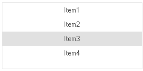
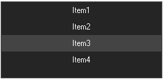

# Style in Windows Forms Navigation Pane (GroupView)

 The GroupView control has rich set of themes for professional representation. You can easily modify the look and feel of the GroupView using the [Style](https://help.syncfusion.com/cr/windowsforms/Syncfusion.Windows.Forms.Tools.GroupView.html#Syncfusion_Windows_Forms_Tools_GroupView_Style) property.

It has the below themes.

•	Default

•	Metro

•	Office2016Colorful

•	Office2016White

•	Office2016DarkGray

•	Office2016Black

The following code example allows you to set the style for the GroupView.

## Default

This option helps to set the Default theme.



  

this.groupView1.Style = Syncfusion.Windows.Forms.Appearance.Default;





Me.groupView1.Style = Syncfusion.Windows.Forms.Appearance.Default





## Metro

This option helps to set the Metro theme.



  

this.groupView1.Style = Syncfusion.Windows.Forms.Appearance.Metro;





Me.groupView1.Style = Syncfusion.Windows.Forms.Appearance.Metro





## Office2016Colorful

This option helps to set the Office2016Colorful theme.



  

this.groupView1.Style = Syncfusion.Windows.Forms.Appearance.Office2016;

this.groupView1.Office2016ColorScheme = GroupViewOffice2016ColorScheme.Colorful;





Me.groupView1.Style = Syncfusion.Windows.Forms.Appearance.Office2016

Me.groupView1.Office2016ColorScheme = GroupViewOffice2016ColorScheme.Colorful





## Office2016White

This option helps to set the Office2016White theme.



  

this.groupView1.Style = Syncfusion.Windows.Forms.Appearance.Office2016;

this.groupView1.Office2016ColorScheme = GroupViewOffice2016ColorScheme.White;





Me.groupView1.Style = Syncfusion.Windows.Forms.Appearance.Office2016

Me.groupView1.Office2016ColorScheme = GroupViewOffice2016ColorScheme.White





## Office2016DarkGray

This option helps to set the Office2016DarkGray theme.



  

this.groupView1.Style = Syncfusion.Windows.Forms.Appearance.Office2016;

this.groupView1.Office2016ColorScheme = GroupViewOffice2016ColorScheme.DarkGray;





Me.groupView1.Style = Syncfusion.Windows.Forms.Appearance.Office2016

Me.groupView1.Office2016ColorScheme = GroupViewOffice2016ColorScheme.DarkGray





## Office2016Black

This option helps to set the Office2016Black theme.



  

this.groupView1.Style = Syncfusion.Windows.Forms.Appearance.Office2016;

this.groupView1.Office2016ColorScheme = GroupViewOffice2016ColorScheme.Black;





Me.groupView1.Style = Syncfusion.Windows.Forms.Appearance.Office2016

Me.groupView1.Office2016ColorScheme = GroupViewOffice2016ColorScheme.Black





