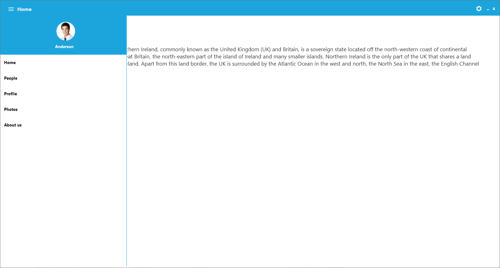
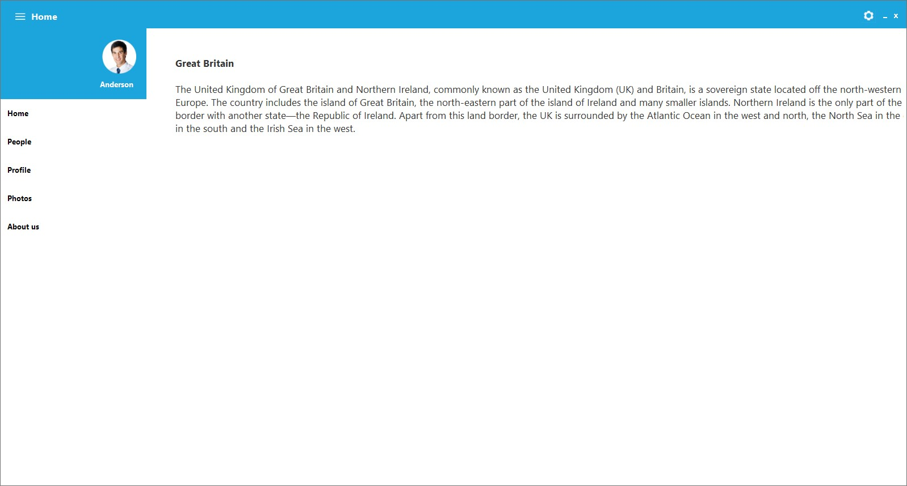
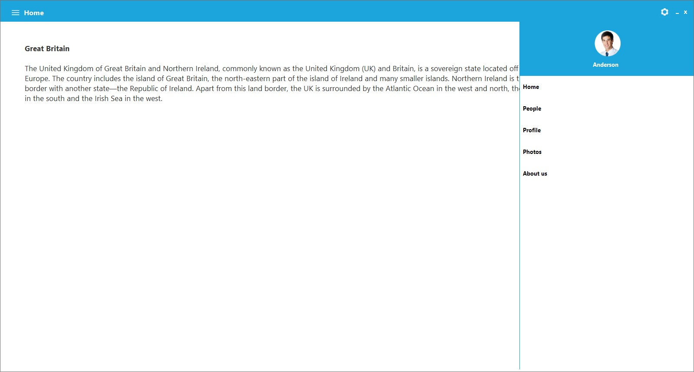
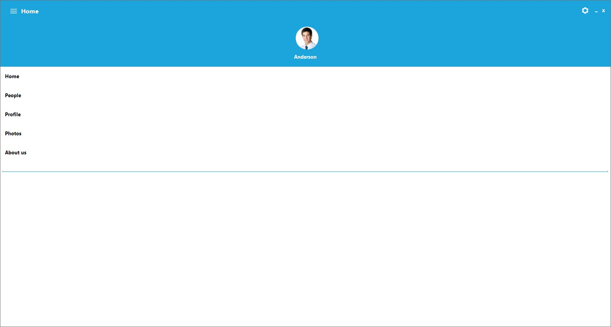
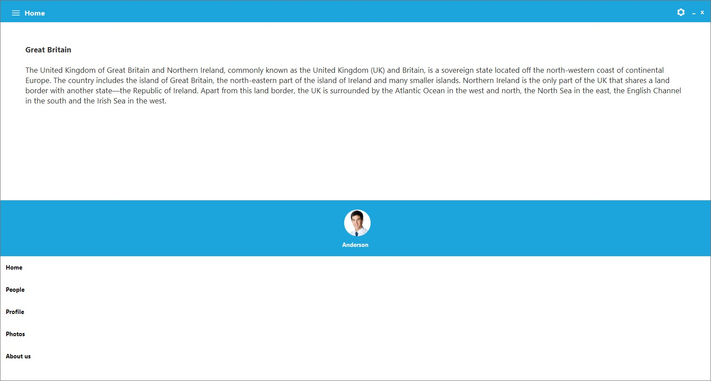

# Concepts and Features

## ContentView

**ContentView** is the main view of the **NavigationDrawer** on which the desired items can be placed. For example, RichTextBox can be used in this sample.





//Creates RichTextBox instance.

RichTextBox richTextBox = new RichTextBox();

//Specifies the Text

this.richTextBox.Text = "Content View" + "\n" + "\n" + "This is Navigation Drawer content View";

//Add RichTextBox into the NavigationDrawer Container Control.

this.navigationDrawer1.ContentViewContainer.Controls.Add(richTextbox);





'Creates RichTextBox instance.

Dim richTextbox As New RichTextBox()

'Specifies the Text

Me.richTextBox.Text = ("Content View" + ("" & vbLf + ("" & vbLf + "This is Navigation Drawer content View")))

'Add RichTextBox into the NavigationDrawer Container Control.

Me.navigationDrawer1.ContentViewContainer.Controls.Add(richTextbox)





## DrawerView

**DrawerView** is a container, that will be displayed upon selection on top, along and below with the Content view section. This will contain below sections.

## Transition

This support specifies the animations for the DrawerView panel. Transition needs to have following three options.

* SlideOnTop
* Push
* Reveal

### SlideOnTop 

That draws the Drawer Content on top of the Content view content. 





//Adds Transition property into NavigationDrawer

this.navigationDrawer1.Transition = Transition.SlideOnTop;





‘Adds Transition property into NavigationDrawer

Me.navigationDrawer1.Transition = Transition.SlideOnTop





### Push

This Transition moves the Drawer and content view section simultaneously.





//Adds Transition property into NavigationDrawer

this.navigationDrawer1.Transition = Transition.Push;





'Adds Transition property into NavigationDrawer

Me.navigationDrawer1.Transition = Transition.Push





### Reveal

In this transition, the Drawer content section will be stable and the content view section will be moved to reveal the drawer content.





//Adds Transition property into NavigationDrawer

this.navigationDrawer1.Transition = Transition.Push;





'Adds Transition property into NavigationDrawer

Me.navigationDrawer1.Transition = Transition.Push





## Position

This support helps user to specify the sliding position of the DrawerView and it will have the following four options.

* Left – Slides from left direction. 
* Right – Slides from right direction. 
* Top – Slides from Top direction. 
* Bottom – Slides from Bottom direction. 





//Adds Position property into the NavigationDrawer

this.navigationDrawer1.Position = Position.Left;





'Adds Transition property into NavigationDrawer

Me.navigationDrawer1.Transition = Transition.Push





* Left 

* Right 

* Top 

* Bottom 

## Animation Duration

This support will help to specify TimeSpan value, by which the DrawerContent can be brought to view.





//Sets AnimationDuration for the NavigationDrawer

 this.navigationDrawer1.AnimationDuration = 100;





'Sets AnimationDuration for the NavigationDrawer

Me.navigationDrawer1.AnimationDuration = 100





## Toggle Drawer

This function decides whether to open or close the DrawerContent based on the truth of IsOpen property.





//Calls the ToggleDrawer function

this.navigationDrawer1.ToggleDrawer();





'Calls the ToggleDrawer function

Me.navigationDrawer1.ToggleDrawer()




