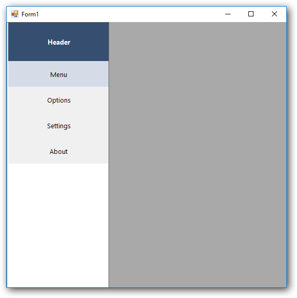

# Getting started

This section describes how to design a `NavigationDrawer` control in a Windows Forms application and overview of its basic functionalities.

* Adding NavigationDrawer control 
* Configuring NavigationDrawer

## Assembly deployment

The following list of assemblies should be added as reference to use the NavigationDrawer in any application:

<table>
<tr>
<td>
{{'**Required assemblies**'| markdownify }}
</td>
<td>
{{'**Description**'| markdownify }}
</td>
</tr>
<tr>
<td>
Syncfusion.Grid.Base.dll
</td>
<td>
Syncfusion.Grid.Base contains classes that contains fundamentals and base classes of GridControl.
</td>
</tr>
<tr>
<td>
Syncfusion.Grid.Windows.dll
</td>
<td>
Syncfusion.Grid.Windows contains classes that handles all UI operations, fundamentals and base classes of GridControl which are used in the NavigationDrawer control.
</td>
</tr>
<tr>
<td>
Syncfusion.Shared.Base.dll
</td>
<td>
Syncfusion.Shared.Base contains style related properties of NavigationDrawer and various editor controls.
</td>
</tr>
<tr>
<td>
Syncfusion.Shared.Windows.dll
</td>
<td>
Syncfusion.Shared.Windows contains style related properties of NavigationDrawer and various editor controls.
</td>
</tr>
<tr>
<td>
Syncfusion.Tools.Base.dll
</td>
<td>
Syncfusion.Tools.Base contains base class which used for NavigationDrawer control.
</td>
</tr>
<tr>
<td>
Syncfusion.Tools.Windows.dll
</td>
<td>
Syncfusion.Tools.Windows contains the class that handles all UI operations and contains helper class of NavigationDrawer control.
</td>
</tr>
</table>

## Installing NuGet Packages

To use NavigationDrawer control in Windows Forms application via nuget, the following packages should be installed.
 
<table>
<tr>
<td>{{'**S.No**'| markdownify }}
</td>
<td>{{'**Framework version**'| markdownify }}
</td>
<td>{{'**NuGet Packages**'| markdownify }}
</td>
</tr>
<tr>
<td> 1
</td>
<td> 2.0
</td>
<td> Syncfusion.Tools.Windows20
</td>
</tr>
<tr>
<td> 2
</td>
<td> 3.5
</td>
<td> Syncfusion.Tools.Windows35
</td>
</tr>
<tr>
<td> 3
</td>
<td> 4.0
</td>
<td> Syncfusion.Tools.Windows40
</td>
</tr>
<tr>
<td> 4
</td>
<td> 4.5
</td>
<td> Syncfusion.Tools.Windows45
</td>
</tr>
<tr>
<td> 5
</td>
<td> 4.5.1
</td>
<td>Syncfusion.Tools.Windows451
</td>
</tr>
<tr>
<td> 6
</td>
<td> 4.6
</td>
<td>Syncfusion.Tools.Windows46
</td>
</tr>
</table>
 
Please find more details regarding how to install the nuget packages in windows form application in the below link:
 
[How to install nuget packages](https://help.syncfusion.com/windowsforms/nuget-packages)

# Creating simple application with NavigationDrawer

You can create the Windows Forms application with NavigationDrawer control as follows:

1. [Creating project](#creating-the-project)
2. [Adding control via Form Designer](#adding-control-via-form-designer)
3. [Adding control manually using code](#adding-control-manually-using-code)
4. [Configuration of Drawer Items](#Configuration-of-drawer-items)

### Creating the project

Create a new Windows Forms project in the Visual Studio to display the NavigationDrawer with basic information.

## Adding control via Form designer

NavigationDrawer control can be added to the application by dragging it from the toolbox and dropping it in a designer view. The following required assembly references will be added automatically:

* Syncfusion.Grid.Base.dll
* Syncfusion.Grid.Windows.dll
* Syncfusion.Shared.Base.dll
* Syncfusion.Shared.Windows.dll
* Syncfusion.Tools.Base.dll
* Syncfusion.Tools.Windows.dll

 

**Adding Items to NavigationDrawer**

Header and menu items can be added to the Drawer using `Items` collection in Smart Tags of NavigationDrawer.

## Adding control manually using code

To add control manually in C#, follow the given steps:

**Step 1** - Add the following required assembly references to the project:

 * Syncfusion.Tools.Base.dll
 * Syncfusion.Tools.Windows.dll
 * Syncfusion.Shared.Base.dll
 * Syncfusion.Shared.Windows.dll
 * Syncfusion.Grid.Base.dll
 * Syncfusion.Grid.Windows.dll

**Step 2** - Include the namespaces **Syncfusion.Windows.Forms.Tools**.





using Syncfusion.Windows.Forms.Tools;





Imports Syncfusion.Windows.Forms.Tools





**Step 3** - Create `NavigationDrawer` control instance and add it to the form.





NavigationDrawer navigationDrawer1 = new NavigationDrawer();

this.Controls.Add(navigationDrawer1);





Dim navigationDrawer1 As NavigationDrawer = New NavigationDrawer

Me.Controls.Add(navigationDrawer1)





**Adding Header to NavigationDrawer**

Create `DrawerHeader` instance and add it to the `Items` collection in NavigationDrawer class





DrawerHeader drawerHeader1 = new DrawerHeader();

this.navigationDrawer1.Items.Add(this.drawerHeader1);





Dim drawerHeader1 As DrawerHeader = New DrawerHeader

Me.navigationDrawer1.Items.Add(Me.drawerHeader1)





**Adding MenuItems to NavigationDrawer**

Create `DrawerHeader` instance and add it to the `Items` collection in NavigationDrawer class.





DrawerMenuItem drawerMenuItem1 = new DrawerMenuItem();
DrawerMenuItem drawerMenuItem2 = new DrawerMenuItem();
DrawerMenuItem drawerMenuItem3 = new DrawerMenuItem();
DrawerMenuItem drawerMenuItem4 = new DrawerMenuItem();

this.navigationDrawer1.Items.Add(this.drawerMenuItem1);
this.navigationDrawer1.Items.Add(this.drawerMenuItem2);
this.navigationDrawer1.Items.Add(this.drawerMenuItem3);
this.navigationDrawer1.Items.Add(this.drawerMenuItem4);





Dim drawerMenuItem1 As DrawerMenuItem = New DrawerMenuItem
Dim drawerMenuItem2 As DrawerMenuItem = New DrawerMenuItem
Dim drawerMenuItem3 As DrawerMenuItem = New DrawerMenuItem
Dim drawerMenuItem4 As DrawerMenuItem = New DrawerMenuItem

Me.navigationDrawer1.Items.Add(Me.drawerMenuItem1)
Me.navigationDrawer1.Items.Add(Me.drawerMenuItem2)
Me.navigationDrawer1.Items.Add(Me.drawerMenuItem3)
Me.navigationDrawer1.Items.Add(Me.drawerMenuItem4)





## Configuration of Drawer Items

NavigationDrawer provides full-fledged color and size customization supports of Drawer items.





// Size of the DrawerPanel

this.navigationDrawer1.DrawerHeight = 500;
this.navigationDrawer1.DrawerWidth = 200;

// Header Settings

this.drawerHeader1.HeaderText = "Header";
this.drawerHeader1.BackColor = ColorTranslator.FromHtml("#364e6f");
this.drawerHeader1.TextColor = System.Drawing.Color.White;
this.drawerHeader1.TextAlign = Syncfusion.Windows.Forms.Tools.TextAlignment.Center;
this.drawerHeader1.Size = new System.Drawing.Size(200, 75);

// Menu Items settings

this.drawerMenuItem1.DefaultColor = SystemColors.Control;
this.drawerMenuItem1.SelectionColor = ColorTranslator.FromHtml("#d5dce8");
this.drawerMenuItem1.Text = "Menu";
this.drawerMenuItem1.TextAlign = Syncfusion.Windows.Forms.Tools.TextAlignment.Center;
this.drawerMenuItem1.Size = new System.Drawing.Size(200, 50);

this.drawerMenuItem2.DefaultColor = SystemColors.Control;
this.drawerMenuItem2.SelectionColor = ColorTranslator.FromHtml("#d5dce8");
this.drawerMenuItem2.Text = "Options";
this.drawerMenuItem2.TextAlign = Syncfusion.Windows.Forms.Tools.TextAlignment.Center;
this.drawerMenuItem2.Size = new System.Drawing.Size(200, 50);

this.drawerMenuItem3.DefaultColor = SystemColors.Control;
this.drawerMenuItem3.SelectionColor = ColorTranslator.FromHtml("#d5dce8");
this.drawerMenuItem3.Text = "Settings";
this.drawerMenuItem3.TextAlign = Syncfusion.Windows.Forms.Tools.TextAlignment.Center;
this.drawerMenuItem3.Size = new System.Drawing.Size(200, 50);

this.drawerMenuItem4.DefaultColor = SystemColors.Control;
this.drawerMenuItem4.SelectionColor = ColorTranslator.FromHtml("#d5dce8");
this.drawerMenuItem4.Text = "About";
this.drawerMenuItem4.TextAlign = Syncfusion.Windows.Forms.Tools.TextAlignment.Center;
this.drawerMenuItem4.Size = new System.Drawing.Size(200, 50);





'' Size of the DrawerPanel

Me.navigationDrawer1.DrawerHeight = 709
Me.navigationDrawer1.DrawerWidth = 200

'' Header Settings

Me.drawerHeader1.HeaderText = "Header"
Me.drawerHeader1.BackColor = ColorTranslator.FromHtml("#364e6f")
Me.drawerHeader1.TextColor = System.Drawing.Color.White
Me.drawerHeader1.TextAlign = Syncfusion.Windows.Forms.Tools.TextAlignment.Center
Me.drawerHeader1.Size = New System.Drawing.Size(200, 75)

'' Menu Items settings

Me.drawerMenuItem1.DefaultColor = SystemColors.Control
Me.drawerMenuItem1.SelectionColor = ColorTranslator.FromHtml("#d5dce8")
Me.drawerMenuItem1.Text = "Menu"
Me.drawerMenuItem1.TextAlign = Syncfusion.Windows.Forms.Tools.TextAlignment.Center
Me.drawerMenuItem1.Size = New System.Drawing.Size(200, 50)

Me.drawerMenuItem2.DefaultColor = SystemColors.Control
Me.drawerMenuItem2.SelectionColor = ColorTranslator.FromHtml("#d5dce8")
Me.drawerMenuItem2.Text = "Options"
Me.drawerMenuItem2.TextAlign = Syncfusion.Windows.Forms.Tools.TextAlignment.Center
Me.drawerMenuItem2.Size = New System.Drawing.Size(200, 50)

Me.drawerMenuItem3.DefaultColor = SystemColors.Control
Me.drawerMenuItem3.SelectionColor = ColorTranslator.FromHtml("#d5dce8")
Me.drawerMenuItem3.Text = "Settings"
Me.drawerMenuItem3.TextAlign = Syncfusion.Windows.Forms.Tools.TextAlignment.Center
Me.drawerMenuItem3.Size = New System.Drawing.Size(200, 50)

Me.drawerMenuItem4.DefaultColor = SystemColors.Control
Me.drawerMenuItem4.SelectionColor = ColorTranslator.FromHtml("#d5dce8")
Me.drawerMenuItem4.Text = "About"
Me.drawerMenuItem4.TextAlign = Syncfusion.Windows.Forms.Tools.TextAlignment.Center
Me.drawerMenuItem4.Size = New System.Drawing.Size(200, 50)





