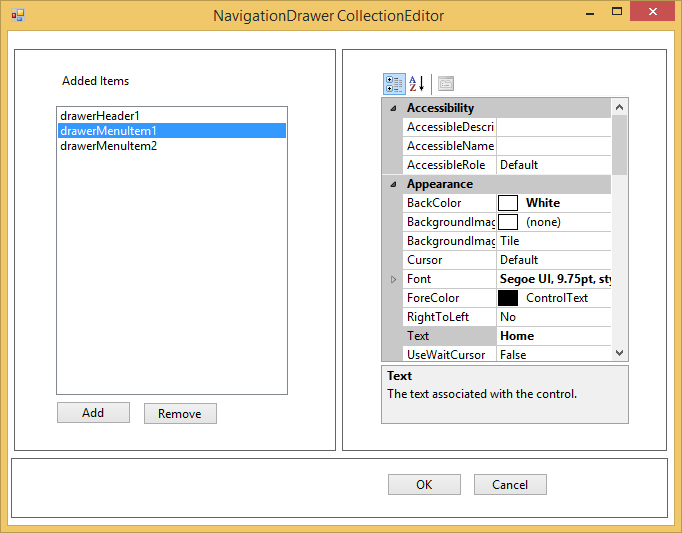

# Getting started

## Through designer

Syncfusion UI for Windows Forms are added automatically to the Visual Studio Toolbox during installation. The following steps helps to add required Essential Windows Forms control through drag and drop from Toolbox.

* Create a Windows Forms project in Visual Studio.

* Find **NavigationDrawer** by typing the name of the “NavigationDrawer” in the search box.

* Drag-and-drop a `NavigationDrawer` control from the VS.NET toolbox onto the form. This will create an instance of the `NavigationDrawer` control on the form.

* The NavigationDrawer is populated with the collection of DrawMenuItems using the `Items` property in the property window.

## Through code-behind

Syncfusion UI for Windows Forms can added at runtime using C# / VB. The following steps helps to add required Essential Windows Forms control through code.

* Create a Windows Forms project in Visual Studio and refer to the following assemblies.
	* Syncfusion.Tools.Base.dll
	* Syncfusion.Tools.Windows.dll
	* Syncfusion.Shared.Base.dll
	* Syncfusion.Shared.Windows.dll
	* Syncfusion.Grid.Base
	* Syncfusion.Grid.Windows.dll

* Create an instance of the NavigationDrawer control and add it to the Form.





//Creates NavigationDrawer instance.

NavigationDrawer navigationDrawer1 = new NavigationDrawer();





'Creates NavigationDrawer instance. 

Dim navigationDrawer1 As New NavigationDrawer()





3. Add DrawMenuItem to the NavigationDrawer control using the following code example.





//Adds items to the TreeNavigator.

private DrawerMenuItem drawerMenuItem1= new DrawerMenuItem();

this.navigationDrawer1.Items.Add(this.drawerMenuItem1);

this.navigationDrawer1.Items.Add(this.drawerMenuItem2);

this.drawerMenuItem1.BackColor = System.Drawing.Color.White;

this.drawerMenuItem1.DefaultColor = System.Drawing.Color.White;

this.drawerMenuItem1.Font = new System.Drawing.Font("Segoe UI", 9.75F, System.Drawing.FontStyle.Bold, System.Drawing.GraphicsUnit.Point, ((byte)(0)));

this.drawerMenuItem1.HoverColor = System.Drawing.Color.LightGray;

this.drawerMenuItem1.ItemText = "drawerMenuItem1";

this.drawerMenuItem1.Location = new System.Drawing.Point(2, 125);

this.drawerMenuItem1.Margin = new System.Windows.Forms.Padding(0);

this.drawerMenuItem1.MinimumSize = new System.Drawing.Size(200, 50);

this.drawerMenuItem1.Name = "drawerMenuItem1";

this.drawerMenuItem1.Selected = false;

this.drawerMenuItem1.SelectionColor = System.Drawing.Color.LightGray;

this.drawerMenuItem1.Size = new System.Drawing.Size(200, 50);

this.drawerMenuItem1.TabIndex = 0;

this.drawerMenuItem1.Text = "Home";

this.drawerMenuItem1.TextColor = System.Drawing.Color.Black;

this.drawerMenuItem2.BackColor = System.Drawing.Color.White;

this.drawerMenuItem2.DefaultColor = System.Drawing.Color.White;

this.drawerMenuItem2.Font = new System.Drawing.Font("Segoe UI", 9.75F, System.Drawing.FontStyle.Bold, System.Drawing.GraphicsUnit.Point, ((byte)(0)));

this.drawerMenuItem2.HoverColor = System.Drawing.Color.LightGray;

this.drawerMenuItem2.ItemText = "drawerMenuItem2";

this.drawerMenuItem2.Location = new System.Drawing.Point(2, 175);

this.drawerMenuItem2.Margin = new System.Windows.Forms.Padding(0);

this.drawerMenuItem2.MinimumSize = new System.Drawing.Size(200, 50);

this.drawerMenuItem2.Name = "drawerMenuItem2";

this.drawerMenuItem2.Selected = false;

this.drawerMenuItem2.SelectionColor = System.Drawing.Color.LightGray;

this.drawerMenuItem2.Size = new System.Drawing.Size(200, 50);

this.drawerMenuItem2.TabIndex = 1;

this.drawerMenuItem2.Text = "People";

this.drawerMenuItem2.TextColor = System.Drawing.Color.Black;





'Adds items to the TreeNavigator.

Private drawerMenuItem1 As New DrawerMenuItem()

Me.navigationDrawer1.Items.Add(Me.drawerMenuItem1)

Me.navigationDrawer1.Items.Add(Me.drawerMenuItem2)

Me.drawerMenuItem1.BackColor = System.Drawing.Color.White

Me.drawerMenuItem1.DefaultColor = System.Drawing.Color.White

Me.drawerMenuItem1.Font = New System.Drawing.Font("Segoe UI", 9.75F, System.Drawing.FontStyle.Bold, System.Drawing.GraphicsUnit.Point, (CByte(0)))

Me.drawerMenuItem1.HoverColor = System.Drawing.Color.LightGray

Me.drawerMenuItem1.ItemText = "drawerMenuItem1"

Me.drawerMenuItem1.Location = New System.Drawing.Point(2, 125)

Me.drawerMenuItem1.Margin = New System.Windows.Forms.Padding(0)

Me.drawerMenuItem1.MinimumSize = New System.Drawing.Size(200, 50)

Me.drawerMenuItem1.Name = "drawerMenuItem1"

Me.drawerMenuItem1.Selected = False

Me.drawerMenuItem1.SelectionColor = System.Drawing.Color.LightGray

Me.drawerMenuItem1.Size = New System.Drawing.Size(200, 50)

Me.drawerMenuItem1.TabIndex = 0

Me.drawerMenuItem1.Text = "Home"

Me.drawerMenuItem1.TextColor = System.Drawing.Color.Black

Me.drawerMenuItem2.BackColor = System.Drawing.Color.White

Me.drawerMenuItem2.DefaultColor = System.Drawing.Color.White

Me.drawerMenuItem2.Font = New System.Drawing.Font("Segoe UI", 9.75F, System.Drawing.FontStyle.Bold, System.Drawing.GraphicsUnit.Point, (CByte(0)))

Me.drawerMenuItem2.HoverColor = System.Drawing.Color.LightGray

Me.drawerMenuItem2.ItemText = "drawerMenuItem2"

Me.drawerMenuItem2.Location = New System.Drawing.Point(2, 175)

Me.drawerMenuItem2.Margin = New System.Windows.Forms.Padding(0)

Me.drawerMenuItem2.MinimumSize = New System.Drawing.Size(200, 50)

Me.drawerMenuItem2.Name = "drawerMenuItem2"

Me.drawerMenuItem2.Selected = False

Me.drawerMenuItem2.SelectionColor = System.Drawing.Color.LightGray

Me.drawerMenuItem2.Size = New System.Drawing.Size(200, 50)

Me.drawerMenuItem2.TabIndex = 1

Me.drawerMenuItem2.Text = "People"

Me.drawerMenuItem2.TextColor = System.Drawing.Color.Black





