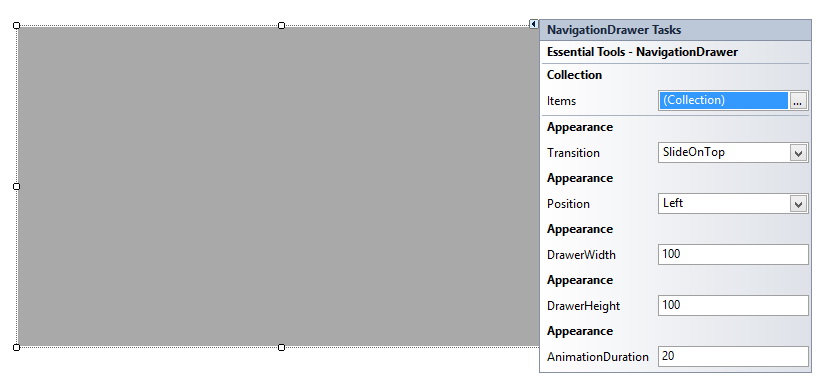

# Getting Started

## Create your first NavigationDrawer in Windows Forms

Through Designer

Syncfusion UI for Windows Forms are added automatically to the Visual Studio Toolbox during installation. The following steps helps to add required Essential Windows Forms control through drag and drop from Toolbox. 

1. Create a Windows Forms project in Visual Studio.

2. Find **NavigationDrawer** by typing the name of the “NavigationDrawer” in the search box.

Through Code-Behind

Syncfusion UI for Windows Forms can added at runtime using C# / VB. The following steps helps to add required Essential Windows Forms control through code. 

1. Create a Windows Forms project in Visual Studio and refer to the following assemblies .
	* Syncfusion.Tools.Base.dll
	* Syncfusion.Tools.Windows.dll
	* Syncfusion.Shared.Base.dll
	* Syncfusion.Shared.Windows.dll
	* Syncfusion.Grid.Base
	* Syncfusion.Grid.Windows.dll

2. Create an instance of the NavigationDrawer control and add it to the Form.





//Creates NavigationDrawer instance.

NavigationDrawer navigationDrawer1 = new NavigationDrawer();





'Creates NavigationDrawer instance. 

Dim navigationDrawer1 As New NavigationDrawer()





NavigationDrawer control

